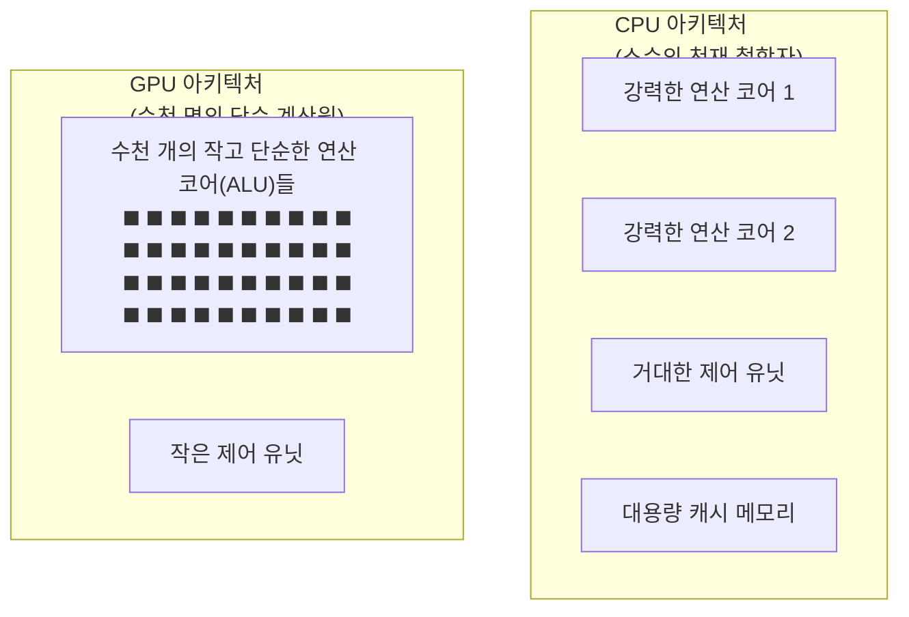

# 디지털인문학과 매체 철학의 교차점: GPU의 기술적 진화

현대의 디지털인문학은 단순히 텍스트 마이닝을 수행하는 도구적 학문을 넘어섰습니다. 오늘날 학문적 담론과 세계관을 형성하는 가장 강력한 인식론적 도구인 인공지능(AI)의 배후에는, 이를 물리적으로 지탱하는 절대적인 하드웨어 아키텍처가 존재합니다. 그것이 바로 그래픽 처리 장치, **GPU**(Graphics Processing Unit)입니다.

이 장에서는 컴퓨터 모니터의 픽셀을 채색하기 위해 고안된 단일 목적의 실리콘 칩이 어떻게 인간의 언어를 해독하고 자본주의 패권을 좌우하는 핵심으로 진화했는지 추적합니다. 나아가 막대한 연산 능력을 독점한 소수의 빅테크 기업이 어떻게 지식 생산의 주도권을 장악하고 있는지 매체 철학적 관점에서 비판적으로 사유합니다.

## 1. GPU의 탄생과 병렬 처리 아키텍처

### 1.1 순차적 처리의 한계와 CPU의 딜레마

컴퓨터의 뇌인 **CPU**(Central Processing Unit)의 근본적인 설계 철학은 “**복잡하고 다양한 작업을 얼마나 지연 없이 신속하게(Low Latency) 직렬로 처리할 수 있는가**”에 맞춰져 있습니다. 이를 위해 분기 예측과 방대한 캐시 메모리를 갖춘 소수의 매우 강력하고 복잡한 코어(Core)로 진화했습니다.

그러나 1990년대 3D 그래픽의 시대가 열리며 CPU는 딜레마에 빠집니다. 초당 60프레임으로 200만 개의 픽셀 색상을 동시에 칠하기 위해서는 1초에 1억 2천만 번의 단순 연산이 필요합니다. 아무리 똑똑한 철학자(CPU)라도 수백만 장의 산수 문제지를 1초 만에 혼자 풀 수는 없었습니다.

### 1.2 병렬 처리의 탄생: 단순함의 물량 공세

이 물리적 연산 한계를 극복하기 위해 등장한 전용 하드웨어가 1999년 엔비디아(NVIDIA)가 처음 명명한 GPU입니다.

GPU의 특징은 복잡한 논리를 포기하는 대신, 단순한 산술 논리 장치(ALU)를 수천 개 집적한 것입니다. 픽셀 하나를 계산하는 작업이 다른 픽셀에 영향을 주지 않는다는 그래픽 연산의 고유한 속성 덕분에, 수천 개의 코어가 하나의 명령을 받아 동시에(Simultaneously) 처리하는 **병렬 처리 체계**가 완성되었습니다. 

## 2. GPGPU와 인공지능 혁명의 방아쇠

### 2.1 쿠다(CUDA)의 도래: 픽셀에서 뉴런으로

2000년대 초반까지 GPU는 오직 그래픽 렌더링에만 갇혀 있었습니다. 2006년, 엔비디아는 연구자들이 C/C++ 같은 표준 언어로 GPU 코어에 직접 명령을 내릴 수 있는 **쿠다**(CUDA) 아키텍처를 발표합니다. 이로써 GPU는 화면 색상을 칠하는 도구에서 **범용 목적의 연산 장치**(GPGPU)로 재탄생합니다.

### 2.2 신경망과 3D 그래픽의 동형성: 행렬 곱셈

GPGPU가 인공지능 분야에 폭발적인 파급력을 미친 이유는, 딥러닝의 근간인 인공 신경망의 수학적 구조가 3D 그래픽 연산과 완벽하게 일치했기 때문입니다.

두 분야 모두 거대한 배열 데이터를 다루는 선형 대수학의 **일반 행렬 곱셈**(GEMM)에 의존합니다. 3D 폴리곤 정점의 빛 반사를 계산하던 GPU의 수천 개 코어는, 인공지능 뉴런의 수억 개 가중치(Weight) 곱셈을 병렬로 처리하는 데 CPU보다 수십~수백 배 빠른 압도적 효율을 냈습니다. 실리콘 회로 입장에서는 그래픽이나 인공지능이나 똑같은 부동소수점 병렬 연산에 불과했던 것입니다.

### 2.3 2012년 알렉스넷(AlexNet): 역사적 특이점

2012년 제프리 힌턴(Geoffrey Hinton) 교수팀은 방대한 이미지 데이터를 학습한 알렉스넷으로 시각 인식 대회(ImageNet)를 제패합니다. 

이들이 극도로 깊은 신경망을 단 5~6일 만에 학습시킬 수 있었던 핵심 비결은 두 대의 게임용 GPU(GTX 580)에 쿠다를 적용한 데 있었습니다. 알렉스넷의 승리는 소수의 인간 전문가가 만든 논리적 규칙보다, 방대한 데이터와 GPU의 무자비한 물리적 병렬 연산력(Compute Power)을 결합한 심층 학습이 기계 지능 구현에 압도적으로 우월함을 전 세계에 증명한 사건이었습니다.

## 3. 지식 생산의 헤게모니와 자본의 독점

GPU의 궤적 이면에는 디지털인문학이 가장 민감하게 경계해야 할 권력 구조의 지각변동이 숨어 있습니다. 컴퓨팅 연산력이 세계를 해독하고 진리를 규정하는 렌즈가 되면서, 자본의 비대칭성이 지식 생산의 헤게모니를 지배하게 되었습니다.

### 3.1 연산 격차(Compute Divide)와 탈민주화

GPT-4 같은 거대 언어 모델(LLM)을 훈련하기 위해서는 수만 대의 최고급 GPU(A100, H100)로 구성된 천문학적 자본의 클러스터가 필요합니다. 

이로 인해 알고리즘 혁신은 학계나 개인 연구자의 손을 떠나 글로벌 “**빅테크**(Big Tech)”의 서버 팜 내부로 완전히 흡수되었습니다. 이를 “**연산 격차**”(Compute Divide)라 부릅니다. 자원이 없는 인문학자나 공공 연구소는 거대 기업이 하사하듯 제공하는 블랙박스화된 상용 API에 의존해야 하는 수동적 위치로 전락하고 말았습니다.

### 3.2 마테오 파스퀴넬리와 매체 철학: 포획된 집단 지성

이탈리아 매체 철학자 **마테오 파스퀴넬리**는 AI의 발전이 순수한 수학적 성취가 아니라, 무수한 인간의 사회적 협력 관계를 포획하는 자본주의적 착취 기계장치라고 비판합니다.

GPU가 수행하는 무한한 행렬 연산은 결국 예술가, 프로그래머, 언어학자, 그리고 일반 대중이 인터넷에 남긴 거대한 인지적 노동을 알고리즘으로 추출하는 과정입니다. 빅테크의 AI는 다중(Multitude)이 축적한 문화적 유산을 전유하여 소수의 이익으로 환원하는 “**인클로저**(Enclosure)”의 최신 형태에 다름 아닙니다.

### 3.3 벤자민 브래튼의 『스택(The Stack)』

철학자 **벤자민 브래튼**은 현대 디지털 인프라를 전 지구를 뒤덮는 수직적 메가구조물인 “**스택**”으로 파악합니다.

아프리카의 광산(Earth Layer)에서 캔 희토류로 실리콘 칩을 만들고, 이 칩들이 모여 막대한 에너지를 뿜어내는 데이터 센터(Cloud Layer)가 되어 인간의 인지와 행동을 실시간으로 통제(User Layer)합니다. GPU 클러스터를 장악한 플랫폼은 기존 국가의 주권을 무력화하고, 무엇이 진실이고 환각(Hallucination)인지를 규정하는 궁극적인 심판관이 되었습니다.

### 3.4 육 후이와 기술 다양성(Technodiversity)

이러한 지식의 획일화에 저항하기 위해 **육 후이**의 통찰이 필요합니다. 그는 기술이란 문화적 맥락과 분리된 중립적 도구가 아니라, 각 문화권의 독특한 “**우주기술**(Cosmotechnics)”이라고 규정합니다.

만약 실리콘밸리의 가치관이 하드코딩된 단일 언어 모델만이 전 세계 지식 탐구의 표준이 된다면, 우리는 새로운 디지털 식민화에 직면할 것입니다. 디지털인문학은 서구적 기술 이성에 대항하여, 다원적인 존재론이 공존할 수 있는 “**기술 다양성**”을 회복해야만 합니다.

:::{seealso} 📖 추천 문헌 및 웹 리소스
GPU 혁명과 AI 지식 권력에 대한 비판적 매체 철학을 심층 연구하기 위한 핵심 문헌입니다. (KADH 인용 규정 준수)

* **Krizhevsky, A. et al. (2012).** “ImageNet Classification with Deep Convolutional Neural Networks”. <Advances in Neural Information Processing Systems>. 25. <a href="https://doi.org/10.1145/3065386" target="_blank">DOI: 10.1145/3065386</a>
* **Pasquinelli, M. (2023).** <The Eye of the Master: A Social History of Artificial Intelligence>. Verso Books. <a href="https://search.worldcat.org/title/1351688647" target="_blank">WorldCat URI</a>
* **Chun, J. & Elkins, K. (2023).** “The Crisis of Artificial Intelligence: A New Digital Humanities Curriculum”. <International Journal of Humanities and Arts Computing>. 17(2). <a href="https://doi.org/10.3366/ijhac.2023.0310" target="_blank">DOI: 10.3366/ijhac.2023.0310</a>
* **정은경 (2021).** “디지털 인문학 연구 동향 분석”. <한국문헌정보학회지>. 55(1). 393-413. <a href="https://doi.org/10.4275/KSLIS.2021.55.1.393" target="_blank">DOI: 10.4275/KSLIS.2021.55.1.393</a>
* **박경우 (2022).** “인문학 연구에서의 디지털 기술 활용 현황 및 적용 방향”. <국어국문학>. 200. 137-179. <a href="https://www.kci.go.kr/kciportal/ci/sereArticleSearch/ciSereArtiView.kci?sereArticleSearchBean.artiId=ART002823295" target="_blank">KCI URI</a>
:::

---

## 💡 디지털인문학자를 위한 생각해볼 점

1.  **지식의 블랙박스와 연산 격차:** 막대한 GPU 클러스터가 없는 인문학자는 빅테크가 제공하는 API에 종속될 수밖에 없습니다. 이 극단적인 "연산 격차(Compute Divide)" 상황에서 학술 지식 생산의 공공성을 어떻게 회복할 수 있을까요?
2.  **데이터 인클로저 비판:** 오늘날 AI가 생성하는 유려한 문장은 인류가 수백 년간 쌓아온 문화 유산과 이름 모를 개인들의 무급 디지털 노동을 "추출"한 결과물입니다. 디지털인문학은 이 거대한 인지 노동의 포획을 어떤 방식으로 가시화하고 비판해야 할까요?
