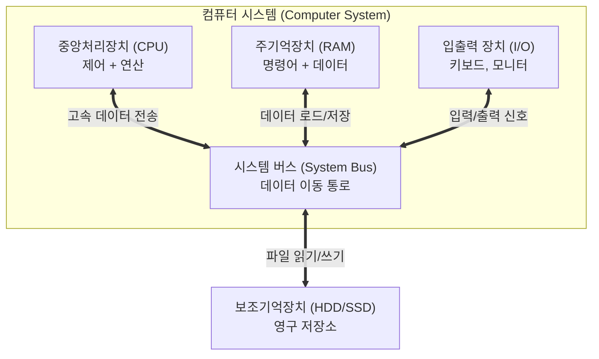
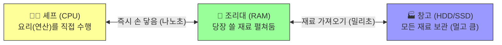

# 현대 컴퓨터 하드웨어의 해부학과 디지털의 물질성

디지털 정보 기술과 인문학적 연구 문제의 결합을 통해 새롭고 혁신적인 지식을 창출하는 **디지털인문학**(Digital Humanities)은 현대 학문 체계에서 가장 역동적으로 성장하고 있는 다학제적 융합 분야입니다.

그러나 많은 인문학 연구자와 학생들은 “**디지털**”(Digital)이라는 기표를 접할 때, 그것을 물리적 한계와 공간적 제약, 그리고 열역학적 법칙에서 완전히 벗어난 “**비물질적**”(Immaterial)이고 “**가상적**”(Virtual)인 이데아의 세계로 무비판적으로 상정하는 경향이 있습니다.

클라우드, 사이버 스페이스 같은 매끄러운 은유는 사용자 인터페이스 이면에 존재하는 거대한 기계적, 전기적, 그리고 지질학적 토대를 교묘하게 은폐합니다. 이 장에서는 현대 컴퓨터의 **물리적 해부학**을 통해 블랙박스의 신화를 해체하고, 희토류 채굴부터 데이터 센터의 전력 소모에 이르는 **디지털의 거대한 물질성**(Materiality)을 고찰합니다.

## 1. 기계의 은폐: 블랙박스와 소프트웨어의 환상

독일의 매체 철학자 **프리드리히 키틀러**(Friedrich Kittler)는 “**소프트웨어는 없다**”(There is no software)라는 도발적인 선언을 남겼습니다. 우리가 화면에서 마주하는 모든 텍스트와 프로그램은 궁극적으로 마이크로프로세서 내부의 트랜지스터 셀 사이에서 발생하는 미세한 전압 차이로 환원됩니다.

컴퓨터는 명령을 내리면 마법처럼 결과가 도출되는 **블랙박스**(Black Box)가 아닙니다. 그것은 철저한 물리적 법칙과 전기적 신호의 흐름에 의해 통제되고 작동하는, 인류 역사상 가장 복잡하고 거대한 정보 처리 공장입니다.

## 2. 현대 PC의 해부학: 폰 노이만 구조의 물리적 구현

현대 컴퓨터의 논리적 뼈대는 1945년 **존 폰 노이만**이 제안한 구조에 기반을 두고 있습니다. 이 구조의 핵심 혁신은 **프로그램 내장 방식**(Stored-Program Concept)입니다.

과거의 기계(에니악)는 계산 방식을 바꾸기 위해 물리적 배선을 뜯어고쳐야 했습니다. 그러나 폰 노이만은 **데이터**(식재료)와 **명령어**(레시피)를 동일한 메모리에 저장함으로써, 하드웨어 수정 없이 소프트웨어 교체만으로 무한히 다양한 작업을 수행하는 **범용 기계**(General-purpose computing)를 탄생시켰습니다.

### 주방의 메타포 (Kitchen Metaphor)

컴퓨터 내부의 복잡한 작동 원리를 이해하기 위해, 이를 **대형 레스토랑의 주방**에 비유해 보겠습니다.

1.  **CPU (수석 요리사):** 주문서(명령어)를 확인하고 식재료(데이터)를 다듬어 요리(연산)하는 주체입니다. 손이 매우 빠르지만(수 GHz), 한 번에 처리할 수 있는 양에는 한계가 있습니다.
2.  **RAM (조리대):** 요리사가 당장 사용할 재료와 레시피를 올려두는 작업 공간입니다. 조리대가 넓을수록(용량이 클수록) 요리사는 창고를 오가는 시간을 줄이고 여러 요리를 동시에 할 수 있습니다. 전원이 꺼지면 조리대 위의 재료는 모두 치워집니다(휘발성).
3.  **HDD/SSD (식자재 창고):** 모든 식재료를 영구적으로 보관하는 곳입니다. 용량은 거대하지만, 요리사가 직접 가기에는 너무 멀어(속도 차이) 반드시 조리대(RAM)로 재료를 옮겨와야 합니다.
4.  **메인보드 (주방의 바닥과 동선):** 셰프와 조리대, 창고를 연결하는 물리적 기반입니다. 이곳에는 데이터가 이동하는 고속도로인 **버스**(Bus)가 깔려 있습니다.

## 3. 기계적 인과율: 전압과 입출력의 번역

### 전원공급장치(PSU)와 전압의 통제

인문학적 상상 속에서 정보가 우아하게 처리되는 동안, 실제 메인보드 위에서는 치열한 열역학적 투쟁이 벌어집니다. 

* **전원공급장치(PSU):** 가정용 교류 전기를 컴퓨터가 쓸 수 있는 직류로 변환합니다.
* **전압 조절 모듈(VRM):** 12V의 강한 전압을 CPU가 요구하는 1.2V의 미세 전압으로 강하(Step-down)시킵니다. 이 과정에서 엄청난 열이 발생하며, 전압이 0.1V만 불안정해도 시스템은 붕괴(블루스크린)합니다.

### 입출력 장치: 물리적 힘의 번역

우리가 키보드를 누르는 것은 기계적 압력(Physical force)입니다. 이 압력은 스위치를 눌러 전기적 신호(0과 1)로 변환됩니다. 반대로 모니터는 전기 신호를 빛 에너지(Photon)로 치환하여 망막을 자극합니다. 정보는 결코 비물질적으로 공간을 도약하지 않습니다. 오직 물리적 변환과 인과적 연쇄만이 존재할 뿐입니다.

## 4. 블랙박스의 해체: 포렌식 물질성

**매슈 커션바움**(Matthew Kirschenbaum)은 디지털 데이터가 물리적으로 각인된다는 사실을 강조하며 두 가지 물질성을 제시합니다.

1.  **형식적 물질성 (Formal Materiality):** 사용자가 화면에서 체감하는 데이터의 조작 가능성(파일 복사, 이동).
2.  **포렌식 물질성 (Forensic Materiality):** 데이터가 하드디스크의 자성 표면에 미세한 물리적 흔적(Trace)으로 새겨지는 상태. 파일을 삭제해도 자성의 배열은 남아 있으며, 현미경으로 들여다보면 어떤 데이터도 완벽하게 동일한 물리적 상태를 갖지 않습니다.

## 5. 디지털의 물질성: 생태적, 지질학적 영토

현대 디지털 자본주의는 “클라우드”라는 가벼운 은유 뒤에 거대한 환경적 부하를 숨기고 있습니다. **유시 파리카**(Jussi Parikka)는 이를 **미디어 지질학**(Geology of Media)의 관점에서 비판합니다.

### 희토류 채굴과 e-폐기물

스마트폰과 서버를 만들기 위해서는 **희토류**(Rare Earth Elements)가 필수적입니다. 중국 바오터우(Baotou)의 거대한 유독성 호수는 우리의 디지털 기기가 지구의 지각을 파헤치고 맹독성 화공약품을 쏟아부은 결과물임을 증명합니다. 사용이 끝난 기기는 가나와 인도 등지로 보내져, 빈곤한 노동자들의 폐를 갉아먹으며 **전자 폐기물**(e-waste)로 분해됩니다.

### 데이터 센터: 물과 전기를 먹는 괴물

우리의 데이터가 저장되는 “데이터 센터”는 전 세계 전력의 1.5% 이상을 소비하는 전기 먹는 하마입니다.
* **전력 소모:** AI 학습 수요 폭증으로 2030년에는 전력 소모가 2배 이상 늘어날 전망입니다.
* **물 부족:** 뜨거워진 서버를 식히기 위해 수만 톤의 식수를 증발시킵니다.
* **지정학:** 버지니아주의 “데이터 센터 앨리”는 지역 전력망을 포화 상태로 만들고 화석 연료 발전소의 수명을 연장시키고 있습니다.

:::{seealso} 📖 추천 문헌 및 웹 리소스
디지털의 물질성과 매체 철학을 깊이 있게 탐구하기 위한 핵심 문헌입니다. (KADH 인용 규정 준수)

* **Parikka, J. (2015).** <A Geology of Media>. University of Minnesota Press. <a href="[https://discovered.ed.ac.uk/discovery/fulldisplay?vid=44UOE_INST%3A44UOE_VU2&search_scope=UoE&tab=Everything&docid=alma9923878017802466](https://discovered.ed.ac.uk/discovery/fulldisplay?vid=44UOE_INST%3A44UOE_VU2&search_scope=UoE&tab=Everything&docid=alma9923878017802466)" target="_blank">Library URI</a>
* **Kirschenbaum, M. G. (2008).** <Mechanisms: New Media and the Forensic Imagination>. The MIT Press. <a href="[https://books.google.mw/books?id=-G3-ygAACAAJ](https://books.google.mw/books?id=-G3-ygAACAAJ)" target="_blank">Google Books URI</a>
* **Kittler, F. (1997).** “There is No Software”. <Literature, Media, Information Systems>. Routledge. <a href="[https://www.taylorfrancis.com/chapters/edit/10.4324/9781315078595-11/software-friedrich-kittler-john-johnston](https://www.taylorfrancis.com/chapters/edit/10.4324/9781315078595-11/software-friedrich-kittler-john-johnston)" target="_blank">Publisher URI</a>
* **박경우 (2022).** “인문학 연구에서의 디지털 기술 활용 현황 및 적용 방향”. <국어국문학>. 200. 325-360. <a href="[https://m.riss.kr/search/detail/DetailView.do?p_mat_type=1a0202e37d52c72d&control_no=29cb6fd857297a364884a65323211ff0](https://m.riss.kr/search/detail/DetailView.do?p_mat_type=1a0202e37d52c72d&control_no=29cb6fd857297a364884a65323211ff0)" target="_blank">RISS URI</a>
* **문상호, 강지훈 외 (2021).** <디지털 인문학의 이해>. 이담북스. <a href="[https://select.ridibooks.com/book/878001596](https://select.ridibooks.com/book/878001596)" target="_blank">Ridi Books URI</a>
:::

---

## 💡 디지털인문학자를 위한 생각해볼 점

1.  **비물질성의 환상:** 우리는 왜 스크린 뒤의 물리적 실체를 잊어버리기 쉬울까요? “매끄러운 사용자 경험(UX)”이 역설적으로 기술의 폭력성을 은폐하는 도구가 되고 있는 것은 아닐까요?
2.  **윤리적 컴퓨팅:** AI 모델 하나를 학습시키는 데 발생하는 탄소 배출량과 희토류 채굴의 고통을 고려할 때, 우리는 어떤 방식의 “적정 기술”을 고민해야 할까요? 디지털인문학은 이 생태적 비용에 대해 어떤 윤리적 답을 내놓을 수 있을까요?
