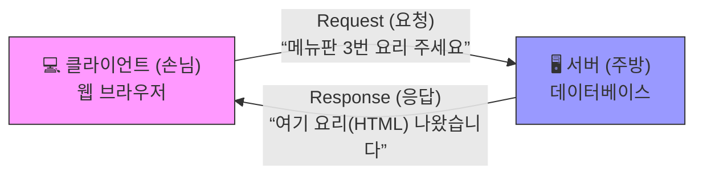

# 웹 통신의 규약: HTTP 프로토콜의 진화와 보안

현대 디지털 사회의 정보 교환은 “**프로토콜**”(Protocol)이라는 엄격한 기계적 통신 규약을 통해 이루어집니다. 디지털인문학의 관점에서 월드와이드웹(WWW)은 단순히 비물질적 가상 공간이 아닙니다. 그것은 해저 광케이블과 서버 랙, 그리고 이들을 논리적으로 연결하는 수학적 규칙들로 직조된 거대한 “**물질적 네트워크 장치**”입니다.

이 장에서는 웹 통신의 척추인 **HTTP**(HyperText Transfer Protocol)의 진화 과정을 매체 이론으로 해부하고, 감시 자본주의 시대에 데이터를 보호하기 위한 **HTTPS**의 암호화 메커니즘을 탐구합니다.

## 1. 클라이언트-서버 모델: 정보 교환의 대화 규칙

웹의 기저 구조는 정보를 요구하는 주체와 제공하는 객체 사이의 고도로 양식화된 대화로 이루어집니다. 이를 이해하기 위해 **거대한 식당**의 작동 방식에 비유해 보겠습니다.

1.  **메서드(Method)와 상태 코드(Status Code):** 클라이언트의 요청 첫 줄에는 **GET**(가져오기)이나 **POST**(기록하기) 같은 동사적 지시어인 “**메서드**”가 포함됩니다. 이에 대해 서버는 **200 OK**(성공)나 **404 Not Found**(부재) 같은 3자리 숫자의 “**상태 코드**”로 응답합니다. 이는 시스템의 파열을 증명하는 인식론적 기호로 작동합니다.
2.  **헤더(Header):** 편지 봉투의 겉면과 같습니다. 브라우저 종류, 언어 설정, 데이터 형식(Content-Type) 등 텍스트를 둘러싼 주변적 요소인 “**파라텍스트**”(Paratext) 역할을 수행합니다.
3.  **본문(Body):** 봉투 속의 내용물입니다. HTML 문서, 이미지, 동영상 스트리밍 데이터 등 실제 사용자가 소비하는 미디어 데이터가 담깁니다.

## 2. HTTP의 진화사: 단순성에서 속도의 혁명으로

HTTP는 1991년 팀 버너스 리에 의해 소박한 규약으로 시작되었으나, 멀티미디어 데이터의 폭발적 증가와 함께 근본적인 아키텍처를 갱신하며 진화해 왔습니다.

| 버전 | 발표 | 핵심 기술적 특징 | 인문학적 / 일상적 비유 |
| :--- | :--- | :--- | :--- |
| **HTTP/0.9** | 1991 | 원-라인 프로토콜. 헤더 없음. 오직 텍스트만 전송. | 사서에게 제목만 외치고 내용물만 받아오는 행위. |
| **HTTP/1.0** | 1996 | **헤더**와 **상태 코드** 도입. 이미지 등 멀티미디어 지원. | 내용물의 종류가 적힌 규격화된 편지 봉투의 탄생. |
| **HTTP/1.1** | 1997 | **지속 연결**(Keep-Alive), 파이프라이닝 도입. | 전화를 끊지 않고 여러 용건을 연달아 처리하는 방식. |
| **HTTP/2** | 2015 | **멀티플렉싱**(Multiplexing), 바이너리 프레이밍. | 1차선 비포장도로를 다차선 고속도로로 전면 확장. |
| **HTTP/3** | 2022 | **QUIC**(UDP 기반) 채택. 연결 마이그레이션 지원. | 철도(TCP)를 버리고 드론(UDP) 개별 배송으로 전환. |

### 2.1 전송 계층의 혁명: HTTP/3와 글로벌 사우스
HTTP/1.1과 2가 의존하던 **TCP**는 신뢰성은 높지만 패킷 하나만 유실되어도 전체 통신이 멈추는 “**HOL 블로킹**”(Head-of-Line Blocking) 문제를 안고 있었습니다. HTTP/3는 이를 극복하기 위해 가벼운 **UDP** 기반의 **QUIC** 프로토콜을 채택했습니다. 이는 특히 통신망이 불안정한 아프리카, 라틴아메리카 등 “**글로벌 사우스**”(Global South) 국가들의 정보 접근성을 개선하는 기술적 구원자로 평가받습니다.

## 3. HTTPS와 암호화 통신의 물리학

보안 장치가 없는 초기 HTTP는 은밀한 정보를 투명한 엽서에 적어 보내는 것과 같습니다. 누구나 길목에서 내용을 들여다보는 “**스니핑**”(Sniffing)이 가능했습니다. 이를 해결하기 위해 등장한 것이 “**HTTPS**”(HTTP Secure)입니다.

### 3.1 비대칭키 암호 방식의 미학
HTTPS는 현대 암호학의 정수인 “**비대칭키 암호 방식**”을 사용합니다. 이는 두 개의 짝을 이룬 자물쇠와 열쇠 비유로 설명할 수 있습니다.

* **공개키 (Public Key):** 누구나 볼 수 있는 “**열려 있는 자물쇠**”입니다. 사용자는 이 자물쇠로 데이터를 잠가 서버로 보냅니다. 한 번 잠기면 자물쇠를 건 본인조차 열 수 없습니다.
* **개인키 (Private Key):** 서버가 내실에 깊숙이 보관한 “**마스터키**”입니다. 오직 이 키로만 잠긴 자물쇠를 풀 수 있습니다.

이러한 수학적 기하학을 통해 우리는 사전에 열쇠를 교환하지 않고도 전 지구적 네트워크 위에서 안전한 “**비밀 통로**”(Secure Tunnel)를 형성합니다.

## 4. 정보 정치학과 에드워드 스노든 사태

2013년 **에드워드 스노든**의 폭로는 인터넷이 자유의 공간이 아니라 국가 감시망에 의한 “**파놉티콘**”(Panopticon)으로 전락했음을 알렸습니다. 이 사건을 기점으로 암호화는 금융 거래 도구를 넘어 시민의 기본권을 지키는 “**인권의 보호구**”로 재정규정되었습니다.

* **Let's Encrypt의 탄생:** 비영리 단체가 주도하여 유료였던 디지털 인증서를 무료화했습니다. 이는 자본의 특권이었던 보안을 대중에게 해방시킨 정보 통신 역사의 “**민주화 운동**”입니다.
* **플랫폼 권력의 개입:** 구글은 HTTPS를 사용하는 사이트에 SEO(검색 엔진 최적화) 가산점을 부여하고, 일반 HTTP 사이트에는 “**주의 요함**” 경고를 각인시켜 평문 통신의 종말을 이끌었습니다.

:::{seealso} 📖 추천 문헌 및 웹 리소스
프로토콜의 정치성과 네트워크 보안을 심층 연구하기 위한 핵심 문헌입니다. (KADH 인용 규정 준수)

* **Galloway, A. R. (2004).** <Protocol: How Control Exists after Decentralization>. MIT Press. <a href="https://hdl.handle.net/2027/heb.32042" target="_blank">WorldCat URI</a>
* **Chun, W. H. K. (2011).** <Programmed Visions: Software and Memory>. MIT Press. <a href="https://doi.org/10.7551/mitpress/9780262015424.001.0001" target="_blank">DOI Link</a>
* **Nissenbaum, H. (2009).** <Privacy in Context: Technology, Policy, and the Integrity of Social Life>. Stanford University Press. <a href="https://doi.org/10.1515/9780804772891" target="_blank">DOI Link</a>
* **Levy, S. (2001).** <Crypto: How the Code Rebels Beat the Government>. Penguin Random House. <a href="https://www.penguinrandomhouse.com/books/317300/crypto-by-steven-levy/" target="_blank">Publisher URI</a>
* **Terranova, T. (2004).** <Network Culture: Politics for the Information Age>. Pluto Press. <a href="https://www.jstor.org/stable/j.ctt18fs66v" target="_blank">JSTOR URI</a>
:::

---

## 💡 디지털인문학자를 위한 생각해볼 점

1.  **프로토콜이라는 통제:** 알렉산더 갤러웨이는 “**프로토콜은 분산화 이후에 존재하는 새로운 통제 권력**”이라 말했습니다. 기술적 규약을 지키지 않으면 정보 네트워크에서 자동 배제되는 현실은 민주주의적 가치와 어떻게 충돌할까요?
2.  **데이터의 물질적 흔적:** 암호화된 통신이라 할지라도 데이터가 이동하는 물리적 경로(해저 케이블, 라우터)는 실재합니다. 국가나 거대 자본이 이 “**물리적 길목**”을 장악했을 때, 논리적 암호화 기술은 어디까지 우리를 보호할 수 있을까요?
3.  **맥락적 무결성:** 헬렌 니슨바움이 주창한 “**맥락적 무결성**”의 관점에서, 우리의 사적 대화 데이터가 AI 학습용 데이터로 변환되어 네트워크를 떠도는 현상을 어떻게 평가해야 할까요?
