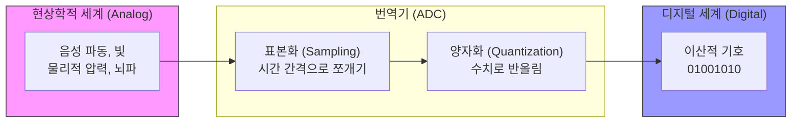

# 입출력 인터페이스의 진화와 매체 철학적 고찰

**디지털인문학**(Digital Humanities)은 인간의 사유, 문화, 역사적 기록을 정보 기술과 교차하여 탐구하는 학제간 연구 분야입니다. 이 융합적 체계에서 기계와 인간이 상호작용하는 물리적·논리적 경계면인 “**인터페이스**(Interface)”는 단순한 도구를 넘어, 인간의 지성과 신체적 감각을 디지털 세계로 확장하는 핵심적인 매개체입니다.

천공 카드 시대부터, 오늘날의 스마트폰, 그리고 인간의 뇌파를 직접 읽어내는 뇌-컴퓨터 인터페이스(BCI)에 이르기까지, 입출력 장치(I/O Interface)의 진화는 기술 발전을 넘어 인간 주체성과 매체 환경의 근본적인 변화를 동반했습니다.

이 장에서는 우리가 일상적으로 사용하는 키보드, 마우스, 모니터의 궤적을 쫓아 아날로그 자극이 디지털 신호로 번역되는 원리를 분석합니다. 나아가 UI/UX의 설계 철학과, 매체 스스로 존재를 지워버리는 “**투명성의 역설**(Paradox of Transparency)”을 매체 철학 관점에서 비판적으로 사유합니다.

## 1. 인터페이스의 기술적 진화: 고전적 입출력 장치의 해부학

### 1.1 기계 중심적 상호작용: 천공 카드와 명령줄 인터페이스(CLI)

여명기의 컴퓨팅은 극도로 기계 중심적이었습니다. 1890년 도입된 **천공 카드**는 인간이 기계의 이진법에 자신의 사고를 종속시켜야만 했던 시기를 상징합니다. 1960년대에는 텍스트 모니터가 결합된 텔레타이프 기반의 “**명령줄 인터페이스**”(CLI, Command-Line Interface)가 등장했습니다. 즉각적인 입력이 가능해졌으나, 복잡한 시스템 명령어를 암기해야 하는 인지적 부하가 높은 시대였습니다.

### 1.2 인간 지성의 증강과 GUI 패러다임

1968년, 스탠퍼드 연구소의 **더글러스 엔겔바트**(Douglas Engelbart)는 “**모든 데모의 어머니**(The Mother of All Demos)” 시연을 통해 현대 컴퓨팅의 청사진을 제시했습니다. 그는 마우스를 발명하고 윈도우 시스템을 선보이며, 컴퓨터를 단순한 수치 계산기가 아닌 “**인간 지성의 증강**”(Augmenting Human Intellect) 도구로 재정의했습니다.

이는 1970년대 제록스 PARC를 거쳐 “**그래픽 사용자 인터페이스**”(GUI, Graphical User Interface)로 구체화되었습니다. 텍스트 대신 화면에 렌더링 된 은유적 객체(아이콘)를 마우스로 조작하게 되면서, 주도권이 인간의 시각적 인지 능력으로 이양되었습니다.

### 1.3 현대 고전 하드웨어의 해부: 키보드, 마우스, 모니터

우리가 숨 쉬듯 사용하는 데스크톱 인터페이스는 고도의 공학과 역사적 유산의 결합체입니다.

* **키보드 (문화적 경로 의존성):** 키보드의 “**쿼티**”(QWERTY) 배열은 사실 타자기 시절, 금속 활자가 서로 엉키지 않도록 '의도적으로 타이핑 속도를 늦추기 위해' 고안된 비효율적 설계입니다. 그러나 이 물리적 유산은 디지털 시대에도 경로 의존성(Path Dependency)을 통해 그대로 살아남아 우리의 손가락을 지배하고 있습니다. 키보드 내부의 마이크로컨트롤러는 수 마이크로초 단위로 격자(Matrix) 회로에 전압을 흘려, 우리가 누른 물리적 스위치의 위치(좌표)를 0과 1로 번역해 냅니다.
* **마우스 (물리적 이동의 광학적 번역):** 초기 마우스가 고무공의 물리적 마찰을 이용했다면, 현대의 광학 마우스는 초소형 카메라입니다. 바닥 표면을 초당 수천 번 촬영한 뒤, “**디지털 신호 프로세서**”(DSP)가 직전 사진과 현재 사진의 미세한 픽셀 차이를 비교 분석하여 상대적 이동 거리($\Delta x, \Delta y$)를 계산해 냅니다.
* **모니터 (디지털의 시각적 재현):** 과거의 CRT 모니터가 전자총을 쏘아 형광물질을 태우는 거대한 아날로그 진공관이었다면, 현대의 OLED 패널은 수백만 개의 미세한 픽셀(Pixel) 자체가 독립적으로 빛을 내는 디지털의 시각화 장치입니다. 그래픽 처리 장치(GPU)가 연산한 이진수 색상 코드는 모니터 내부에서 정밀한 아날로그 전압으로 변환되어, 인간의 망막에 빛 에너지로 투사됩니다.

## 2. 모바일과 NUI, 그리고 차세대 인터페이스

### 2.1 모바일 혁명과 감각의 체화: 스마트폰

2007년 아이폰(iPhone)의 등장은 인터페이스 역사에 코페르니쿠스적 전환을 가져왔습니다. 키보드와 마우스라는 중간 매개체가 사라지고, 인간의 손가락이 디스플레이와 직접 맞닿는 “**자연 사용자 인터페이스**”(NUI, Natural User Interface)의 시대가 열린 것입니다.

* **정전식 터치 (Capacitive Touch):** 스마트폰 액정에는 미세한 전류가 흐릅니다. 전도체인 인간의 손가락이 닿으면 그 부분의 정전 용량이 변하고, 센서가 이 전압 변화를 읽어내어 터치 위치를 파악합니다.
* **멀티터치와 모빌리티:** 두 손가락으로 화면을 확대하는(Pinch-to-zoom) 행위는 인간의 본능적인 제스처를 디지털 명령으로 일치시킨 완벽한 사례입니다. 여기에 자이로스코프와 가속도 센서가 결합되면서, 스마트폰은 정적인 기계를 넘어 인간의 신체와 함께 이동하는 “**감각적 외연**”으로 진화했습니다.

### 2.2 공간 컴퓨팅과 스마트 글래스: 스크린의 해방

차세대 인터페이스인 가상현실(VR), 증강현실(AR), 확장현실(XR) 기기(예: 애플 비전 프로, 메타 스마트 글래스)는 인간을 사각의 평면 모니터라는 “**액자**” 밖으로 해방시킵니다. 

이른바 “**공간 컴퓨팅**”(Spatial Computing) 환경에서 디지털 데이터는 현실의 물리적 3차원 공간 위에 직접 덧씌워집니다. 사용자의 눈동자 움직임(Eye-tracking)이 마우스 커서가 되고, 허공에 젓는 손짓이 클릭이 됩니다. 디지털 세계와 아날로그 세계의 경계가 인터페이스를 통해 완전히 융해되는 현상입니다.

### 2.3 궁극의 결합: 뇌-컴퓨터 인터페이스 (BCI)

인터페이스 진화의 가장 극단적인 종착지는 근육의 움직임조차 생략하는 “**뇌-컴퓨터 인터페이스**”(BCI, Brain-Computer Interface)입니다. 

일론 머스크의 뉴럴링크(Neuralink)로 대표되는 이 기술은, 두개골에 미세한 칩을 이식하거나 뇌파(EEG) 센서를 통해 뉴런의 전기적 발화 신호를 직접 가로채어 디지털 코드로 해독합니다. 물리적 신체를 거치지 않고 인간의 “**사유(생각)**”가 곧바로 기계의 “**명령**”으로 직결되는 텔레파시적 상호작용입니다. 이는 인간 지성의 극단적 확장을 가져오지만, 동시에 외부의 기계가 내면의 생각을 해킹할 수 있다는 심각한 철학적, 윤리적 과제를 디지털인문학에 던집니다.

## 3. 존재론적 변환: 아날로그와 디지털의 번역 메커니즘

손가락의 압력, 음성, 뇌파 등 우리가 발생시키는 자극은 아날로그입니다. 이것이 컴퓨터로 들어가고 나오는 번역의 메커니즘은 다음과 같습니다.

* **ADC (아날로그-디지털 변환기):** 연속적인 파형을 특정 시간 간격으로 잘라내어(표본화), 가장 가까운 정수 값으로 반올림(양자화)하여 0과 1로 부호화합니다.
* **DAC (디지털-아날로그 변환기):** 연산이 끝난 이산 데이터를 다시 미세 전압으로 재생성하고 파형을 부드럽게 다듬어, 스피커의 진동이나 모니터의 빛으로 환원합니다.

## 4. UI/UX와 매체 철학 (디지털인문학적 관점)

### 4.1 UI와 UX의 차이: 기호학적 설계와 인지 심리학

현대 인터페이스를 논할 때 빼놓을 수 없는 개념이 UI와 UX입니다.
* **사용자 인터페이스 (UI, User Interface):** 폰트, 버튼의 색상, 레이아웃 등 사용자가 기계와 만나는 시각적, 물리적 “**디자인 형태**”입니다. 자동차로 치면 운전대와 계기판의 생김새입니다.
* **사용자 경험 (UX, User Experience):** 사용자가 시스템을 이용하며 느끼는 감정, 편의성, 태도 등 “**총체적인 심리적 경험**”입니다. 좋은 UX는 기호학과 인지 심리학을 바탕으로, 사용자가 별도의 학습 없이도 버튼을 보면 누르고 싶게 만드는 “**어포던스**”(Affordance, 행동 유도성)를 완벽하게 설계해 냅니다.

### 4.2 투명성의 역설 (Paradox of Transparency)

UX 설계의 궁극적 지향점은 사용자가 매개체의 존재를 잊게 만드는 “**자연스러움(투명성)**”입니다. 하지만 매체 철학은 이를 강하게 경고합니다. 

인터페이스가 투명해지고 편리해질수록, 그 기저에서 작동하는 거대한 데이터 수집 시스템, 알고리즘 연산, 빅테크 기업의 통제는 완벽하게 “**은폐**”(Blackboxing)되기 때문입니다. 스마트폰의 안면 인식이나 AI 스피커의 매끄러운 대화 이면에는 우리의 생체 정보와 사적 욕망을 자본화하는 감시망이 도사리고 있습니다. 투명성은 비판적 사유를 마비시키고 기계에 대한 맹목적 의존을 낳습니다.

### 4.3 도구적 존재론과 체화된 관계 (Embodiment Relations)

미국의 기술철학자 **돈 아이디**(Don Ihde)는 이를 현상학적 사유로 체계화했습니다.

그가 명명한 “**체화 관계**”(Embodiment Relations)는 “**(인간-기술) → 세계**”의 도식을 갖습니다. 우리가 능숙하게 스마트폰을 스크롤할 때, 기기는 지각의 대상이 아니라 시각장애인의 지팡이처럼 나의 신체 도식(Body Schema) 안으로 편입됩니다. 기계가 인간의 신체 일부로 융합되어 세계를 인식하는 렌즈가 되는 것입니다.

과거 CLI 시대에 인간과 기계가 “명령하는 주체”와 “복종하는 객체”였다면, BCI와 AI가 결합된 현재는 기계가 맥락을 사전 추론하고 선제적으로 행동을 제안하는 “**능동적 행위자**”(Agent)로 격상되었습니다. 디지털인문학은 이처럼 인터페이스가 인간의 인식론을 어떻게 은밀하게 구조화하는지 집요하게 해독해야 합니다.

:::{seealso} 📖 추천 문헌 및 웹 리소스
HCI의 매체 철학, UI/UX 설계, 그리고 매개 이론을 심층 연구하기 위한 핵심 문헌입니다. (KADH 인용 규정 준수)

* **Norman, D. A. (2013).** <The Design of Everyday Things>. Basic Books. (UX와 어포던스의 개념을 정립한 디자인 철학의 고전) <a href="[https://search.worldcat.org/title/812252065](https://search.worldcat.org/title/812252065)" target="_blank">WorldCat URI</a>
* **Bolter, J. D. & Grusin, R. (1999).** <Remediation: Understanding New Media>. MIT Press. <a href="[https://search.worldcat.org/title/remediation-understanding-new-media/oclc/39659396](https://search.worldcat.org/title/remediation-understanding-new-media/oclc/39659396)" target="_blank">WorldCat URI</a>
* **Ihde, D. (1990).** <Technology and the Lifeworld: From Garden to Earth>. Indiana University Press. <a href="[https://search.worldcat.org/title/technology-and-the-lifeworld/oclc/20263229](https://search.worldcat.org/title/technology-and-the-lifeworld/oclc/20263229)" target="_blank">WorldCat URI</a>
* **Engelbart, D. C. (1968).** “A Research Center for Augmenting Human Intellect”. <AFIPS '68 (Fall, part I)>. 395-410. <a href="[https://doi.org/10.1145/1476589.1476645](https://doi.org/10.1145/1476589.1476645)" target="_blank">DOI: 10.1145/1476589.1476645</a>
* **Heidegger, M. (1977).** “The Question Concerning Technology”. <The Question Concerning Technology and Other Essays>. Garland Publishing. <a href="[https://search.worldcat.org/title/question-concerning-technology/oclc/3238692](https://search.worldcat.org/title/question-concerning-technology/oclc/3238692)" target="_blank">WorldCat URI</a>
:::

---

## 💡 디지털인문학자를 위한 생각해볼 점

1.  **신체의 소외인가, 확장인가:** 스마트 글래스와 뇌-컴퓨터 인터페이스(BCI)는 마우스와 키보드라는 물리적 마찰을 완전히 없애줍니다. 근육의 노동이 사라지고 순수한 '생각'만으로 세계를 통제하게 될 때, 우리의 신체성은 어떤 인문학적 의미를 갖게 될까요?
2.  **은폐된 권력의 시각화:** 매끄러운 UX 디자인은 사용자에게 편안함을 주지만 알고리즘의 편향성을 가려버립니다. 디지털인문학자는 사용자들이 기계의 '블랙박스'를 인지하고 비판할 수 있도록, 이 불투명한 권력을 어떻게 다시 "가시화(Visualizing)" 할 수 있을까요?
