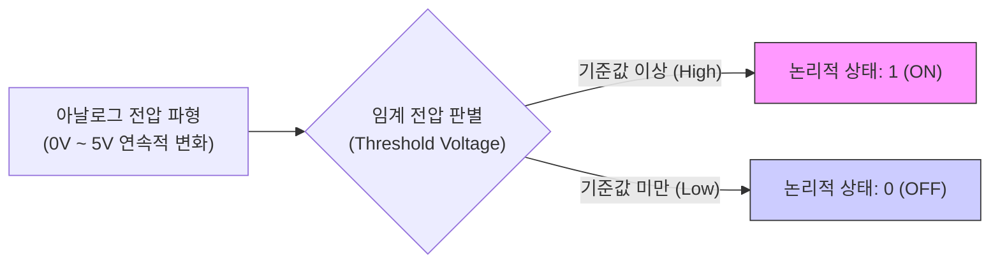
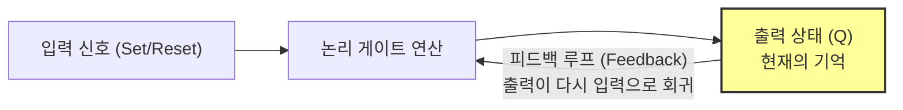

# 0과 1의 세계: 논리 연산과 비트

현대의 인문학은 텍스트와 유물을 해독하는 전통적인 문헌학적 단계를 넘어, 0과 1이라는 **이산적**(Discrete) 기호로 전면 재구성된 디지털 환경 속에서 새로운 국면을 맞이하고 있습니다.

**디지털인문학**(Digital Humanities)은 단순히 컴퓨터 분석법을 적용하는 도구적 방법론이 아닙니다. 이는 인간의 언어, 역사, 예술이 어떻게 추상적인 수학적 기호 체계로 환원되고, 전기적 회로를 통해 연산 가능한 데이터로 변환되며, 다시 감각 세계로 표출되는지를 탐구하는 거대한 **인식론적 전환**입니다.

이 장에서는 트랜지스터의 전압이 어떻게 비트(Bit)로 변환되는지 그 물리적 메커니즘을 분석하고, **조지 불**(George Boole)의 논리 대수가 **클로드 섀넌**(Claude Shannon)에 의해 전기 회로로 구현되는 과정을 추적합니다.

## 1. 전압에서 기호로: 트랜지스터와 이산성의 물리학

### 연속적 에너지에서 이산적 상태로

자연계의 물리적 에너지(전압, 전류)는 본래 **아날로그**(Analog)적이며 무한한 연속성을 지닙니다. 그러나 디지털 시스템은 이 무한한 연속성을 거부하고, 오직 **ON(참)**과 **OFF(거짓)**라는 두 가지 상태로만 세계를 인식합니다.

이러한 추상화의 핵심에는 **트랜지스터**(Transistor)가 있습니다. 트랜지스터는 전류의 흐름을 통제하는 “**전기적으로 제어되는 스위치**”입니다.

* **임계 전압 (Threshold Voltage):** 트랜지스터에 전류가 흐르기 시작하는 최소한의 전압 기준선입니다. 기계는 이 기준선을 통해 요동치는 전압을 0과 1로 강제 분절합니다.
* **여유 잡음 (Noise Margin):** 물리적 세계의 전압은 노이즈로 인해 흔들립니다. 하지만 디지털 회로는 “**2.0V 이상이면 무조건 1**”이라는 식으로 구간(Range)을 설정하여, 물리적 신호가 훼손되어도 수학적 기호(1)를 완벽하게 복원해 냅니다. 이는 언어학에서 물리적 소리(파롤)를 추상적 체계(랑그)로 인식하는 과정과 유사합니다.

## 2. 사유의 기계화: 불 대수와 전기 회로

도선을 흐르는 전압이 0과 1로 분절되었다면, 이 죽은 기호들은 어떻게 “**사유**”의 영역으로 진입할까요?

### 조지 불과 클로드 섀넌의 만남

19세기 수학자 **조지 불**은 인간의 논리적 추론을 수학적 방정식(불 대수)으로 표현했습니다. 그리고 20세기 공학자 **클로드 섀넌**은 이 추상적인 논리 대수가 전기 스위치 회로와 완벽하게 일치함을 증명했습니다.

* **직렬 연결 (Series) = AND 게이트:** 두 스위치가 모두 닫혀야 전기가 흐름 ($A \cdot B$)
* **병렬 연결 (Parallel) = OR 게이트:** 둘 중 하나만 닫혀도 전기가 흐름 ($A + B$)
* **반전 (Inverter) = NOT 게이트:** 신호가 오면 스위치가 열림 ($A'$)

섀넌의 발견은 “**추론 그 자체를 기계화할 수 있으며, 관념의 세계를 물리적 회로로 재현할 수 있음**”을 선언한 역사적 사건이었습니다.

## 3. 기억의 물질화: 플립플롭과 순차 논리

단순한 계산기를 넘어 정보 처리 장치가 되기 위해서는 연산 결과를 저장하는 “**기억**(Memory)”이 필요합니다. 디지털 세계에서 기억은 **플립플롭**(Flip-Flop)이라는 회로를 통해 구현됩니다.

### 피드백 루프: 과거를 현재로 되돌리기

기억의 핵심은 **피드백**(Feedback)입니다. 

**SR 플립플롭**과 같은 회로는 출력된 신호가 다시 입력으로 되돌아가는 루프 구조를 가집니다. 외부 신호가 사라져도, 회로는 자기 자신의 출력을 다시 입력으로 삼아 상태(1 또는 0)를 무한히 유지합니다. 이것이 바로 트랜지스터 덩어리가 1비트의 정보를 “**기억**”하는 물리적 원리이자, 기계가 시간성(History)을 갖게 되는 순간입니다.

## 4. 기호로 환원된 세계: 디지털 환원주의

**디지털인문학**의 과제는 이러한 기술적 성취를 넘어, 아날로그 세계가 이산적 기호로 환원될 때 발생하는 기호학적 파장을 분석하는 것입니다.

### 아날로그의 지표성 vs 디지털의 상징성

* **아날로그 (지표, Index):** 필름 사진이나 레코드판은 물리적 현실의 빛과 소리가 남긴 직접적인 흔적(Trace)입니다. 여기에는 연속성과 텍스처가 살아 있습니다.
* **디지털 (수치적 재현):** 디지털 변환은 대상을 잘게 쪼개어(Sampling) 수치로 치환합니다. 이 과정에서 물리적 연결고리(지표성)는 끊어지고, 0과 1이라는 자의적 기호만 남습니다. **프리드리히 키틀러**는 이를 두고 모든 감각 데이터가 “**표준화된 비트의 패턴**”으로 수렴해버렸다고 통찰했습니다.

### 분절의 역설: 가변성의 획득

그러나 이러한 단절은 역설적으로 극단적인 **가변성**(Variability)을 창출합니다. 무의미한 비트로 환원된 데이터는 원본의 훼손 없이 무한히 복제, 변형, 재조합될 수 있습니다. 인류는 이제 역사적 사유의 한계를 넘어, 알고리즘을 통해 텍스트와 이미지를 자유자재로 연산하는 **기술적 형상**의 차원으로 진입했습니다.

:::{seealso} 📖 추천 문헌 및 웹 리소스
디지털의 물리학적 기초와 매체 기호학을 심층 탐구하기 위한 핵심 문헌입니다. (KADH 인용 규정 준수)

* **Shannon, C. E. (1938).** “A Symbolic Analysis of Relay and Switching Circuits”. <Transactions of the American Institute of Electrical Engineers>. 57(12). 713-723. <a href="https://doi.org/10.1109/T-AIEE.1938.5057767" target="_blank">DOI: 10.1109/T-AIEE.1938.5057767</a>
* **Boole, G. (1854).** <An Investigation of the Laws of Thought>. Walton and Maberly. <a href="https://www.worldcat.org/oclc/001468872" target="_blank">WorldCat URI</a>
* **Kittler, F. A. (1999).** <Gramophone, Film, Typewriter>. Stanford University Press. <a href="https://www.sup.org/books/media-studies/gramophone-film-typewriter" target="_blank">Publisher URI</a>
* **Manovich, L. (2001).** <The Language of New Media>. MIT Press. <a href="https://doi.org/10.22230/cjc.2002v27n1a1280" target="_blank">DOI: 10.22230/cjc.2002v27n1a1280</a>
* **Hayles, N. K. (2005).** <My Mother Was a Computer: Digital Subjects and Literary Texts>. University of Chicago Press. <a href="https://scholars.duke.edu/publication/1050065" target="_blank">Publication URI</a>
:::

---

## 💡 디지털인문학자를 위한 생각해볼 점

1.  **기호의 자의성:** `01000001`이라는 비트열은 텍스트로는 'A', 색상으로는 '붉은색', 소리로는 '특정 음압'이 될 수 있습니다. 디지털 데이터의 의미가 이토록 해석기(Software)에 의존적이라면, 디지털 아카이브에 저장된 데이터의 "원본성"은 어디에 존재하는 것일까요?
2.  **기억의 물리성:** 인간의 기억은 뇌세포의 시냅스 연결로 존재하고, 컴퓨터의 기억은 플립플롭의 피드백 루프로 존재합니다. 전원이 꺼지면 사라지는 휘발성 메모리(RAM)와 인간의 망각 사이에는 어떤 철학적 유사성과 차이점이 있을까요?
