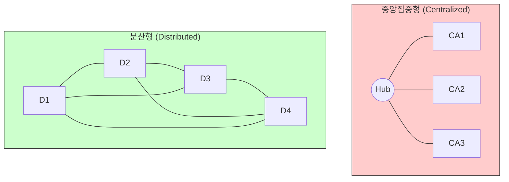

# 인터넷과 웹의 역사적 궤적

현대 디지털 인문학은 인류가 정보를 생산하고 소비하는 근본적인 환경인 **“인터넷”**(Internet)과 **“월드와이드웹”**(World Wide Web)이라는 거대한 기술-사회적 인프라스트럭처에 대한 이해를 요구합니다. 기술은 진공 상태에서 진화하지 않으며, 특정 시대의 정치, 군사적 요구, 학술적 비전이 교차하며 만들어진 사회적 구성물입니다.

이 장에서는 냉전의 공포에서 탄생한 분산 네트워크의 기원부터 지식 공유를 위한 웹의 발명, 그리고 브라우저 전쟁을 거쳐 웹 표준이 확립되기까지의 과정을 비판적으로 추적합니다.

## 1. 냉전의 불안과 분산 네트워크의 탄생

### 1.1 핵전쟁의 공포와 폴 배런의 위상수학
1960년대 초 쿠바 미사일 위기를 겪으며 미국은 선제 핵 공격 이후의 통신 생존성에 대한 극도의 공포를 느꼈습니다. 당시의 중앙집중화된 통신망은 허브 노드 하나만 파괴되어도 전체가 마비되는 취약점이 있었습니다.

전기공학자 **폴 배런**(Paul Baran)은 이를 극복하기 위해 사령탑이 없는 “**완전한 분산형 네트워크**”를 제안했습니다.

* **패킷 교환 (Packet Switching):** 메시지를 작은 조각(패킷)으로 잘라 목적지 주소를 부여하고 네트워크에 흩뿌려 보내는 방식입니다.
* **뜨거운 감자 라우팅:** 각 노드는 받은 패킷을 손을 데이지 않기 위해 옆 사람에게 넘기듯 최적의 우회 경로로 즉시 전달하며, 특정 선로가 파괴되어도 데이터는 스스로 길을 찾아 목적지에 도달합니다.

## 2. 아파넷(ARPANET)의 신화와 실체

### 2.1 생존성 신화의 해체와 자원 공유
인터넷의 역사를 오직 핵전쟁 대비용으로만 서술하는 것은 기술결정론적 오류입니다. 자넷 아바테(Janet Abbate)는 실제 아파넷이 군사적 목적보다는 **“값비싼 컴퓨터 자원의 공유”**(Resource Sharing)라는 학술적, 경제적 목표를 최우선으로 기획되었다고 지적합니다.

### 2.2 사용자에 의한 사회적 구성
아파넷은 설계자의 예측을 벗어나 사용자에 의해 그 성격이 변모했습니다. 초기 설계자들은 대용량 데이터 전송을 예상했으나, 실제 사용자(대학원생 및 연구원)들은 사적인 소통과 토론을 위한 **“이메일”**(E-mail)에 네트워크를 압도적으로 사용했습니다. 이는 기술의 의미가 실험실이 아닌 사회적 맥락 속에서 완성된다는 사실을 보여줍니다.

## 3. 매체적 층위: 인터넷 vs 월드와이드웹

디지털 인문학에서 이 둘의 존재론적 차이를 구분하는 것은 필수적입니다.

| 분석 층위 | 인터넷 (The Internet) | 월드와이드웹 (The Web) |
| :--- | :--- | :--- |
| **개념적 본질** | 전 세계 컴퓨터를 연결하는 **물리적 인프라** | 인프라 위에서 작동하는 **논리적 서비스** |
| **핵심 구조** | 하드웨어망, TCP/IP, 패킷 전송 | 소프트웨어 환경, HTTP, HTML, URL |
| **비유적 이해** | **도로망** 혹은 거대한 서점 건물 | 도로 위 **자동차** 혹은 서점 안의 책들 |
| **포괄 범위** | 상위 집합 (이메일, FTP, 게임 등 포함) | 부분 집합 (가장 널리 쓰이는 서비스) |

## 4. 팀 버너스 리와 하이퍼텍스트의 혁명

1989년 CERN(유럽입자물리연구소)의 정보 관리 위기를 해결하기 위해 **팀 버너스 리**(Tim Berners-Lee)는 하이퍼텍스트와 인터넷을 결합한 보편적 정보 시스템을 제안했습니다.

* **노드와 링크:** 지식의 단위인 노드(Node)와 이들 간의 의미론적 관계를 규명하는 링크(Link)로 구성됩니다.
* **보편적 열람:** 중앙의 허가 없이 누구나 정보를 자유롭게 가리키고 접근할 수 있는 열린 철학을 지향했습니다.
* **협력적 저작:** 최초의 웹 브라우저는 뷰어인 동시에 직접 정보를 수정할 수 있는 편집기(Editor) 기능을 통합하여 고안되었습니다.

## 5. 기술적 타협: 제나두(Xanadu) vs 웹(Web)

테드 넬슨(Ted Nelson)은 웹이 탄생하기 수십 년 전부터 **“제나두 프로젝트”**를 통해 완벽한 하이퍼텍스트 비전을 제시했습니다.

1.  **제나두의 이상:** 양방향 링크, 엄격한 저작권 보호, 영구적 버전 관리를 지향했습니다.
2.  **웹의 타협:** 단방향 링크와 버전 관리 부재로 인해 “**404 Not Found**”라는 고질적인 결함을 가집니다.
3.  **승리의 이유:** 역설적이게도 웹의 **“불완전함”**이 진입 장벽을 낮추어 폭발적인 확장을 가능케 했습니다. 단순함이 완벽함을 이긴 기술 진화의 사례입니다.

## 6. 브라우저 전쟁과 권력의 획득

웹 브라우저는 단순한 뷰어가 아니라 인간이 세계의 정보를 인식하는 방식을 규정하는 **“인식론적 창구”**입니다.

* **제1차 전쟁:** 넷스케이프와 마이크로소프트(IE)의 대결입니다. 마이크로소프트는 윈도우 운영체제에 IE를 끼워 파는 번들링 전략으로 시장을 독점했습니다.
* **제2차 전쟁:** 구글의 **크롬**(Chrome)이 압도적인 렌더링 속도와 보안(샌드박싱) 기능을 무기로 승리하며 새로운 정보 유통 패권자가 되었습니다.

## 7. 개방성의 수호: 웹 표준 프로젝트

상업 기업들이 자사 브라우저에서만 작동하는 독점 태그(예: `<blink>`)를 쏟아내며 웹을 사유화하려 하자, 이를 막기 위한 투쟁이 일어났습니다.

1.  **W3C의 설립:** 팀 버너스 리는 기기와 브라우저에 종속되지 않는 공통 규격(HTML, CSS) 제정을 위해 컨소시엄을 세웠습니다.
2.  **WaSP(말벌)의 행동주의:** 실무 개발자들은 기업들이 표준을 준수하도록 압박하고 **“애시드 테스트”**(Acid Test)를 통해 기술적 결함을 공개적으로 드러냈습니다.
3.  **표준의 윤리:** 웹 표준의 확립은 모든 인간이 차별 없이 정보에 접근할 수 있어야 한다는 “**매체적 평등**”을 쟁취한 디지털 민주주의의 승리입니다.

:::{seealso} 📖 추천 문헌
인터넷과 웹의 매체사를 깊이 있게 탐구하기 위한 핵심 도서입니다.

* **Abbate, J. (1999).** <Inventing the Internet>. MIT Press. (기술결정론적 신화를 타파한 과학기술학의 고전).
* **Berners-Lee, T. (1999).** <Weaving the Web>. HarperSanFrancisco. (웹 창시자의 육성으로 듣는 WWW의 탄생 비화).
* **Castells, M. (2001).** <The Internet Galaxy>. Oxford University Press. (네트워크 사회의 도래를 정밀하게 규명한 명저).
* **Russell, A. L. (2014).** <Open Standards and the Digital Age>. Cambridge University Press. (개방성 이데올로기의 역사를 탐구).
* **Brügger, N., & Laursen, D. (2018).** <The Historical Web and Digital Humanities>. Routledge. (웹 아카이브 연구와 DH의 접점 모색).
:::

---

## 💡 디지털인문학자를 위한 생각해볼 점

1.  **중앙의 복원:** 분산형으로 설계된 인터넷 위에서 구글이나 메타와 같은 거대 플랫폼이 정보를 독점하는 현재의 **“재중앙화”** 현상을 어떻게 비판적으로 바라보아야 할까요?
2.  **링크의 취약성:** 웹의 단방향 링크 구조가 초래하는 정보의 소실(404 에러)은 디지털 아카이브를 구축하는 인문학자들에게 어떤 기술적, 철학적 과제를 던져주나요?
3.  **표준과 권력:** 기술적 표준(HTML/CSS)이 단순한 규칙을 넘어, 사회적 소수자나 장애인의 정보 접근권을 보장하는 **“정치적 도구”**로 기능하는 사례를 찾아봅시다.

