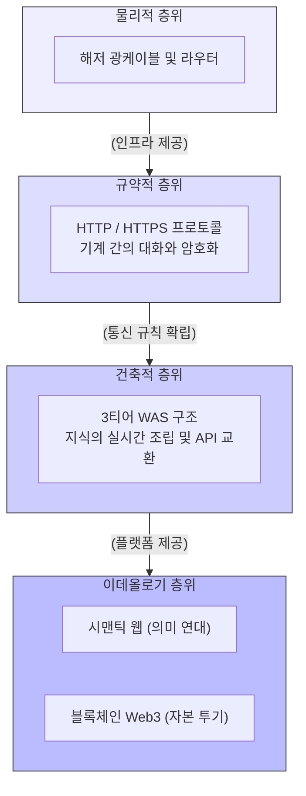

# 네트워크와 웹 기술의 통합적 이해

디지털인문학의 무대는 모니터 너머의 추상적이고 비물질적인 가상 공간이 아닙니다. 그것은 심해를 가로지르는 해저 광케이블의 “**물질성**”과 기계들이 대화하는 “**프로토콜**”의 엄격한 규칙, 그리고 데이터를 실시간으로 조립해 내는 거대한 서버 “**아키텍처**” 위에 세워진 고도로 복합적인 기술-사회적 영토입니다.

이 장에서는 앞서 상세히 다룬 인터넷의 역사, HTTP 규약, 웹 아키텍처, 그리고 웹 3.0의 매체 철학적 쟁점들을 하나의 거시적인 조감도로 통합하여 살펴봅니다. 

## 1. 기반 인프라: 분산된 영토와 지식의 거미줄

대중은 흔히 인터넷과 웹을 혼용하지만, 매체 고고학적 관점에서 이 둘은 명확히 구분되는 존재론적 층위를 지닙니다.

* **인터넷 (물리적 인프라):** 1960년대 핵전쟁의 공포 속에서 중앙 집중식 통신의 취약점을 극복하기 위해 고안된 “**아파넷**”(ARPANET)에서 출발했습니다. 데이터를 잘게 쪼개어 보내는 “**패킷 교환**” 방식을 통해, 특정 노드가 파괴되어도 살아남는 “**분산 네트워크**”를 형성했습니다. 인터넷은 지식을 실어 나르는 거대한 “**도로망**”이자 심해 광케이블에 종속된 물리적 인프라입니다.
* **웹 (논리적 서비스):** 1990년 유럽 입자 물리 연구소(CERN)의 **팀 버너스 리**(Tim Berners-Lee)가 발명한 웹(WWW)은 인터넷이라는 도로 위에 세워진 거대한 “**도서관**” 혹은 “**자동차**”입니다. “**하이퍼텍스트**”를 통해 전 세계의 파편화된 정보를 비선형적으로 연결하며 지식의 보편적 공유를 이끌어냈습니다.

## 2. 규약과 조립: 기계의 대화와 동적 아카이브

이 거대한 네트워크 위에서 지식이 생산되고 유통되기 위해서는 엄격한 규칙과 조립의 메커니즘이 필요합니다.

### 2.1 HTTP와 프로토콜의 정치학
웹은 브라우저(클라이언트)가 정보를 요청(Request)하고 서버가 응답(Response)하는 비대칭적 교섭으로 작동합니다. 이 대화의 규칙이 바로 **HTTP**입니다. 초기의 단순한 텍스트 전송(0.9)에서 시작하여, 메타데이터를 담은 헤더의 도입(1.0), 지속 연결(1.1), 그리고 데이터를 동시다발적으로 처리하는 멀티플렉싱(HTTP/2)과 UDP 기반의 혁명(HTTP/3)으로 진화하며 정보 전송의 물리적 한계를 극복해 왔습니다.

### 2.2 지식 조립 공장: 3티어(3-Tier) 아키텍처
현대의 웹은 완성된 문서를 그대로 보여주는 “**정적 페이지**”가 아닙니다. 사용자의 질의에 따라 실시간으로 지식을 연출해내는 “**동적 시스템**”입니다.
* **웹 서버 (프레젠테이션):** 가공된 지식을 시각적으로 전시하는 인터페이스입니다.
* **WAS (애플리케이션):** 데이터베이스에서 원시 데이터를 꺼내 인문학적 맥락과 알고리즘에 맞게 실시간으로 지식을 조립하는 “**해석학적 처리기**”입니다.
* **데이터베이스 (데이터):** 원시 사료를 영구 보존하는 수장고입니다.

더불어 **API**는 이러한 기계와 기계가 인간의 개입 없이 구조화된 데이터(XML, JSON)를 직접 교환하게 해주는 거대한 통역관 역할을 수행합니다.

## 3. 감시와 저항: HTTPS의 암호화 물리학

인터넷은 태생적으로 모든 데이터가 평문으로 전송되는 투명한 “**감시의 공간**”이었습니다. 2013년 에드워드 스노든의 폭로는 네트워크가 국가 권력의 “**파놉티콘**”으로 전락했음을 고발했습니다.

이에 대항하여 웹 생태계는 “**비대칭키 암호 방식**”을 활용한 **HTTPS**를 전면 도입했습니다. 누구나 볼 수 있는 “**공개키**”로 데이터를 잠그고, 오직 서버만이 가진 “**개인키**”로만 풀 수 있게 만드는 이 수학적 기하학은, 암호화를 자본의 전유물에서 시민의 기본권으로 격상시킨 매체 철학적 승리입니다.

## 4. 웹 3.0의 두 얼굴: 의미론적 연대 대 자본의 투기

네트워크 기술의 최전선에서는 “**웹 3.0**”이라는 기표를 두고 두 가지 상반된 이데올로기가 격돌하고 있습니다.

1.  **지식의 웹 (시맨틱 웹):** 팀 버너스 리가 주창한 본래의 웹 3.0입니다. 데이터에 기계가 이해할 수 있는 의미(Ontology)를 부여하고 개방형 연결 데이터(LOD)로 엮어, 인간과 기계가 협력하는 진정한 인식론적 탈중앙화를 지향합니다.
2.  **자본의 웹 (Web3):** 블록체인과 암호화폐를 기반으로 한 투기적 담론입니다. 이들은 탈중앙화를 약속하지만, 실상은 예술품부터 지식까지 모든 상호작용을 자산으로 변형시키는 “**모든 것의 자산화**”(Assetization)를 추구합니다. 이는 인터넷 공유지에 울타리를 치는 “**디지털 엔클로저**”이자 새로운 형태의 렌트 자본주의라는 비판을 받습니다.

:::{seealso} 📖 추천 문헌 및 웹 리소스
네트워크 인프라의 거시적 이해를 돕는 핵심 문헌입니다. (세부 각론의 문헌 종합)

* **Abbate, J. (1999).** <Inventing the Internet>. MIT Press. <a href="https://search.worldcat.org/title/41431665" target="_blank">WorldCat URI</a>
* **Starosielski, N. (2015).** <The Undersea Network>. Duke University Press. <a href="https://doi.org/10.1215/9780822376224" target="_blank">DOI Link</a>
* **Berners-Lee, T., Hendler, J., & Lassila, O. (2001).** “The Semantic Web”. <Scientific American>. 284(5). 34-43. <a href="https://doi.org/10.1038/scientificamerican0501-34" target="_blank">DOI Link</a>
* **Galloway, A. R. (2004).** <Protocol: How Control Exists after Decentralization>. MIT Press. <a href="https://hdl.handle.net/2027/heb.32042" target="_blank">WorldCat URI</a>
* **Andrejevic, M. (2007).** “Surveillance in the Digital Enclosure”. <The Communication Review>. 10(4). 295-317. <a href="https://doi.org/10.1080/10714420701715365" target="_blank">DOI Link</a>
:::

---

## 💡 디지털인문학자를 위한 통합적 사유

1.  **인프라의 붕괴와 지식의 지속성:** 해저 광케이블망이 훼손되거나 WAS 서버가 중단되는 물리적 위기 상황 속에서, 동적으로 생성되는 디지털 지식의 영속성을 어떻게 담보할 수 있을까요?
2.  **프로토콜의 이데올로기:** 우리가 사용하는 브라우저와 HTTP 통신 규칙은 가치중립적일까요? 감시와 저항(HTTPS), 독점과 개방(웹 표준)의 역사 속에서 기술 규약이 어떻게 “**권력의 도구**”로 작동했는지 성찰해 봅시다.
3.  **지식의 자산화 거부:** 블록체인이 강제하는 “**모든 것의 자산화**”에 맞서, 시맨틱 웹과 인문학적 지식 커먼즈(Knowledge Commons)를 수호하기 위해 연구자들은 어떤 기술적·실천적 대안을 마련해야 할까요?