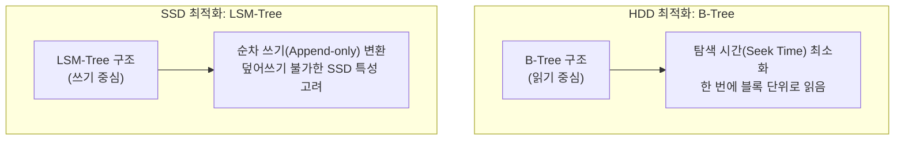

# 기계적 기억에서 알고리즘적 망각으로

디지털인문학은 단순히 텍스트를 디지털로 옮기는 것이 아니라, 인류가 지식을 보존해 온 “**매체적 조건**”(Mediatic Condition) 자체를 묻는 학문입니다.

우리는 “클라우드”라는 은유 속에서 데이터가 영구불변할 것이라 착각하지만, **프리드리히 키틀러**가 말했듯 모든 데이터는 금속, 규소, 전자의 물리적 상태에 종속된 **물질적 사건**입니다.

이 장에서는 천공 카드에서 SSD, 그리고 영구 보존을 꿈꾸는 최신 기술에 이르는 저장 매체의 진화 과정을 추적하고, 이것이 데이터 접근 방식(순차 vs 임의)과 아카이브의 철학에 미친 영향을 분석합니다. 나아가 디지털 매체가 가진 치명적인 약점인 “**보존의 역설**”을 매체 고고학적 관점에서 비판적으로 고찰합니다.

## 1. 기호와 물질의 교차: 저장 매체의 기술적 진화

데이터를 기계가 읽을 수 있는 형태로 물질에 새기는 기술은 **기계적 천공**, **전자기적 자화**, **광학적 반사**, 그리고 **양자역학적 전자 포획**이라는 혁명적 단계를 거쳐 발전했습니다.

### 1.1 기계적 천공: 천공 카드 (Punch Card)

1890년 미국 인구조사에 쓰인 **천공 카드**는 종이에 구멍을 뚫어 0과 1을 표현했습니다.
* **원리:** 구멍이 있으면 전류가 흐르고(1), 없으면 차단됩니다(0).
* **특징:** 한 번 뚫으면 수정할 수 없는 “**1회 기록성**”(Write-Once) 매체였으며, 물리적 부피가 엄청났습니다. (현대 터미널의 80자 너비 제한은 80열 천공 카드의 유산입니다.)

### 1.2 자성과 이력 현상: 자기 테이프 (Magnetic Tape)

**자기 테이프**는 전자기 유도를 이용해 플라스틱 필름 위의 자성 입자를 N극/S극으로 정렬시킵니다.
* **혁신:** 지웠다 쓸 수 있는(Rewrite) 경제성을 확보했고, 전기가 없어도 자성이 유지되는 **비휘발성** 매체입니다.
* **한계:** 데이터를 읽으려면 테이프를 처음부터 감아야 하는 “**순차 접근**”(Sequential Access) 방식이라 검색 속도가 느립니다.

### 1.3 회전하는 평면: 하드 디스크 드라이브 (HDD)

IBM이 1956년 상용화한 **HDD**는 고속으로 회전하는 원판(Platter) 위를 헤드가 비행하며 데이터를 읽습니다.
* **혁신:** 원하는 위치로 헤드를 즉시 이동시키는 “**임의 접근**”(Random Access)을 통해 데이터베이스의 검색 속도를 혁명적으로 단축했습니다.

### 1.4 이동형 매체와 유령 아이콘: 플로피 디스크와 CD-ROM

1980년대 이후 PC의 보급과 함께 데이터를 물리적으로 이동시키기 위한 휴대용 매체들이 등장했습니다.
* **자기와 광학의 교차:** 자성을 이용한 얇은 필름 형태의 **플로피 디스크**(Floppy Disk)를 거쳐, 레이저로 디스크 표면의 미세한 홈(Pit)과 평면(Land)의 반사율 차이를 읽어내는 **CD-ROM**, **DVD**, **블루레이**(Blu-ray) 같은 광학 매체로 진화했습니다.
* **매체 철학적 시사점 (스큐어모프):** 흥미로운 지점은 오늘날 MS 워드나 한글 프로그램에서 사용되는 “**저장(Save)**” 아이콘입니다. 이 아이콘은 3.5인치 플로피 디스크의 모양을 하고 있습니다. 물리적인 매체는 이미 수십 년 전에 멸종했지만, 기호학적인 표상(스큐어모프, Skeuomorph)으로 살아남아 현대인들에게 “**기억의 저장**”을 지시하는 유령 같은 존재가 된 것입니다.

### 1.5 양자 터널링: 낸드 플래시 메모리 (SSD)

현대 컴퓨팅의 총아인 **SSD**는 모터와 같은 기계 부품을 완전히 없앴습니다.
* **원리:** “**파울러-노르트하임 터널링**”(Fowler-Nordheim Tunneling)이라는 양자 역학적 현상을 이용해, 전자를 절연체(산화막) 너머의 플로팅 게이트에 가두어 데이터를 저장합니다.
* **한계:** 전자가 산화막을 뚫고 지나갈 때마다 미세한 손상이 누적되어, 수명(쓰기 횟수)에 물리적 한계가 있습니다.

## 2. 접근 방식의 혁명과 데이터베이스 아키텍처

저장 매체의 진화는 데이터에 접근하는 방식을 **순차 접근**에서 **임의 접근**으로 바꾸어 놓았습니다. 이는 현대 데이터베이스 구조를 결정짓는 핵심 요인이 되었습니다.

### 2.1 B-Tree와 LSM-Tree: 하드웨어에 맞춘 진화

데이터베이스의 자료 구조는 추상적인 수학이 아니라, 하드웨어의 물리적 특성을 극복하기 위한 공학적 산물입니다.

* **B-Tree (HDD 시대):** 헤드가 움직이는 물리적 시간을 줄이기 위해, 트리의 높이를 낮추고 한 번에 많이 읽도록 설계되었습니다. (읽기 최적화)
* **LSM-Tree (SSD 시대):** 덮어쓰기가 불가능하고 수명이 제한된 SSD를 위해, 데이터를 수정하지 않고 새로운 내용을 끝에 덧붙이는(Append-only) 방식을 사용합니다. (쓰기 최적화)

## 3. 기억과 망각의 매체 철학: 보존의 역설

디지털 매체는 무한한 복제를 약속하지만, 역설적으로 아날로그보다 훨씬 취약합니다.

### 3.1 아카이브의 아킬레스건: 비트 부패와 단종

* **비트 부패 (Bit Rot):** 열역학 법칙에 따라, 플래시 메모리에 갇힌 전자는 시간이 지나면 자연적으로 빠져나갑니다. 단 1비트만 변해도 파일 전체가 열리지 않을 수 있습니다.
* **포맷 단종 (Format Obsolescence):** 1986년 BBC의 “**둠스데이 프로젝트**”는 최첨단 레이저디스크에 데이터를 담았지만, 15년 뒤 재생 장치가 단종되어 읽을 수 없게 되었습니다. 반면 900년 전의 양피지 원본은 여전히 읽을 수 있습니다. 이것이 바로 “**디지털 암흑시대**”의 경고입니다.

### 3.2 영구 보존을 향한 공학적 반격: 프로젝트 실리카

디지털의 필연적인 붕괴(휘발성)에 맞서, 아카이브를 영구적으로 물리화하려는 시도도 존재합니다. 대표적인 것이 마이크로소프트(MS)가 추진 중인 “**프로젝트 실리카**”(Project Silica)입니다.

이는 펨토초 레이저를 이용해 단단한 석영 유리(Quartz glass) 내부에 데이터를 3차원 복셀(Voxel) 형태로 새겨 넣는 기술입니다. 전자기파나 열, 물에 영향을 받지 않아 수천 년 이상 데이터를 보존할 수 있습니다. 이는 데이터를 부패하기 쉬운 전자 상태에서 구출하여, 고대 수메르의 점토판처럼 “**디지털 화석**”으로 만들려는 현대 공학의 기념비적 투쟁입니다.

### 3.3 아카이브의 열병과 죽음 충동

**자크 데리다**는 저서 『아카이브의 열병』에서, 기억을 영구 보존하려는 욕망(“**아카이브 열병**”) 이면에는 모든 것을 지워버리려는 “**죽음 충동**”(Death drive)이 숨어 있다고 통찰했습니다.

이는 SSD의 작동 원리와 소름 끼치도록 닮아 있습니다. SSD는 새로운 데이터를 쓰기(기억) 위해 반드시 기존 데이터를 고전압으로 지워야(망각) 하며, 이 과정이 반복될수록 매체는 물리적 죽음(수명 고갈)에 가까워집니다. 기억하려는 행위 자체가 매체의 파괴를 가속화하는 것입니다.

:::{seealso} 📖 추천 문헌 및 웹 리소스
저장 매체의 진화와 디지털 아카이브의 철학을 다룬 핵심 문헌입니다. (KADH 인용 규정 준수)

* **Ernst, W. (2013).** <Digital Memory and the Archive>. University of Minnesota Press. <a href="[https://search.worldcat.org/title/800038481](https://search.worldcat.org/title/800038481)" target="_blank">WorldCat URI</a>
* **Derrida, J. (1996).** <Archive Fever: A Freudian Impression>. University of Chicago Press. <a href="[https://search.worldcat.org/title/33946890](https://search.worldcat.org/title/33946890)" target="_blank">WorldCat URI</a>
* **Chen, S. (2001).** “The Paradox of Digital Preservation”. <Computer>. 34(3). 24-28. <a href="[https://doi.org/10.1109/2.910890](https://doi.org/10.1109/2.910890)" target="_blank">DOI: 10.1109/2.910890</a>
* **Kittler, F. A. (1999).** <Gramophone, Film, Typewriter>. Stanford University Press. <a href="[https://search.worldcat.org/title/39659424](https://search.worldcat.org/title/39659424)" target="_blank">WorldCat URI</a>
* **Brothman, B. (1997).** “Derrida, Archive Fever: A Freudian Impression”. <Archivaria>. 43. 177-182. <a href="[https://archivaria.ca/index.php/archivaria/article/view/12183](https://archivaria.ca/index.php/archivaria/article/view/12183)" target="_blank">Archivaria URI</a>
:::

---

## 💡 디지털인문학자를 위한 생각해볼 점

1.  **스큐어모프와 미디어의 흔적:** 플로피 디스크 모양의 저장 아이콘처럼, 우리는 더 이상 존재하지 않는 과거 매체의 은유를 빌려 현재의 디지털 환경을 통제합니다. 오늘날 우리가 사용하는 인터페이스(폴더, 데스크톱, 휴지통) 중 또 어떤 것들이 죽은 미디어의 유령일까요?
2.  **망각할 권리 vs 영구적 기록:** "프로젝트 실리카"처럼 수천 년간 파괴되지 않는 매체가 상용화된다면, 인류의 흑역사나 개인의 지우고 싶은 흔적조차 지층에 영구적으로 각인될 수 있습니다. 매체의 영구성은 인문학적으로 축복일까요, 아니면 저주일까요?
