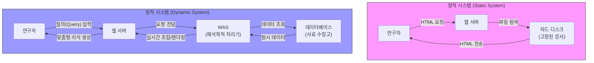

# 웹 아키텍처와 지식 생산 인프라

**디지털인문학**(Digital Humanities)은 단순히 인문학 연구에 기술을 도입하는 도구적 융합을 넘어, 지식이 구조화되고 유통되는 매체 자체를 비판적으로 재구성하는 학문적 실천입니다. 현대의 인문학적 지식은 서버의 구조, 데이터베이스의 스키마, 그리고 기계 간 통신 규약에 의해 그 지형이 결정됩니다.

**매슈 커션바움**(Matthew Kirschenbaum)이 지적하듯, 디지털 텍스트는 결코 비물질적이지 않으며 소프트웨어 아키텍처라는 구체적인 “**포렌식적 물질성**”(Forensic Materiality)에 기반을 둡니다. 이 장에서는 정적 아카이브에서 동적 시스템으로의 전환 과정을 추적하고, 지식을 실시간으로 조립하는 **WAS**(Web Application Server)와 **API**의 구조를 매체 철학적 관점에서 해부합니다.

## 1. 정적 페이지에서 동적 시스템으로: 지식의 공연성

초기 웹(1990년대)의 지식 생산은 인쇄 매체의 패러다임을 디지털로 이식한 “**정적**(Static) **페이지**” 형태였습니다.

* **정적 아카이브:** 웹 서버가 디스크에 이미 완성된 형태로 존재하는 HTML 문서를 찾아 그대로 전송하는 방식입니다. 이는 “**하나의 파일이 곧 하나의 문서**”라는 고정된 대응 관계를 가집니다.
* **동적 시스템의 등장:** 사용자의 요청이 도착하는 즉시 데이터베이스를 조회하고 정보를 가공하여 HTML을 실시간으로 “**생성**(Render)”해내는 방식입니다.

**미겔 에스코바르 바렐라**(Miguel Escobar Varela)는 이러한 동적 시스템 기반의 아카이브를 공연학의 개념을 빌려 “**레퍼토리**”(Repertoire)로 재정의합니다. 고정된 실체가 아니라, 사용자의 개입과 시스템의 응답이 교차하는 순간에만 일시적으로 현현하는 동태적 프로세스로 지식이 전환된 것입니다.

## 2. 지식 조립 공장: 3티어 아키텍처와 WAS

현대 웹 인프라는 애플리케이션을 세 개의 독립된 층위로 분리하는 “**3티어**(3-Tier) **아키텍처**”를 지배적 패러다임으로 사용합니다. 이를 레스토랑의 운영 체계에 빗대어 분석할 수 있습니다.

| 계층 (Tier) | 레스토랑 비유 | 주요 기술 인프라 | 인문학적 역할 |
| :--- | :--- | :--- | :--- |
| **프레젠테이션 계층** | **홀(Dining Room)** | Web Server, HTML, CSS, JavaScript | 가공된 지식의 시각화 및 연구자와의 인터페이스 제공 |
| **애플리케이션 계층** | **주방(Kitchen)** | **WAS** (Tomcat, Python 등) | 지식의 실시간 조립, 질의의 **해석학적 처리** |
| **데이터 계층** | **식자재 창고(Pantry)** | RDBMS (MySQL, PostgreSQL 등) | 원시 사료의 영구적 보존 및 데이터 무결성 확보 |

이 구조의 핵심은 “**관심사의 분리**”(Separation of Concerns)입니다. 텍스트 원본(Data)을 전혀 훼손하지 않은 채, 분석 알고리즘(Logic)만을 수정하여 완전히 새로운 분석 결과를 도출하거나 시각화 방식(Presentation)을 모바일·VR 등으로 자유롭게 확장할 수 있는 유연성을 제공합니다.

## 3. 기계와 기계의 대화: 지식 교환의 항구, API

**WAS**가 내부에서 지식을 조립하는 공장이라면, **API**(Application Programming Interface)는 완성된 지식을 외부 세계와 연결하는 거대한 항구이자 범용 통역관입니다.

* **기계 가독형 데이터:** 연구자가 직접 웹사이트에 접속해 데이터를 복사하는 대신, 스크립트(기계)가 대상 기관의 서버(기계)에 직접 질의를 던져 군더더기 없는 데이터를 추출합니다.
* **디지털 밀리외 (Digital Milieu):** 철학자 **육 후이**(Yuk Hui)는 디지털 객체들이 자신의 경계를 넘어 교류하는 환경을 강조합니다. API는 개별 프로젝트에 고립된 자원들을 하나의 글로벌 의미망으로 직조해 냅니다.
* **사례:** 독일 라이프치히 대학의 **DFHG 프로젝트**는 고대 그리스 텍스트를 API로 개방하여, 전 세계 연구자들이 실시간으로 데이터를 호출해 연결망 분석을 수행할 수 있게 돕습니다.

## 4. 데이터 교환 형식의 존재론: XML vs JSON

API를 통해 기계들이 대화를 나눌 때 사용하는 데이터 포맷은 지식을 인식하는 한계와 가능성을 결정짓는 “**모양**”(Shape)입니다.

### 4.1 XML: 문서의 심층 구조와 보존
**XML**(eXtensible Markup Language)은 텍스트에 의미론적 구조를 부여하기 위한 언어입니다. 
* **장점:** “**혼합 콘텐츠**”(Mixed Content) 처리에 탁월합니다. 본문 속에 화자, 장소, 지워진 흔적 등을 태그로 삽입하여 맥락을 섬세하게 보존할 수 있어 **TEI** 인코딩의 표준이 되었습니다.
* **단점:** 태그의 반복으로 구조가 장황하며(Bulky), 기계가 읽어 들이는 속도가 상대적으로 느립니다.

### 4.2 JSON: 기계적 효율성과 속도
**JSON**(JavaScript Object Notation)은 웹 애플리케이션의 발전과 함께 부상한 경량 포맷입니다.
* **장점:** 문법이 단순하여 기계가 즉각적으로 처리하는 속도가 압도적으로 빠릅니다. 현대 웹 생태계와 **RESTful API**의 사실상 표준입니다.
* **단점:** 텍스트 중간에 태그를 삽입하는 기능이 결여되어, 연속된 흐름을 지닌 문학 텍스트 자체를 모델링하기에는 부적합합니다.

**융합과 상호보완:** 진보된 인프라는 데이터 계층에서 원본 보존을 위해 **XML**을 사용하고, 이를 브라우저로 전송하거나 API로 서비스할 때는 **WAS**가 핵심 메타데이터만 추출하여 **JSON**으로 실시간 변환(Serialization)하여 제공하는 방식을 취합니다.

:::{seealso} 📖 추천 문헌 및 웹 리소스
웹 아키텍처와 데이터 모델링의 철학을 심층 연구하기 위한 핵심 문헌입니다. (KADH 인용 규정 준수)

* **Hui, Y. (2016).** <On the Existence of Digital Objects>. University of Minnesota Press. <a href="https://doi.org/10.5749/minnesota/9780816698905.001.0001" target="_blank">DOI Link</a>
* **McGann, J. (2014).** <A New Republic of Letters: Memory and Scholarship in the Age of Digital Reproduction>. Harvard University Press. <a href="https://doi.org/10.1080/01576895.2014.955119" target="_blank">DOI Link</a>
* **Kirschenbaum, M. G. (2008).** <Mechanisms: New Media and the Forensic Imagination>. MIT Press. <a href="https://doi.org/10.7551/mitpress/7393.001.0001" target="_blank">DOI Link</a>
* **Varela, M. E. (2016).** “The Archive as Repertoire: Transience and Sustainability in Digital Archives”. <Digital Humanities Quarterly>. 10(4). <a href="http://www.digitalhumanities.org/dhq/vol/10/4/000269/000269.html" target="_blank">URI Link</a>
* **Flanders, J. & Jannidis, F. (eds.) (2019).** <The Shape of Data in the Digital Humanities: Modeling Texts and Text-Based Resources>. Routledge. <a href="https://doi.org/10.4324/9781315552941" target="_blank">DOI Link</a>
:::

---

## 💡 디지털인문학자를 위한 생각해볼 점

1.  **아카이브의 휘발성:** 동적 웹 시스템에서 생성된 지식은 생성되는 순간에만 존재하는 “**공연**”과 같습니다. 만약 서버가 멈추거나 데이터베이스가 유실된다면, 우리는 고정된 종이책이 가졌던 “**불변의 증거 능력**”을 어떻게 확보할 수 있을까요?
2.  **API와 지식의 민주화:** 특정 도서관의 데이터를 API로 가져올 수 있다는 것은 지식의 독점을 해체하는 일일까요, 아니면 데이터를 긁어가는 쪽의 알고리즘에 지식의 해석을 종속시키는 일일까요?
3.  **데이터의 모양:** XML과 JSON 중 무엇을 선택하느냐에 따라 연구자가 텍스트를 바라보는 방식이 달라집니다. 여러분이 다루는 연구 대상에 가장 적합한 “**데이터의 모양**”은 무엇입니까?