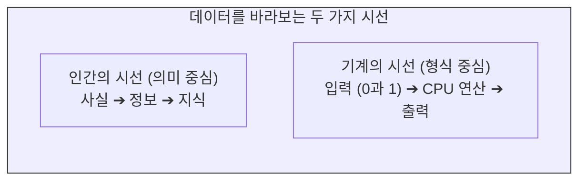

# 데이터의 정의와 기계가독성

우리는 일상적으로 “**데이터**”라는 용어를 사용하지만, 인문학자가 바라보는 데이터와 컴퓨터 공학자가 다루는 데이터의 개념은 확연히 다릅니다. 데이터 사이언스와 전처리 기술을 학습하기 위해서는 가장 먼저 데이터의 본질적 정의를 정보공학적 관점에서 재정립해야 합니다.

이 장에서는 추상적인 데이터의 개념을 기계가 처리할 수 있는 물리적 실체로 치환하고, “**좋은 데이터**”를 결정짓는 핵심 기준인 “**기계가독성**”(Machine-Readability)과 “**플레인 텍스트**”(Plain Text)의 중요성을 탐구합니다.

## 1. 데이터의 두 가지 정의: 추상과 실체

### 1.1 의미론적 정의: DIKW 피라미드
전통적인 경영학이나 인문학에서는 데이터를 **DIKW 피라미드** 모델로 설명합니다.
* **데이터(Data):** 가공되지 않은 순수한 사실이나 관찰 결과. (예: 35, 36, 34)
* **정보(Information):** 데이터에 맥락이 부여된 상태. (예: 오늘의 기온은 35도이다)
* **지식(Knowledge):** 정보를 분석하여 얻은 유의미한 패턴. (예: 여름 기온이 35도를 넘으면 폭염이다)
* **지혜(Wisdom):** 지식을 바탕으로 한 통찰과 예측. (예: 폭염이 예상되니 야외 활동을 취소하자)

이 모델에서 데이터는 의미를 도출하기 위한 가장 기초적이고 추상적인 재료로 정의됩니다.

### 1.2 정보공학적 정의: 기계의 연산 대상
반면 컴퓨터 공학 및 국립국어원의 정의에 따르면, 데이터는 “**컴퓨터가 처리할 수 있는 모든 형태의 정보**”를 뜻합니다. 

기계의 관점에서 데이터는 사실이나 진리가 아니라, 하드디스크에 저장되고 CPU가 연산할 수 있는 0과 1의 전기적 신호 집합일 뿐입니다. 텍스트, 숫자, 이미지, 오디오, 비디오 등 컴퓨터에 입력되어 처리될 수 있다면 그 내용의 참/거짓 여부와 상관없이 모두 데이터로 규정됩니다.

## 2. 좋은 데이터의 조건: 내용(Content)보다 형식(Format)

데이터 사이언스의 세계에서 데이터의 가치를 결정하는 것은 텍스트에 담긴 철학적 깊이나 문학적 아름다움이 아닙니다. 철저하게 **“기계가 얼마나 쉽게 읽고 연산할 수 있는 형식인가”**에 달려 있습니다. 이를 “**기계가독성**”(Machine-Readability)이라고 부릅니다.

* **나쁜 데이터의 예:** 세계적인 석학이 쓴 통찰력 넘치는 논문이라 하더라도, 종이에 인쇄된 것을 사진으로 찍어 놓은 스캔 PDF 파일이라면 데이터 사이언스 관점에서는 최악의 데이터입니다. 기계가 그 안의 글자를 검색하거나 단어의 빈도를 계산할 수 없기 때문입니다.
* **좋은 데이터의 예:** 초등학생이 매일 기록한 단순한 온도와 습도 기록이라도, 엑셀이나 CSV 파일처럼 열과 행이 명확히 구분된 파일이라면 이는 훌륭한 데이터입니다. 기계가 즉각적으로 통계를 내고 시각화할 수 있기 때문입니다.

즉, 내용(Content)이 아무리 우수해도 기계가 해독할 수 없는 형식(Format)이라면 분석의 재료로 사용할 수 없습니다.

## 3. 이미지 데이터의 한계와 기계의 맹점

문서가 기계가독성을 잃어버리는 가장 대표적인 사례는 텍스트가 “**이미지**” 형태로 굳어버렸을 때입니다.

우리가 스마트폰 카메라로 촬영한 책의 한 페이지나, 웹사이트에 업로드된 홍보용 JPG 포스터를 볼 때, 인간의 눈과 뇌는 그 안의 획을 인식하여 “**문자**”로 해독합니다. 그러나 컴퓨터의 시각에서 JPG, PNG, 스캔 PDF 파일은 문자가 아닙니다. 단지 빨강, 초록, 파랑(RGB)의 색상 값을 가진 수백만 개의 “**픽셀(Pixel) 격자**”에 불과합니다.

* **검색과 연산의 불가:** 이미지는 픽셀의 집합이므로 “**Ctrl + F**”를 눌러 특정 단어를 검색할 수 없으며, 텍스트를 복사하여 텍스트 에디터에 붙여넣을 수도 없습니다.
* **OCR(광학 문자 인식)의 필요성:** 이 픽셀 덩어리에서 기계가독형 텍스트를 추출해 내기 위해서는 인공지능이 이미지 패턴을 분석하여 문자로 번역해 주는 **OCR**(Optical Character Recognition) 기술을 거쳐야만 합니다. 이 과정에서 필연적으로 오탈자라는 노이즈가 발생하게 됩니다.

## 4. 가장 순수한 질료: 플레인 텍스트 (Plain Text)

기계가독성을 극대화한 가장 원초적이고 투명한 데이터 형식이 바로 “**플레인 텍스트**”(Plain Text)입니다. 

### 4.1 플레인 텍스트의 특징
플레인 텍스트는 굵기, 색상, 기울임꼴, 글꼴 크기 등 어떠한 시각적 서식(Formatting)도 포함하지 않은 순수한 문자 데이터입니다. 윈도우의 메모장(Notepad)이나 텍스트 에디터에서 작성하고 `.txt` 확장자로 저장되는 파일이 이에 해당합니다.

문서는 오직 문자 인코딩(예: UTF-8, ASCII) 규약에 따라 0과 1로 변환될 수 있는 알맹이 글자들로만 구성됩니다. 한컴오피스(.hwp)나 마이크로소프트 워드(.docx) 파일은 글자의 모양과 여백 정보를 담기 위해 복잡한 압축 구조와 독자적인 마크업을 사용하지만, 플레인 텍스트는 이러한 군더더기가 전혀 없습니다.

### 4.2 데이터 사이언스의 출발점
플레인 텍스트는 시각적으로는 투박하고 밋밋하지만, 컴퓨터에게는 가장 처리하기 쉽고 가벼운 완벽한 질료입니다. 
1. **절대적인 검색성:** 기계가 바이트 값을 직접 대조하여 100%의 정확도로 문자열을 검색할 수 있습니다.
2. **범용성과 영속성:** 특정 회사의 소프트웨어(예: 워드 프로세서)가 없어도 모든 운영체제와 프로그래밍 언어에서 읽고 쓸 수 있어 데이터의 영구 보존에 유리합니다.
3. **구조화의 기반:** 이 순수한 플레인 텍스트에 쉼표(,)나 탭(\t)을 규칙적으로 삽입하면 CSV나 TSV가 되고, 태그(`< >`)를 입히면 XML이 됩니다. 즉, 플레인 텍스트는 모든 복잡한 데이터 구조를 쌓아 올리기 위한 가장 단단한 기반암입니다.

:::{seealso} 📖 관련 자료
* **한국학중앙연구원.** <인문데이터개론>. (강의 슬라이드 자료 참고).
:::

---

## 💡 디지털인문학자를 위한 생각해볼 점

1.  **기계가독성의 역설:** 역사적 사료(예: 고문서 원본 이미지)는 인간에게 시각적 아름다움과 물질적 맥락을 전달하지만, 기계에게는 읽을 수 없는 암흑입니다. 사료를 기계가독형 플레인 텍스트로 변환하는 과정에서 우리는 무엇을 얻고 무엇을 잃게 될까요?
2.  **데이터의 범위:** 텍스트뿐만 아니라 사람들의 이동 동선, 스마트폰의 터치 기록 등 “**컴퓨터가 처리할 수 있는 모든 것**”이 데이터가 되는 시대입니다. 일상 속에서 무의식적으로 생산되는 디지털 흔적들을 어떻게 인문학적 연구 데이터로 활용할 수 있을지 기획해 봅시다.