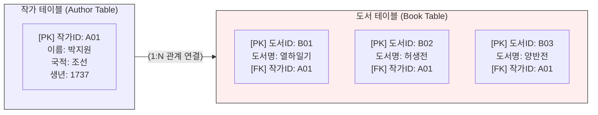

# 평면 데이터와 관계형 데이터베이스

가장 순수한 형태의 질료인 플레인 텍스트에 쉼표(,)나 탭(\t) 같은 일정한 규칙의 구분자를 삽입하면, 기계는 이를 행(Row)과 열(Column)로 이루어진 표(Table)로 인식하게 됩니다. 

이 장에서는 우리가 일상적으로 마주하는 2차원의 표 형태인 “**평면 데이터**”(Flat Data)의 공학적 특징과 구조적 한계를 분석합니다. 나아가 이러한 한계를 극복하고 데이터의 무결성을 보장하기 위해 고안된 현대 정보공학의 뼈대, “**관계형 데이터베이스**”(RDB, Relational Database)의 작동 원리를 심층적으로 탐구합니다.

## 1. 평면 데이터(Flat Data)의 직관성과 한계

### 1.1 평면 데이터의 구조: CSV와 TSV
평면 데이터는 모든 정보가 단 하나의 거대한 2차원 표 안에 평면적으로 나열된 형태를 말합니다. 엑셀(Excel) 스프레드시트 화면이나, 앞서 배운 CSV(쉼표 구분) 및 TSV(탭 구분) 파일이 대표적인 평면 데이터입니다.

* **장점:** 인간의 눈에 매우 직관적이며, 구조가 단순하여 기계가 읽어 들이고 통계를 내는 속도가 빠릅니다.
* **구조:** 가로줄인 행(Row 또는 Record)은 하나의 개별 개체를 의미하고, 세로줄인 열(Column 또는 Field)은 개체가 가진 속성(이름, 연도, 직업 등)을 나타냅니다.

### 1.2 중복의 늪: 평면 데이터의 치명적 결함
데이터의 규모가 작을 때는 평면 데이터가 유용하지만, 복잡한 현실 세계의 정보를 하나의 표에 모두 담으려 하면 심각한 공학적 문제가 발생합니다. 이를 “**데이터 중복**”(Data Redundancy)과 “**갱신 이상**”(Update Anomaly)이라고 부릅니다.

다음과 같은 인문학 도서 목록 평면 데이터가 있다고 가정해 봅시다.

| 도서ID | 도서명 | 작가명 | 작가국적 | 작가생년 |
| :--- | :--- | :--- | :--- | :--- |
| B01 | 열하일기 | 박지원 | 조선 | 1737 |
| B02 | 허생전 | 박지원 | 조선 | 1737 |
| B03 | 양반전 | 박지원 | 조선 | 1737 |

* **데이터의 낭비:** 박지원이라는 작가가 10권의 책을 썼다면, 도서명만 다를 뿐 “**박지원, 조선, 1737**”이라는 동일한 작가 정보가 10번이나 무의미하게 반복 저장되어 하드디스크 용량을 낭비하게 됩니다.
* **수정의 위험성 (갱신 이상):** 만약 후속 연구를 통해 박지원의 생년이 1737년이 아니라 다른 연도로 밝혀졌다고 가정해 봅시다. 평면 데이터에서는 데이터베이스에 흩어진 박지원의 기록 수십 개를 일일이 찾아 모두 수정해야 합니다. 단 하나라도 수정을 누락하면, 시스템 내부에 “**서로 다른 생년을 가진 박지원**”이 공존하게 되어 데이터의 무결성(Integrity)이 붕괴됩니다.

## 2. 관계형 데이터베이스(RDB)의 공학적 해결책

1970년 에드가 코드(E.F. Codd)가 제안한 “**관계형 데이터베이스**”(RDBMS)는 이러한 평면 데이터의 한계를 완벽하게 극복한 정보공학의 혁명입니다. RDB의 핵심 철학은 거대한 하나의 표를 주제별로 잘게 쪼개고, 이들을 논리적인 “**관계**”(Relation)로 다시 묶어내는 데 있습니다.

### 2.1 데이터 정규화(Normalization)와 테이블 분리
RDB는 “**작가**”와 “**도서**”라는 성격이 다른 두 정보를 하나의 테이블에 두지 않습니다. 중복을 제거하기 위해 데이터를 성격에 따라 분리하는 이 과정을 “**정규화**”라고 합니다.

### 2.2 고유키(PK)와 외래키(FK)의 매커니즘
분리된 두 테이블이 서로를 알아보고 연결되기 위해서는 명확한 기계적 식별자가 필요합니다.

* **기본키 (Primary Key, PK):** 각 테이블에서 데이터를 유일하게 식별하는 고유 번호입니다. 주민등록번호와 같은 역할을 하며, 절대 중복될 수 없고 비어있을 수도 없습니다. (예: 작가 테이블의 `작가ID`, 도서 테이블의 `도서ID`)
* **외래키 (Foreign Key, FK):** 다른 테이블의 기본키(PK)를 참조하여 두 테이블을 연결하는 다리 역할을 하는 식별자입니다.

### 2.3 관계형 모델의 절대적 이점
RDB 구조에서는 박지원이 100권의 책을 쓰더라도 작가 테이블에는 “**작가ID A01**” 정보가 단 한 번만 저장됩니다. 
만약 박지원의 생년을 수정해야 한다면, 도서 테이블은 전혀 건드릴 필요 없이 작가 테이블의 `A01` 레코드 단 한 줄만 수정하면 됩니다. 외래키로 연결된 모든 도서 데이터는 즉각적으로 수정된 작가 정보를 참조하게 됩니다. 이것이 바로 기계가 데이터의 “**무결성**”(Integrity)과 “**일관성**”(Consistency)을 영구적으로 유지하는 방법입니다.

## 3. 스키마(Schema)의 경직성과 인문 데이터의 충돌

관계형 데이터베이스(MySQL, Oracle 등)는 현대 정보 시스템(은행, 쇼핑몰, 학사행정 등)의 90% 이상을 지탱하는 완벽에 가까운 모델입니다. 하지만 이 모델은 “**스키마**”(Schema)라는 엄격한 뼈대를 요구합니다. 

데이터를 입력하기 전, 미리 “**이 테이블은 4개의 열을 가지며, 1열은 숫자, 2열은 최대 20자의 텍스트만 들어갈 수 있다**”라고 기계에 선언해야 합니다. 

만약 예측할 수 없는 구조를 가진 고문헌 데이터나, 본문 중간중간에 주석과 비고가 파편적으로 삽입되는 인문학적 텍스트를 이 꽉 짜인 RDB 표 안에 억지로 우겨넣으려 하면, 데이터의 맥락이 단절되거나 테이블 구조가 무한히 복잡해지는 문제가 발생합니다. 이러한 2차원 표의 한계를 돌파하기 위해 등장한 개념이 바로 다음 장에서 다룰 **“계층형 데이터”**(JSON/XML)와 **“네트워크 데이터”**(RDF)입니다.

:::{seealso} 📖 관련 자료
:::

---

## 💡 디지털인문학자를 위한 생각해볼 점

1.  **1:N과 N:M의 관계:** 한 작가가 여러 권의 책을 쓰는 것은 1:N(일대다) 관계입니다. 그렇다면 여러 명의 작가가 공동으로 여러 권의 책을 집필하는 N:M(다대다) 관계는 관계형 데이터베이스에서 어떻게 표로 구현할 수 있을까요?
2.  **구조의 폭력성:** RDB는 효율적이지만, 모든 정보를 규격화된 열(Column)에 강제로 분리해 넣어야 합니다. 편지나 일기 같은 비정형 서사 텍스트를 표의 칸으로 조각낼 때, 문맥(Context)이 지니는 의미는 어떻게 보존될 수 있을까요?