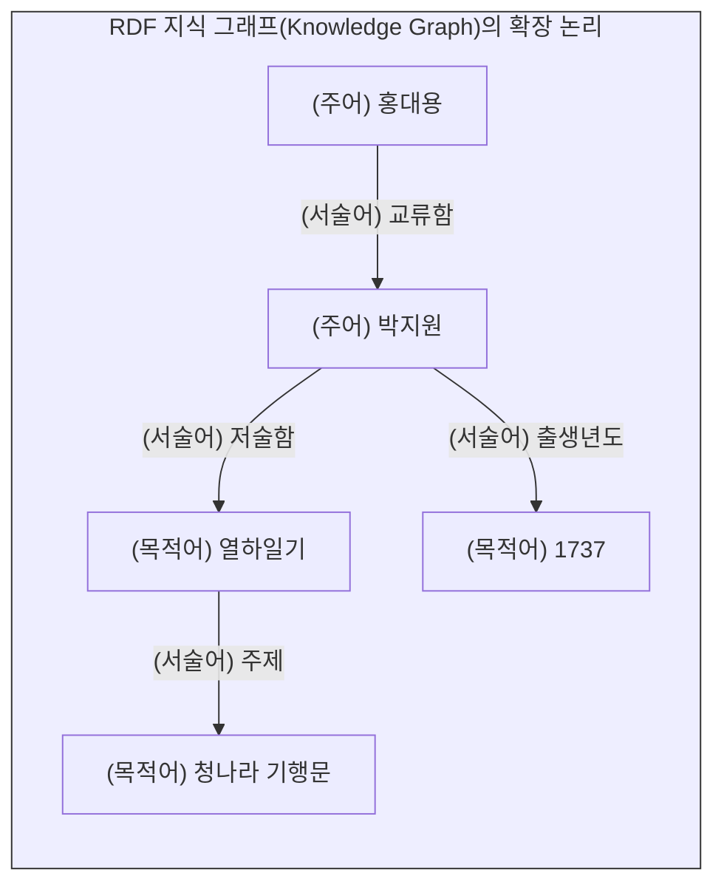

# 그래프 데이터와 인공지능 학습 데이터

앞서 다룬 관계형 데이터베이스(RDB)의 “**표(Table)**”와 JSON/XML의 “**트리(Tree)**” 구조는 훌륭한 정보공학적 모델이지만, 궁극적으로 하나의 파일이나 단일 시스템 안에 갇혀 있는 “**닫힌 세계**”(Closed World)입니다. 

현대 데이터 사이언스는 이 닫힌 구조를 부수고 전 세계의 데이터를 무한히 연결하는 **“그래프 데이터”**(Graph Data)로 진화했습니다. 더불어 이렇게 고도로 구조화된 데이터들은 단순히 저장되는 것을 넘어, 인공지능(AI)을 훈련시키는 핵심 교보재인 **“레이블 데이터”**(Labeled Data)로 활용되고 있습니다. 이 장에서는 시맨틱 웹의 기반이 되는 RDF의 네트워크 논리와 인공지능 학습 데이터의 구조를 파헤칩니다.

## 1. 닫힌 세계를 부수는 네트워크: RDF (Resource Description Framework)

### 1.1 트리플(Triple) 구조: 주어-서술어-목적어
그래프 데이터 모델의 국제 표준인 **RDF**는 세상의 모든 정보와 관계를 오직 세 가지 요소의 결합, 즉 “**트리플**”(Triple)로 환원합니다.

* **주어 (Subject):** 설명하고자 하는 주체 (노드)
* **서술어 (Predicate):** 주어와 목적어의 관계 (엣지/링크)
* **목적어 (Object):** 주어의 속성 값이나 또 다른 대상 (노드)

예를 들어, “**박지원은 열하일기를 저술했다**”라는 자연어 문장은 RDF 구조에서 `[주어: 박지원] - [서술어: 저술함] -> [목적어: 열하일기]`라는 명확한 논리적 방향성을 가진 그래프(네트워크)로 치환됩니다.




### 1.2 고유 식별자(URI)와 무한한 연결성
JSON이나 XML 파일 내부의 `박지원`이라는 텍스트는 그 파일 밖을 벗어나면 의미를 상실합니다. 하지만 RDF는 모든 주어, 서술어, 목적어에 전 세계에서 유일무이한 웹 주소인 **URI**(Uniform Resource Identifier)를 부여합니다. 

한국학중앙연구원 데이터베이스의 `박지원(URI)`과, 프랑스 국립도서관 데이터베이스에 있는 `박지원(URI)`이 동일한 URI를 공유한다면, 두 기관의 데이터베이스는 물리적으로 떨어져 있더라도 기계적으로 완벽하게 하나로 연결됩니다. 이것이 트리 구조를 넘어선 “**지식 그래프**”(Knowledge Graph)이자 “**시맨틱 웹**”(Semantic Web)의 정보공학적 실체입니다.

## 2. 인공지능의 교과서: 레이블 데이터 (Labeled Data)

지금까지 배운 플레인 텍스트, CSV, JSON 등의 데이터 구조화 기술은 현대 데이터 사이언스의 최전선인 **인공지능 학습**(AI Training) 분야에서 가장 폭발적인 가치를 발휘합니다.

### 2.1 원시 데이터(Raw Data)의 한계
인공지능의 알고리즘을 훈련시키기 위해서는 막대한 양의 데이터가 필요합니다. 하지만 인터넷에서 긁어모은 수백만 장의 강아지 사진(이미지 데이터)이나 수억 건의 뉴스 기사(플레인 텍스트)를 그대로 기계에 밀어 넣는다고 해서 인공지능이 스스로 학습하는 것은 아닙니다. 기계에게는 **“무엇이 정답인지”**를 알려주는 길잡이가 필요합니다.

### 2.2 지도학습(Supervised Learning)과 주석(Annotation)
원시 데이터에 사람이 직접 (또는 반자동으로) 기계가 읽을 수 있는 정답(Label)을 달아놓은 구조화된 데이터를 **“레이블 데이터”**(Labeled Data)라고 합니다. 기계는 이 문제와 정답의 쌍을 수없이 반복 학습(지도학습)하며 스스로 패턴을 찾아냅니다.

* **컴퓨터 비전(Vision):** 자율주행 AI를 만들기 위해 도로 사진(Raw Data) 위에 자동차의 위치를 네모난 박스(Bounding Box)로 그리고, “**이 좌표의 물체는 자동차이다**”라는 메타데이터를 JSON이나 XML 파일로 저장합니다. 
* **자연어 처리(NLP):** 역사 문헌 텍스트(Raw Data)에서 “**이순신**”이라는 단어에 “**인물(PERSON)**”이라는 태그를, “**한산도**”라는 단어에 “**장소(LOCATION)**”라는 태그(개체명 인식, NER)를 달아 JSON 형태로 변환합니다.


### 2.3 레이블 데이터의 공학적 구조 (JSON 예시)
실제 인공지능 학습에 투입되는 자연어 처리용 레이블 데이터는 앞서 배운 계층형 데이터(JSON) 형식을 가장 널리 채택합니다.

```json
{
  "문서ID": "DOC_001",
  "원문": "이순신은 1592년 한산도에서 대승을 거두었다.",
  "레이블": [
    {"단어": "이순신", "시작_인덱스": 0, "끝_인덱스": 3, "개체명": "PERSON"},
    {"단어": "1592년", "시작_인덱스": 5, "끝_인덱스": 10, "개체명": "DATE"},
    {"단어": "한산도", "시작_인덱스": 12, "끝_인덱스": 15, "개체명": "LOCATION"}
  ]
}
```
이러한 완벽한 기계가독형 구조 덕분에 인공지능은 텍스트의 어느 위치(인덱스)에 어떤 의미(개체명)가 있는지 수학적으로 계산하고 가중치를 업데이트할 수 있습니다. 

## 3. 구조화의 정점: 데이터 사이언스의 파이프라인

지금까지 우리는 기계가 문자를 인식하는 가장 밑바닥의 “**플레인 텍스트**”부터, 표 형태의 “**CSV/RDB**”, 위계를 가진 “**JSON/XML**”, 무한히 확장하는 “**RDF 그래프**”, 그리고 인공지능의 먹이가 되는 “**레이블 데이터**”까지 정보공학의 모든 데이터 모델을 훑어보았습니다.

디지털인문학의 전처리 과정은 이 단계들을 순차적으로 밟아 나가는 거대한 파이프라인입니다. 스캔된 고문헌(이미지)에서 문자를 추출(플레인 텍스트)하고, 정규표현식으로 노이즈를 제거하여 표(TSV)로 정제한 뒤, 이를 위계화(JSON/XML)하고 최종적으로 전 세계의 데이터와 연결(RDF)하여 인공지능을 학습(Labeled Data)시키는 것, 이것이 현대 데이터 사이언스가 세상을 읽어내는 방식입니다.

:::{seealso} 📖 관련 자료
* **한국학중앙연구원.** <인문데이터개론>. (강의 슬라이드 자료 참고).
:::

---

## 💡 디지털인문학자를 위한 생각해볼 점

1.  **레이블링의 주관성:** 인공지능을 위한 레이블 데이터를 만들 때, “**이 단어가 긍정적인지 부정적인지**” 혹은 “**이 인물이 반역자인지 혁명가인지**” 정답(Label)을 다는 주체는 결국 인간입니다. 데이터 구조화 과정에 개입하는 인간의 편향성(Bias)은 AI 모델에 어떤 영향을 미칠까요?
2.  **온톨로지(Ontology) 설계:** RDF 그래프 데이터를 구축하려면 세상의 사물들이 어떤 관계(서술어)를 맺고 있는지 철학적으로 정의해야 합니다. 여러분이 연구하는 주제의 인물과 사건들을 트리플(주어-서술어-목적어) 관계로 설계해 봅시다.