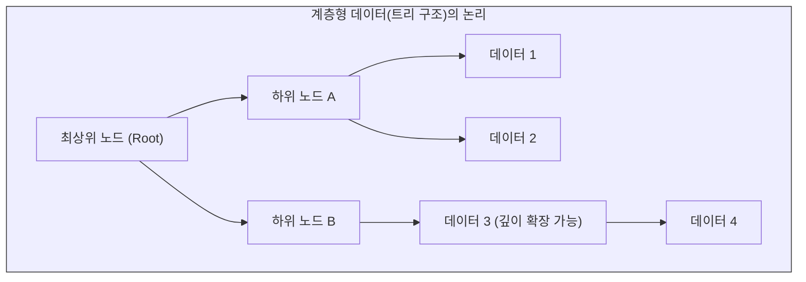

# 계층형 데이터와 마크업 언어

앞서 살펴본 관계형 데이터베이스(RDB)는 데이터를 2차원의 표(Table)로 쪼개어 관리하는 데 탁월한 성능을 발휘합니다. 하지만 편지, 소설, 조선왕조실록과 같은 인문학 텍스트는 일정한 규격의 “**칸(Cell)**”에 억지로 밀어 넣을 수 없는 고유한 서사적 흐름과 복잡한 내적 위계를 지니고 있습니다.

표의 닫힌 구조를 깨고 텍스트 본연의 맥락을 보존하기 위해 정보공학은 “**계층형 데이터**”(Hierarchical Data)라는 새로운 패러다임을 고안했습니다. 이 장에서는 현대 웹 통신의 표준인 **JSON**과, 인문학 텍스트의 복잡성을 담아내는 마크업 언어인 **XML**의 구조적 차이를 심층 분석합니다.

## 1. 계층형 데이터(Hierarchical Data)의 구조적 특징

계층형 데이터는 데이터 간의 상하 포함 관계를 “**트리(Tree)**” 형태로 모델링하는 방식입니다. 

가장 직관적인 비유는 윈도우 운영체제의 **“폴더 구조”**입니다. `내 PC`라는 최상위 뿌리(Root) 아래에 `C드라이브`와 `D드라이브`가 있고, `C드라이브` 아래에 다시 여러 하위 폴더와 파일(Leaf)들이 가지를 치며 뻗어나가는 위계적 구조를 상상하면 됩니다.

이러한 구조는 표(RDB)처럼 행과 열의 개수를 미리 고정할 필요가 없으므로, 데이터의 길이가 제각각이거나 하위 항목이 무한히 깊어지는 비정형 정보를 표현하는 데 압도적인 유연성을 제공합니다.



## 2. 현대 정보 통신의 표준: JSON (JavaScript Object Notation)

현대 웹 브라우저와 서버 간에 데이터를 주고받을 때 가장 보편적으로 사용되는 순수 계층형 데이터 포맷이 바로 **JSON**입니다.

### 2.1 키-값 (Key-Value) 쌍의 중첩 구조
JSON은 데이터를 오직 “**키(Key)**”와 “**값(Value)**”의 1:1 대응으로 정의하며, 중괄호 `{}`와 대괄호 `[]`를 사용하여 데이터를 논리적으로 중첩시킵니다.

```json
{
  "도서명": "열하일기",
  "작가": {
    "이름": "박지원",
    "국적": "조선"
  },
  "등장인물": ["허생", "양반"]
}
```
위 코드에서 기계는 `작가`라는 키값 아래에 `이름`과 `국적`이라는 하위 계층이 존재함을 직관적으로 파악합니다. JSON은 기계가 파싱(Parsing)하기에 가장 가볍고 효율적인 모델입니다.

### 2.2 JSON의 인문학적 한계: 서사적 맥락의 단절
그러나 JSON은 데이터가 “**문서(Document)**” 중심이 아니라 철저히 “**데이터(Data)**” 중심일 때만 유용합니다. 소설이나 일기처럼 긴 문장 한가운데에 중요한 정보가 파편적으로 섞여 있는 경우, JSON의 엄격한 키-값 구조는 문장의 서사적 맥락을 처참하게 단절시킵니다. 줄글을 끊지 않고 그 내부에 의미를 부여하는 작업에는 JSON이 적합하지 않습니다.

## 3. 인문학의 구원자: XML과 혼합 콘텐츠 (Mixed Content)

JSON의 한계를 극복하고 긴 서사 텍스트의 맥락을 보존하면서도 기계가독성을 부여하기 위해 고안된 마크업(Markup) 언어가 바로 **XML**(eXtensible Markup Language)입니다.

### 3.1 사용자 정의 태그와 위계의 형성
HTML이 웹페이지를 시각적으로 꾸미기 위해 미리 정해진 태그(예: `<b>`, `<i>`)만을 사용한다면, XML은 연구자가 자신의 연구 목적에 맞게 태그의 이름을 자유롭게 창조(eXtensible)할 수 있습니다. 

```xml
<문헌>
    <제목>열하일기</제목>
    <저자>박지원</저자>
</문헌>
```
여는 태그 `< >`와 닫는 태그 `</ >`가 하나의 노드(Node)를 형성하며, 태그 안에 태그를 삽입함으로써 완벽한 트리 위계를 구축합니다.

### 3.2 핵심 강점: 혼합 콘텐츠 (Mixed Content) 처리
XML이 디지털인문학(특히 텍스트 인코딩 이니셔티브, TEI)의 절대적인 표준으로 자리 잡은 이유는 바로 “**혼합 콘텐츠**”를 처리할 수 있는 유일한 포맷이기 때문입니다. 

혼합 콘텐츠란 줄글(일반 텍스트) 한가운데에 자식 태그가 이질감 없이 섞여 들어가는 구조를 뜻합니다.

```xml
<본문>
    서기 <연도>1780년</연도>, <인물>박지원</인물>은 청나라 황제의 칠순을 축하하기 위해 <장소>연경</장소>으로 떠났다.
</본문>
```

* **맥락의 보존:** 위 XML 코드를 보면 인간이 문장을 처음부터 끝까지 자연스럽게 읽어 내려갈 수 있는 “**서사적 흐름**”이 전혀 훼손되지 않았습니다.
* **기계적 의미 부여:** 동시에 기계는 `<인물>` 태그 안의 “**박지원**”을 단순한 문자열이 아니라 “**역사적 개체**”로 완벽히 추출하고 연산할 수 있습니다. 

즉, XML은 인간을 위한 “**문서**”와 기계를 위한 “**데이터베이스**”의 특성을 동시에 충족시키는 가장 정교한 정보공학적 타협점입니다. 

:::{seealso} 📖 관련 자료
* **한국학중앙연구원.** <인문데이터개론>. (강의 슬라이드 자료 참고).
:::

---

## 💡 디지털인문학자를 위한 생각해볼 점

1.  **트리의 딜레마 (Overlapping Hierarchies):** XML은 완벽한 트리 구조를 요구하므로 태그가 서로 교차(Overlap)할 수 없습니다. 만약 한 문장이 형태소 분석 단위로는 A 위계에 속하고, 문장 구조 분석 단위로는 B 위계에 동시에 속해야 한다면, 이 엄격한 트리 구조의 한계를 어떻게 극복할 수 있을까요?
2.  **닫힌 세계에서 열린 세계로:** 계층형 데이터(JSON, XML)는 결국 하나의 파일이라는 최상위 뿌리(Root) 안에 갇힌 폐쇄적인 “**닫힌 세계**”입니다. 전 세계의 분산된 데이터들을 트리의 위계를 넘어 무한히 연결하려면 어떤 수학적 모델이 필요할까요?