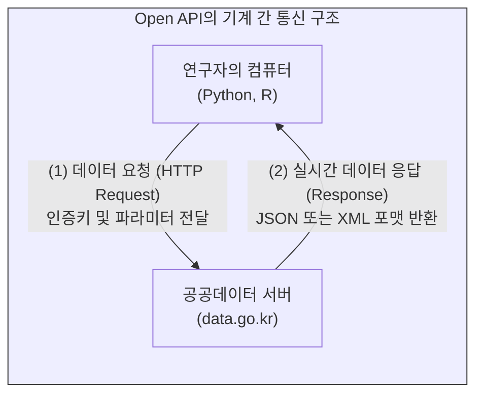

# 데이터의 개방과 공공데이터 실무

지금까지 우리는 기계가독형 플레인 텍스트에서 출발하여 CSV, RDB, JSON, 그리고 무한히 연결되는 RDF 지식 그래프까지 데이터가 진화하는 정보공학적 구조를 살펴보았습니다. 그러나 이렇게 잘 구조화된 데이터라 할지라도, 특정 기관의 폐쇄적인 서버 안에 갇혀 있다면 데이터 사이언스의 재료로 활용될 수 없습니다.

데이터의 진정한 가치는 시스템의 장벽을 넘어 기계와 기계가 서로 데이터를 교환할 때 폭발적으로 증가합니다. 이 장에서는 웹의 창시자가 제안한 데이터 개방의 5단계 진화 모델을 이해하고, 국가가 주도하는 “**공공데이터**”의 법률적 기반과 이를 수집하기 위한 실무적 기술(Open API)을 학습합니다.

## 1. 개방성의 진화: 5성급 오픈 데이터 (5-Star Open Data)

월드 와이드 웹(WWW)의 창시자인 팀 버너스 리(Tim Berners-Lee)는 데이터가 웹상에서 얼마나 기계가독적이고 연결 가능한 상태로 개방되어 있는지를 평가하기 위해 **“5성급 오픈 데이터”**(5-Star Open Data) 모델을 제안했습니다. 

데이터 사이언티스트는 자신이 수집하거나 생산하는 데이터가 이 중 어느 단계에 속하는지 객관적으로 평가할 수 있어야 합니다.

* **★ 1성급 (개방형 라이선스):** 데이터가 웹에 공개되어 있으나 기계가 연산할 수 없는 이미지 형태입니다. (예: 스캔된 PDF 문서, JPG 이미지)
* **★★ 2성급 (기계가독형 데이터):** 기계가 읽을 수 있는 정형 데이터이지만, 특정 회사의 유료 소프트웨어에 종속된 독점적 포맷입니다. (예: 엑셀 `.xls`, 한글 `.hwp`)
* **★★★ 3성급 (비독점 포맷):** 특정 소프트웨어에 종속되지 않는 개방형 표준 포맷을 사용하여 데이터의 범용성을 확보한 단계입니다. (예: CSV, TSV)
* **★★★★ 4성급 (URI 부여):** 데이터의 각 개체(Node)에 고유한 웹 주소(URI)를 부여하여, 다른 시스템의 기계가 특정 데이터 자원을 정확히 가리키고 호출할 수 있게 만든 단계입니다. (예: RDF)
* **★★★★★ 5성급 (LOD, Linked Open Data):** 내 데이터의 URI를 다른 사람이 구축한 데이터의 URI와 논리적으로 연결(Link)하여, 거대한 글로벌 지식 그래프(Knowledge Graph)의 일부로 통합된 최고 수준의 개방 상태입니다.

## 2. 공공데이터의 법률적 기반과 패러다임 전환

정부와 공공기관이 생성한 방대한 데이터는 데이터 사이언스의 가장 중요한 원천입니다. 대한민국은 **「공공데이터의 제공 및 이용 활성화에 관한 법률」**을 제정하여 국가 데이터의 개방을 강력하게 의무화하고 있습니다.

이 법률의 정보공학적 핵심은 단순한 “**공개**”(국민이 눈으로 볼 수 있게 게시판에 올림)를 넘어, 기계가 즉각적으로 판독하고 영리적 목적으로도 가공할 수 있는 형태의 “**제공**”(Machine-readable Format으로 개방)으로 패러다임이 전환되었다는 점입니다. 

국민은 국가의 데이터를 기계가독형으로 요구할 법적 “**권리**”를 가지며, 공공기관은 특별한 보안 사유가 없는 한 이를 원시 데이터(Raw Data) 형태로 개방해야 할 의무를 지닙니다.

## 3. 공공데이터포털(data.go.kr)과 데이터 획득 실무

공공데이터를 실무적으로 획득하는 가장 1차적인 창구는 국가가 운영하는 **“공공데이터포털”**입니다. 연구자는 이곳에서 두 가지 방식으로 데이터를 수집합니다.

### 3.1 파일 데이터와 Open API
* **파일 데이터 (정적 데이터):** 인구 통계나 역사 기록처럼 한 번 생성되면 잘 변하지 않는 데이터는 CSV, JSON 등의 파일 형태로 직접 다운로드하여 전처리 파이프라인에 투입합니다.
* **Open API (동적 데이터):** 날씨, 미세먼지, 실시간 교통정보처럼 분 단위로 값이 갱신되는 데이터는 파일로 다운로드하는 것이 무의미합니다. 이때는 기계와 기계가 실시간으로 데이터를 주고받는 통신 규약인 **“Open API”**(Application Programming Interface)를 활용해야 합니다. 파이썬(Python) 등의 프로그래밍 언어로 정부 서버에 요청(Request)을 보내면, 서버가 최신 데이터를 JSON이나 XML 형식으로 즉각 응답(Response)해 줍니다.

### 3.2 공공데이터 제공 신청 실무
포털에 검색해도 원하는 데이터가 없다면 어떻게 해야 할까요? 연구자는 법률에 근거하여 해당 기관에 직접 **“공공데이터 제공 신청”**을 청구할 수 있습니다.

1.  **제공 신청:** 포털의 신청 메뉴를 통해 원하는 데이터의 구체적인 항목과 기계가독형 포맷(CSV 등)을 지정하여 신청서를 제출합니다.
2.  **기관의 검토 및 결정:** 공공기관은 10일 이내에 제공 여부를 결정해야 합니다. 민감한 개인정보나 국가 안보에 직결된 데이터가 아니라면 원칙적으로 제공해야 합니다.
3.  **공공데이터제공분쟁조정:** 만약 기관이 부당한 사유로 제공을 거부(반려)한다면, 연구자는 “**공공데이터제공분쟁조정위원회**”에 조정을 신청하여 법적 구제를 받을 수 있는 실무적 절차가 완비되어 있습니다.

## 4. 데이터 사이언티스트의 사회적 역할

공공데이터는 그 자체로 완성된 지식이 아닙니다. 파편화된 CSV 파일들을 정규표현식으로 정제하고, RDB의 관계로 묶어내며, 지식 그래프(LOD)로 연결하여 새로운 통찰을 빚어내는 것은 온전히 데이터 사이언티스트의 몫입니다. 기계가독성의 원리를 이해하고, 정부의 데이터를 적극적으로 호출(API)하며 분쟁 조정 실무까지 감당하는 연구자만이, 닫혀 있던 정보를 사회적 가치로 환원할 수 있습니다.

:::{seealso} 📖 관련 자료 및 법령
* **한국학중앙연구원.** <공공데이터 활용 개론>. (강의 슬라이드 자료 참고).
* **국가법령정보센터.** <공공데이터의 제공 및 이용 활성화에 관한 법률>.
* **공공데이터포털.** <a href="https://www.data.go.kr/" target="_blank">https://www.data.go.kr/</a>
:::

---

## 💡 디지털인문학자를 위한 생각해볼 점

1.  **비식별화와 인문학 데이터:** 공공기관은 개인정보 보호를 위해 이름이나 상세 주소를 가리는 “**비식별화**”(De-identification) 조치를 거친 후 데이터를 개방합니다. 하지만 역사학이나 사회학 연구에서는 인물의 이름과 장소가 핵심 연결 고리가 됩니다. 개인정보 보호와 데이터의 5성급 연결성(LOD)은 어떻게 양립할 수 있을까요?
2.  **API 호출 실습 구상:** 여러분이 진행하고자 하는 연구를 위해 공공데이터포털에서 어떤 Open API를 호출해야 할지 탐색해 봅시다. (예: 국립중앙도서관 서지정보 API, 문화재청 문화재 정보 API 등)