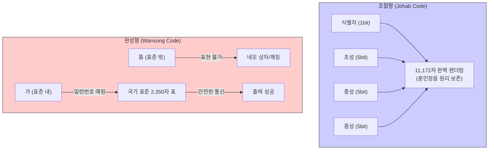

# 영어 제국주의와 7비트의 굴레

디지털인문학(Digital Humanities)은 모니터 위에 나타나는 텍스트를 비물질적인 기호의 유희로만 보지 않습니다. 화면의 빛나는 픽셀들 이면에는 수십 년 전의 엄격한 기계적 제약과 통제된 규약이 숨 쉬고 있습니다. 

현대 정보화 사회의 문법을 규정한 절대적인 표준인 **아스키**(ASCII, American Standard Code for Information Interchange) 코드는 단순한 문자 매핑표가 아닙니다. 그것은 1960년대 미국의 압도적인 기술 패권, 당시 하드웨어의 극한적 경제성, 그리고 영미권 중심의 “**언어적 제국주의**”가 고밀도로 응축된 텍스트의 “**화석**”(Fossil)입니다. 

이 장에서는 아스키의 공학적 기원에서부터 제어 문자에 깃든 매체 철학적 의미, 그리고 이로 인해 한국어를 비롯한 비(非)라틴어권 문자들이 겪어야 했던 기술적 소외를 심도 있게 분석합니다.

## 1. 아스키의 공학적 기원: 전신타자기의 유산

인간의 문자를 0과 1의 숫자 데이터로 변환하는 “**문자 인코딩**”(Character Encoding)의 역사는 컴퓨터 발명 이전인 전신(Telegraph) 시대로 거슬러 올라갑니다.

### 1.1 가변 길이에서 고정 길이로
1840년대의 모스 부호는 점과 선의 길이를 달리하는 “**가변 길이**” 방식이었으나, 기계적 자동화에 한계가 있었습니다. 1870년, 에밀 바우도(Émile Baudot)는 기계 처리에 최적화된 “**고정 길이**”의 5비트 바우도 코드(Baudot Code)를 발명합니다. 5개의 비트(2⁵ = 32개 기호)로 작동하는 이 코드는 천공 테이프와 전신타자기(Teleprinter) 시스템과 결합하여 20세기 중반까지 전기 통신의 표준으로 군림했습니다.

### 1.2 호환성의 대혼란과 아스키의 제정
1950년대 후반, 컴퓨터가 복잡한 텍스트를 처리하게 되면서 32자밖에 표현하지 못하는 5비트의 한계가 명백해졌습니다. 미군의 FIELDATA 등 여러 6비트 규격이 난립하며 기계 간 호환성 대란이 일어났습니다. 이를 종식시키기 위해 1963년, 미국표준협회(ASA) 소속 밥 베머(Bob Bemer) 등이 주도하여 7비트로 이루어진 단일 표준 “**아스키**”(ASCII)를 제정하게 됩니다.

| 인코딩 규격 | 개발 시기 | 비트 수 | 표현 문자 수 | 역사적 의의 및 특징 |
| :--- | :--- | :--- | :--- | :--- |
| **Baudot Code** | 1870년대 | 5비트 | 32자 | 세계 최초 2진 문자 코드. 전신타자기 활용. |
| **FIELDATA** | 1950년대 | 6비트 | 64자 | 미군 주도 개발 규격. 아스키 이전의 시도. |
| **ASCII** | 1963년 | 7비트 | 128자 | 현대 디지털 문자 인코딩의 근간. (7비트) |
| **EBCDIC** | 1960년대 | 8비트 | 256자 | IBM이 대형 메인프레임을 위해 독자 개발. |

## 2. 7비트의 굴레: 물리적·경제적 제약이 낳은 타협

아스키가 8비트(256자)의 확장성을 포기하고 7비트(128자)라는 좁은 영토를 선택한 것은 철저한 경제적, 물리적 한계 때문이었습니다.

1.  **메모리 소자의 경제학:** 1960년대 초기 컴퓨터의 진공관이나 자기 코어 메모리는 천문학적으로 비쌌습니다. 8비트 레지스터를 구축하려면 부품이 증가해 단가가 상승했습니다. 기술자들은 “**영문 대소문자와 숫자면 128자로 충분하다**”는 경제적 논리를 따랐습니다.
2.  **천공 테이프의 한계:** 당시 데이터를 저장하던 종이 천공 테이프(Punched Tape)는 물리적으로 최대 8개의 구멍만 뚫을 수 있었습니다. 만약 문자에 8구멍을 다 써버리면 종이가 찢어지거나 전송 오류가 발생했을 때 검증할 방법이 없었습니다. 따라서 7자리는 데이터에, 남은 1자리는 오류 검증용 “**패리티 비트**”(Parity Bit)로 할당하는 실용적 설계를 채택했습니다.

## 3. 제어 문자의 화석화와 매체 철학

아스키코드의 첫 32개 문자는 모니터에 인쇄할 수 없는 “**제어 문자**”(Control Characters)입니다. 현대 스크린에서는 기능이 사라졌으나, 이들은 디지털 코드 속에 완강히 화석화되어 있습니다.

### 3.1 타자기의 물리적 구동계 이식 (CR과 LF)
디지털에서 줄바꿈(엔터 키)을 할 때, 내부적으로는 아스키 13번 **CR**(Carriage Return)과 10번 **LF**(Line Feed)가 전송됩니다.
* **CR:** 기계식 타자기의 무거운 쇳덩어리(캐리지)를 종이의 맨 왼쪽 가장자리로 물리적으로 복귀시키는 모터 신호입니다.
* **LF:** 원통형 고무 롤러를 회전시켜 종이를 한 줄 위로 밀어 올리는 물리적 신호입니다.

### 3.2 포렌식 물질성과 형식적 물질성
독일의 매체 철학자 틸 하일만(Till A. Heilmann)은 이를 가리켜 “**상호적 물질성**”(Reciprocal Materiality)이라 칭합니다. 무거운 쇳덩어리와 종이가 부딪히던 타자기의 물리적 흔적이, 추상적인 디지털 코드의 내부 질서(형식적 물질성)로 영구히 이식된 것입니다. CR과 LF는 단순한 기호가 아니라 과거 기계 장치의 톱니바퀴가 남긴 지울 수 없는 “**화석**”입니다.

## 4. 언어적 제국주의와 디지털 소외

아스키의 그래픽 문자 94개는 오직 “**미국식 영어**”만을 표기하기 위해 완벽히 재단되었습니다. 이를 정보학자 다니엘 파르그만(Daniel Pargman)은 “**아스키 제국주의**”(ASCII Imperialism)라 명명합니다.

* **기호의 위계화:** 극심한 용량 부족 속에서도 달러 기호($)는 당당히 36번 자리를 차지했지만, 파운드(£)나 엔(¥) 등은 배제되었습니다.
* **ISO 646의 대혼란:** 유럽 국가들이 구두점 기호 자리에 자국의 알파벳(움라우트 등)을 억지로 끼워 넣으면서, 미국에서 작성한 코드가 유럽 컴퓨터에서는 외계어로 깨져버리는 “**모지바케**”(Mojibake) 대란이 발생했습니다. 

## 5. 2바이트의 사투: 한글 인코딩 투쟁사

라틴 알파벳을 쓰지 않는 아시아 국가들에게 아스키의 1바이트 구조는 폭력적이었습니다. 초성, 중성, 종성이 2차원 공간에 결합하여 11,172자의 음절을 빚어내는 한글은, 무조건 16비트(2바이트) 이상의 공간이 필요했습니다.

이 과정에서 1980~90년대 한국 사회에서는 “**한글 코드 논쟁**”이 격발합니다.

1.  **조합형 (Johab):** 훈민정음의 창제 원리를 16비트 공간에 대칭적으로 이식하여 11,172자를 완벽히 구현했습니다. 그러나 아스키 통신 영역과 일부 충돌할 수 있다는 기술적/상업적 한계가 있었습니다.
2.  **완성형 (Wansung):** 1987년, 정부는 서구의 통신 규약에 안전하게 종속되기 위해 완성된 글자 덩어리에 일련번호를 부여하는 방식을 국가 표준으로 채택했습니다. 공간 부족으로 단 2,350자만 배정되어, 나머지 80%의 우리말(똠, 펲 등)은 디지털 공간에서 강제 학살당했습니다.
3.  **통합 완성형 (CP949):** 1995년 마이크로소프트가 Windows 95를 통해 도입한 방식으로, 완성형의 빈 공간에 나머지 8,822자를 욱여넣었습니다. 모든 글자 표현은 가능해졌으나, 글자의 수학적 질서가 완전히 붕괴된 “**누더기 기형 코드**”였습니다.

이후 유니코드(Unicode)가 도입되어 한글은 고유한 영토(U+AC00–U+D7AF)를 회복했지만, 현대 인터넷 전송의 절대 표준인 UTF-8조차 미국식 아스키 문자에 한해서만 1바이트를 할당함으로써 영미권의 대역폭 패권을 굳건히 유지하고 있습니다.

:::{seealso} 📖 추천 문헌 및 웹 리소스
문자 인코딩의 역사와 매체 철학적 쟁점을 심화 학습하기 위한 핵심 문헌입니다. (KADH 인용 규정 준수)

* **Heilmann, T. A. (2015).** <Reciprocal Materiality and the Body of Code: A Close Reading of the American Standard Code for Information Interchange (ASCII)>. Digital Culture & Society. 1(1). 39-52. <a href="https://doi.org/10.14361/dcs-2015-0104" target="_blank">DOI Link</a>
* **Pargman, D. & Palme, J. (2009).** <ASCII Imperialism>. Standards and Their Stories. Cornell University Press. 177-199. <a href="urn:nbn:se:su:diva-33379" target="_blank">URI Link</a>
* **Kirschenbaum, M. G. (2008).** <Mechanisms: New Media and the Forensic Imagination>. The MIT Press. <a href="https://doi.org/10.1162/leon.2008.41.5.529" target="_blank">DOI Link</a>
* **Park, D. (2016).** <The Korean Character Code: A National Controversy, 1987-1995>. IEEE Annals of the History of Computing. 38(2). 40-53. <a href="https://doi.org/10.1109/MAHC.2016.14" target="_blank">DOI Link</a>
* **Mackenzie, C. E. (1980).** <Coded Character Sets, History and Development>. Addison-Wesley Publishing Company. <a href="https://lccn.loc.gov/77090165" target="_blank">URI Link</a>
:::

---

## 💡 디지털인문학자를 위한 생각해볼 점

1.  **화석화된 규칙:** 타자기 시대의 종속물인 CR과 LF가 현대의 최신 웹 프로토콜에도 남아있듯, 우리가 인문학적 데이터를 모델링할 때 과거 인쇄 매체의 관습을 맹목적으로 이식하고 있는 부분은 없는지 비판적으로 성찰해 봅시다.
2.  **보편적 표준과 문화적 특수성:** 1바이트(아스키) 중심의 통신망에 한글을 구겨 넣었던 완성형의 비극은, 기술적 호환성을 위해 문화적 특수성이 소거된 대표적 사례입니다. 챗GPT와 같은 현대 AI의 영어 중심 구조 속에서 우리는 언어 주권을 어떻게 지켜낼 수 있을까요?