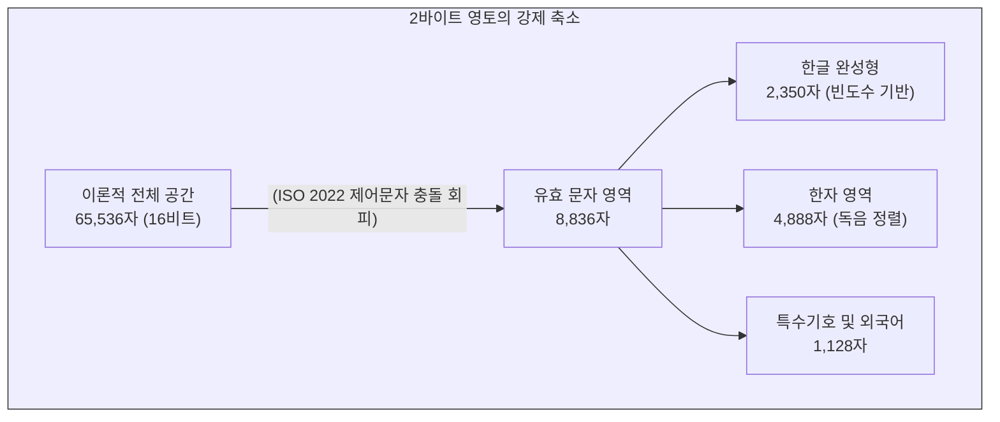

# 2바이트의 고군분투: 한글과 한자의 디지털 편입사

인간의 문자가 아날로그 매체를 떠나 이진수(Binary Code)의 전자적 매질에 정착하는 과정은 단순한 기술적 변환을 넘어선 고도의 존재론적 번역 작업입니다. 1바이트(8비트, 256자)로 모든 것을 표현할 수 있었던 영미권의 라틴 알파벳과 달리, 수만 자의 표의문자인 한자(漢字)와 11,172자의 수학적 조합을 가진 한글은 1바이트 공간에 수용될 수 없는 태생적 복잡성을 지니고 있었습니다.

한국, 중국, 일본을 비롯한 동아시아 국가들은 자국의 문자를 전산망에 편입시키기 위해 “**2바이트**”(16비트, 65,536개)라는 확장된 디지털 영토를 개척해야만 했습니다. 이 장에서는 16비트 공간을 둘러싼 공학적 제약과, 한글 인코딩을 둘러싸고 벌어졌던 철학, 행정, 자본의 치열한 충돌, 그리고 이로 인해 단절된 디지털 문화유산의 역사를 추적합니다.

## 1. 16비트 공간의 영토 분할과 공학적 타협

16비트가 제공하는 65,536개의 경우의 수는 표면적으로 방대해 보이지만, 1980년대 국제 통신 교환 표준(ISO/IEC 2022)의 틀 안에서 이 영토는 심각하게 축소되었습니다. 영문 통신 제어 문자와 충돌하지 않기 위해 2바이트 문자의 가용 범위는 약 8,836자(94 × 94) 수준으로 극단적으로 제한되었습니다.

### 1.1 완성형(KSC 5601)의 구조와 한자의 효율성 논리
이러한 가혹한 제약 속에서 대한민국 정부가 1987년에 제정한 국가 표준 **KS C 5601**(완성형)은 극도의 효율성을 추구한 타협의 산물이었습니다. 11,172자의 현대 한글 전체를 포기하고, 사용 빈도가 높은 2,350자만 선별하여 수록했습니다. 

나머지 공간에 배정된 4,888자의 한자(Hanja)는 전통적인 부수나 획수가 아닌 철저히 “**한글 독음(음가)**”의 가나다순으로 정렬되었습니다. 이는 초기 컴퓨터 환경에서 한글-한자 변환 검색 알고리즘의 연산 비용을 극적으로 낮추는 혁신이었으나, 반대로 “**동형이음**”(同形異音, 모양은 같으나 소리가 다른 한자. 예: 樂을 낙, 악, 요로 3번 중복 할당)을 처리하기 위해 막대한 코드 낭비를 초래하는 맹점을 낳았습니다.

## 2. 조합형 대 완성형: 다차원적 충돌의 역사

1990년대 한국 사회를 달구었던 “**조합형 대 완성형 논쟁**”은 단순한 공학적 다툼이 아니라, 문자를 바라보는 철학, 국가의 행정 이성, 그리고 자본주의 시장 논리가 맞부딪힌 매체 철학적 사건이었습니다.

### 2.1 철학의 저항: 훈민정음 원리와 조합형(Johab)
조합형은 16비트 중 최상위 1비트를 한글 식별자로 두고, 남은 15비트를 초성(5비트), 중성(5비트), 종성(5비트)에 대칭적으로 할당하는 방식이었습니다. 이 설계는 훈민정음의 창제 원리를 현대 정보 이론에 완벽하게 이식한 기적적인 공학적 번역이었습니다. 조합형은 수학적으로 가능한 11,172자를 빈틈없이 표현하여 “**찦차를 타고 온 펲시맨과 쑛다리 똠방각하**” 같은 외래어나 신조어를 완벽히 모니터에 출력할 수 있었습니다.

### 2.2 행정과 국가 이성: 데이터 안정성(Wansung)
철학적 완결성에도 불구하고 국가는 2,350자만을 지원하는 완성형을 표준으로 강제했습니다. 이는 초기 글로벌 네트워크 장비가 조합형의 최상위 비트 1을 통신 제어 신호로 오인하여 패킷을 파기해버리는 심각한 “**프로토콜 충돌**”을 방지하기 위함이었습니다. 행정 데이터 교환의 무결성을 지키기 위해 자국어의 80%를 디지털 공간에서 소거하는 폭력적인 고육책을 택한 것입니다.

### 2.3 자본의 논리와 누더기 코드(CP949)
1995년 마이크로소프트는 Windows 95를 출시하며 확장 완성형인 **CP949(UHC)**를 독자 도입했습니다. 기존 완성형 2,350자의 위치는 그대로 둔 채, 쓰이지 않던 비표준 바이트 영역을 긁어모아 나머지 8,822자를 아무런 정렬 규칙 없이 욱여넣었습니다. 이로 인해 코드표 상에서 한글의 가나다순 정렬이 완전히 붕괴되는 치명적인 결함이 발생했지만, 윈도우라는 압도적인 “**플랫폼 권력**”을 등에 업고 사실상의 국가 표준으로 군림하게 되었습니다.

## 3. 디지털 문화유산의 단절과 포렌식 복원

이러한 기술적 타협과 플랫폼 권력 다툼 속에서 가장 깊은 내상을 입은 것은 한국학과 고문헌 아카이빙이었습니다. 현대 상용어 중심의 16비트 공간에서, 조선시대 문헌에 기록된 옛한글(고어)과 희귀 한자인 벽자(僻字)는 완벽하게 배제되었습니다.

* **인식론적 폭력:** 1990년대 초 조선왕조실록 전산화 작업 등에서, 입력기(IME)로 표기할 수 없는 수많은 고유 문자들이 기계적 한계 때문에 검은색 사각형인 “**■**”나 “**?**”로 치환되었습니다. 당대의 발음과 문화적 맥락이 응축된 문자가 물리적 메모리의 제약으로 소실된 역사적 파편화 현상입니다.
* **디지털 인문학의 치유:** 최근 한국학중앙연구원(AKS)이 구축한 “**웹서비스 옛한글 원문정보 온라인 열람시스템**” 등은 과거에 누락되었던 문헌들을 유니코드의 첫소리-가운뎃소리-끝소리 자모 결합 체계를 활용하여 재조립함으로써, 끊어졌던 디지털 문화유산의 완전성을 회복하는 중대한 학술적 실천을 보여줍니다.

## 4. 유니코드의 도래와 남겨진 책무

1996년 유니코드(Unicode) 2.0은 11,172자의 모든 한글 음절을 통째로 16비트 영역에 일괄 수록하며 과거의 굴레를 표면적으로 해소했습니다. 그러나 애플 Mac OS X 시스템이 NFD(정규화) 방식을 채택하며 글자의 자음과 모음이 낱낱이 분해되는 이른바 “**자모 풀림 현상**”을 일으키는 등, 과거 인코딩이 남긴 상흔은 여전히 잔존합니다.

디지털인문학자는 모니터에 출력된 글자를 수동적으로 읽는 소비자가 되어서는 안 됩니다. 텍스트 이면에 숨겨진 공학적 타협과 자본의 권력을 해독해 낼 수 있는 “**코드 리터러시**”(Code Literacy)를 획득하고, 데이터의 한계 속에서 유실된 문화적 기호를 발굴하는 것이야말로 우리의 가장 중요한 매체 철학적 사명입니다.

:::{seealso} 📖 추천 문헌 및 웹 리소스
문자 인코딩의 기술사와 디지털 문화유산의 관계를 조명하는 핵심 자료입니다. (KADH 인용 규정 준수)

* **Park, D. (2016).** <The Korean Character Code: A National Controversy, 1987-1995>. IEEE Annals of the History of Computing. 38(2). 40-53. <a href="https://doi.org/10.1109/MAHC.2016.14" target="_blank">DOI Link</a>
* **한국학중앙연구원 (2025).** <[웹서비스] 옛한글 원문정보 온라인 열람시스템>. KADH 한국디지털인문학협의회. <a href="https://www.kadh.org/%EC%9B%B9%EC%84%9C%EB%B9%84%EC%8A%A4-%EC%98%9B%ED%95%9C%EA%B8%80-%EC%9B%90%EB%AC%B8%EC%A0%95%EB%B3%B4-%EC%98%A8%EB%9D%BC%EC%9D%B8-%EC%97%B4%EB%9E%8C%EC%8B%9C%EC%8A%A4%ED%85%9C-%ED%95%9C%EA%B5%AD/" target="_blank">KADH URI</a>
* **Mackenzie, C. E. (1980).** <Coded Character Sets, History and Development>. Addison-Wesley Publishing Company. <a href="https://lccn.loc.gov/77090165" target="_blank">URI Link</a>
:::

---

## 💡 디지털인문학자를 위한 생각해볼 점

1.  **플랫폼 권력의 관성:** 마이크로소프트의 CP949는 기술적으로 열등한 “**누더기 코드**”였음에도 자본과 플랫폼의 힘으로 국가 표준을 압도했습니다. 오늘날 거대 AI 기업들이 주도하는 데이터 포맷 표준화 과정에서 유사한 위협은 발생하지 않을까요?
2.  **맥락의 소실:** 옛한글이 “**■**”로 치환되었던 과거처럼, 현재의 디지털 아카이브 환경에서 형태는 보존되지만 “**기계가 판독할 수 없는 의미론적 파편화**”를 겪고 있는 데이터는 무엇이 있을지 논의해 봅시다.