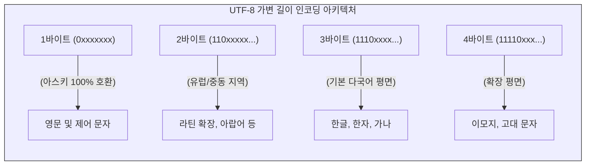

# 하드웨어의 승리와 디지털 바벨탑

인류의 지식과 문화가 디지털 매체로 이식되는 과정은 결코 마찰 없는 매끄러운 진공 상태에서 이루어지지 않습니다. 텍스트가 컴퓨터 내부에서 처리되기 위해 비트열로 변환되는 “**문자 인코딩**”(Character Encoding)은 특정 시대의 자본 논리와 기술 패권이 반영된 고도의 정치적 산물입니다.

현대 디지털 생태계의 근간을 이루는 **유니코드**(Unicode)와 그 구현체인 **UTF-8**은 이종 시스템 간의 언어가 충돌하던 “**디지털 바벨탑**”(Digital Tower of Babel)의 혼란을 종식시킨 기념비적 성취입니다. 그러나 이 보편적 인프라가 확립되는 과정에서 동아시아의 문자 체계는 서구 중심의 기술적 보편성이라는 거대한 벽에 부딪혀 심각한 존재론적 변형을 강제당했습니다.

## 1. 유니코드와 UTF-8의 공학적 성취

초기 컴퓨터는 7비트의 **아스키**(ASCII) 체계로 통일되었으나, 인터넷의 확장과 함께 수많은 8비트 확장 코드와 다국어 2바이트 규격(EUC-KR, Shift-JIS 등)이 난립했습니다. 인코딩 규약이 일치하지 않아 텍스트가 외계어처럼 깨져버리는 “**모지바케**”(Mojibake) 현상이 전 세계를 뒤덮었습니다.

### 1.1 16비트의 환상과 교착 상태
이를 통일하기 위해 등장한 초창기 **유니코드**는 전 세계 문자를 고정된 16비트(2바이트) 크기에 담고자 했습니다(UCS-2). 그러나 이는 아스키 환경에 맞춰진 기존 유닉스(Unix) 및 C 언어 시스템에서 치명적인 충돌(Null Byte 오류 등)을 일으켰고, 영어권 사용자들의 파일 크기를 두 배로 팽창시켜 거센 반발을 샀습니다.

### 1.2 UTF-8: 식당 매트 위에서 구현된 천재적 설계
1992년, 유닉스의 창시자인 켄 톰슨(Ken Thompson)과 롭 파이크(Rob Pike)는 식당 종이 매트 위에 새로운 “**가변 길이 인코딩**”(Variable-width Encoding)의 뼈대를 스케치합니다. 이것이 바로 오늘날 웹 트래픽의 99%를 지배하는 **UTF-8**입니다.

* **레거시의 영구적 보존:** 1바이트 패턴은 기존 아스키코드와 비트 단위까지 완벽하게 동일합니다. 서구의 거대한 기술적 유산을 훼손하지 않으면서 글로벌 문자를 수용해 낸 영리한 실용주의입니다.
* **자기 동기화 (Self-synchronizing):** 네트워크 전송 중 바이트 일부가 유실되더라도, 이어지는 바이트의 앞자리 패턴(10xxxxxx)을 판별하여 즉시 다음 문자의 시작점을 복구할 수 있는 무결성을 갖추었습니다.

## 2. 하드웨어의 승리: 한글 11,172자 할당의 맥락

유니코드가 서구 생태계에 유연하게 안착한 반면, 한국의 한글은 디지털 영토를 확보하기 위해 뼈아픈 타협을 치러야 했습니다.

초기 유니코드 1.0은 한국 정부의 표준을 따라 완성형 2,350자만을 수록했습니다. 그러나 거센 비판이 일자, 1996년 발표된 유니코드 2.0은 현대 한글 블록(U+AC00 ~ U+D7A3)에 조합 가능한 모든 음절인 11,172자를 순서대로 강제 할당하며 논쟁의 마침표를 찍었습니다.

이 “**해결**”은 초성, 중성, 종성을 수학적으로 결합하는 훈민정음의 철학적 우수성을 살려낸 결과가 아닙니다. 무어의 법칙에 따른 램(RAM) 가격 하락에 힘입어, 복잡한 렌더링 알고리즘(조합형)을 짜는 대신 “**가능한 모든 글자 이미지를 메모리에 통째로 때려 박는**” 지극히 자본 집약적인 타협의 산물, 즉 “**무식하고 압도적인 하드웨어의 승리**”였습니다.

## 3. 한중일 통합 한자(Han Unification) 논쟁과 재현적 위해

한글이 하드웨어의 폭격으로 1만 자가 넘는 영토를 확보했다면, 동아시아의 한자(Han Characters)는 16비트(65,536개)라는 절대적 공간 부족 앞에서 가혹한 “**통폐합**”의 수술대에 올랐습니다.

### 3.1 통폐합의 경제학과 재현적 위해
중국, 일본, 대만, 한국의 한자 총합은 10만 자를 가볍게 넘겼습니다. 물리적 한계에 부딪힌 유니코드 컨소시엄은 각국에서 미세하게 형태가 다르더라도 역사적 기원이 같고 시각적 추상성(Abstract Shape)이 유사한 글자들을 묶어 “**하나의 유니코드 번호**”를 부여해 버렸습니다.

이는 심각한 “**재현적 위해**”(Representational Harm)를 발생시켰습니다. 텍스트 자체가 고유한 문자를 보존하는 것이 아니라, 사용자의 시스템에 깔린 글꼴(Font)에 의해 일본식 한자로 보일지 중국식 한자로 보일지가 결정되는 기형적인 의존 구조를 낳은 것입니다.

### 3.2 본질과 표면: 시게키 모로의 비판
유니코드의 철학은 “**글리프(시각적 형태)가 아니라 문자(추상적 의미)를 인코딩한다**”는 서구의 기표-기의 분리 모델, 즉 “**아리스토텔레스적 본질주의**”에 기반을 두고 있습니다.

그러나 일본의 철학자 시게키 모로(Shigeki Moro)를 비롯한 고문헌 학자들에게 동아시아 한자의 미세한 형태(Glyph)는 단순한 껍데기가 아닙니다. 점 하나, 획 하나의 차이가 텍스트의 시대적 배경과 이데올로기를 추적하는 핵심 정보, 즉 그 자체가 “**본질**”입니다. 유니코드는 이러한 시각적 다름을 “**중복**”으로 치부하여 하나의 코드로 짓이겨 버림으로써, 문화적 특수성에 거대한 폭력을 가했습니다.

## 4. 결론: 매체 철학적 시야의 획득

우리는 워드 프로세서 위에서 펼쳐지는 디지털 텍스트가 자연의 공기처럼 투명하다고 착각합니다. 그러나 유니코드와 UTF-8의 역사는 문자의 디지털 재현이 결코 투명하지 않으며, 16비트 레지스터라는 하드웨어적 한계, 공학자들의 철학적 편견, 그리고 글로벌 표준화 기구의 지정학적 타협이 얽힌 불투명한 인공물임을 폭로합니다.

디지털인문학자는 화면에 렌더링된 텍스트가 절대불변의 원본이 아니라, 특정 시기의 메모리 단가와 효율성 강박에 의해 굴절된 결과물임을 통찰해야 합니다. 빛나는 디지털 바벨탑의 그림자 속에 미세하게 지워지고 억압된 언어의 다형성을 해독해 내는 것, 그것이 우리가 갖추어야 할 진정한 “**코드 리터러시**”(Code Literacy)입니다.

:::{seealso} 📖 추천 문헌 및 웹 리소스
문자 인코딩에 내재된 권력과 동아시아 문자의 매체 철학적 비판을 심화하기 위한 핵심 문헌입니다. (KADH 인용 규정 준수)

* **Tsu, J. (2022).** <Kingdom of Characters: The Language Revolution That Made China Modern>. Riverhead Books. <a href="https://books.google.com/books?id=EH1MDAAAQBAJ" target="_blank">Google Books URI</a>
* **Lunde, K. (2009).** <CJKV Information Processing (2nd Edition)>. O'Reilly Media. <a href="https://archive.org/details/cjkvinformationp00lund" target="_blank">Archive URI</a>
* **Moro, S. (2003).** <Surface or Essence: Beyond the Coded Character Set Model>. Chise Symposium 2003. <a href="http://coe21.zinbun.kyoto-u.ac.jp/papers/ws-type-2003/026-moro.pdf" target="_blank">URI Link</a>
* **Harvard University CS61. (2022).** <Unicode>. Harvard University Systems Programming Course Material. <a href="https://cs61.seas.harvard.edu/site/2022/Unicode/" target="_blank">URI Link</a>
* **The Unicode Consortium. (2024).** <The Unicode Standard, Version 16.0 – Core Specification>. Unicode, Inc. <a href="https://www.unicode.org/versions/Unicode16.0.0/UnicodeStandard-16.0.pdf" target="_blank">URI Link</a>
:::

---

## 💡 디지털인문학자를 위한 생각해볼 점

1.  **레거시의 그림자:** UTF-8은 1바이트 공간을 아스키코드에 온전히 내어줌으로써 영미권의 대역폭 독점을 영구화했습니다. 가장 보편적인 글로벌 표준 안에 특정 국가의 효율성이 내재화된 또 다른 정보 기술 사례는 무엇이 있을까요?
2.  **재현적 위해 (Representational Harm):** 시스템 설계상의 편의로 인해 특정 집단의 정체성이나 문화를 온전히 표현하지 못하게 만드는 피해를 뜻합니다. 현재의 인공지능(AI)이나 소셜 미디어 플랫폼에서 발생하는 “**재현적 위해**”의 사례를 찾아 토론해 봅시다.