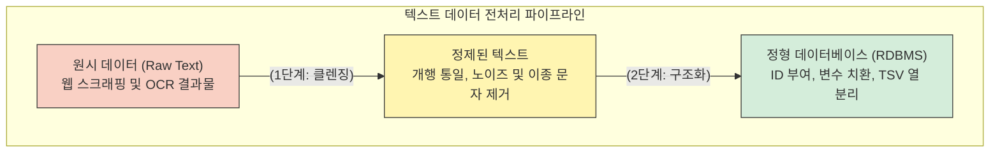

# 정규표현식 실습 개괄

앞서 학습한 메타문자의 논리와 문법은 실제 텍스트 데이터에 적용될 때 비로소 정보공학적 가치를 지닙니다. 우리가 연구 현장에서 마주하는 자연어 원시 데이터(Raw Data)는 수많은 노이즈와 불규칙성을 내포하고 있습니다. 정규표현식 실습은 이 거친 텍스트를 기계가 학습할 수 있는 **“정형 데이터”**(Structured Data)로 깎아내고 조립하는 과정입니다.

이 하위 챕터들에서는 실전 텍스트(문학 작품, 대본, 가사, 리뷰 등)를 활용하여 크게 두 가지 차원의 전처리 작업을 수행합니다.

## 1. 1단계: 실전 데이터 정제 (Data Cleansing)

데이터 분석의 신뢰성을 확보하기 위해 가장 먼저 수행해야 하는 **“클렌징”** 작업입니다.

* **노이즈 제거:** 파편화된 운영체제의 흔적인 캐리지 리턴(`\r`)을 통일하고, 불필요한 공백과 중복 개행을 청소합니다.
* **형식의 통일:** 문자 집합을 활용하여 분석에 불필요한 이종 문자(예: 한자)를 일괄 소거하고, 텍스트를 탭(Tab)으로 분리하여 TSV 형식의 기본 틀을 잡습니다.

👉 **하위 문서: [실전 데이터 정제 기초](regex_practice_cleansing.md)**

## 2. 2단계: 캡처 그룹과 데이터 구조화 (Data Structuring)

정제된 텍스트의 순서를 재배치하고 논리적 식별자를 부여하여 **“관계형 데이터베이스”**(RDBMS)의 형태로 직조하는 고난도 작업입니다.

* **비탐욕적 탐색:** `.*?` 알고리즘을 활용하여 기계의 탐욕적 성향을 제어하고 원하는 구간의 데이터만 정확히 추출합니다.
* **지식의 조립:** 캡처 그룹 `()`과 백레퍼런스(`\1`, `\2`)를 통해 데이터의 열(Column)을 동적으로 재배치하고, 모든 데이터 레코드에 고유 식별자(ID)를 자동 상속합니다.

👉 **하위 문서: [캡처 그룹과 데이터 구조화 심화](regex_practice_structuring.md)**

:::{seealso} 📖 실습 자료 출처
본 실습 챕터의 하위 문서들은 다음의 실무 교육 자료를 기반으로 재구성되었습니다.
* **이효림.** <데이터 전처리 - 정규표현식>. 위키독스. <a href="https://wikidocs.net/book/10006" target="_blank">https://wikidocs.net/book/10006</a>
:::