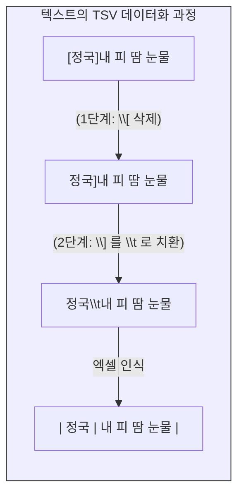

# 실전 데이터 정제 기초

자연어 형태의 원시 데이터(Raw Data)를 기계가 학습할 수 있는 데이터베이스로 만들기 위한 첫 번째 단계는 텍스트에 섞인 불필요한 노이즈를 제거하고 형식을 통일하는 **“데이터 정제”**(Data Cleansing)입니다. 

이 장에서는 정규표현식의 메타문자를 활용하여 파편화된 운영체제의 개행문자를 일원화하고, 텍스트의 줄을 나누며, 특정 문자 집합을 필터링하는 실전 공학 기술을 텍스트 에디터 환경에서 실습합니다.

## 1. 전처리의 숨은 적: 개행문자(\r) 통일의 절대 원칙

우리가 인터넷에서 수집한 문서들은 서로 다른 운영체제(OS) 환경에서 작성되었기 때문에 눈에 보이지 않는 “**개행문자**”(줄바꿈)의 형태가 제각각입니다.

* **\r (Carriage Return):** 과거 Mac OS X 이전 환경에서 사용.
* **\n (Line Feed):** Unix 및 현대 Mac OS 환경에서 사용.
* **\r\n (End Of Line):** Windows 환경에서 기본적으로 사용하는 조합.

텍스트 에디터에서 정규표현식이 이유 없이 작동하지 않거나, `\n`을 지웠는데도 줄바꿈이 사라지지 않는다면 십중팔구 윈도우 환경의 잔재인 `\r`이 텍스트 내부에 숨어있기 때문입니다. 

**[절대 원칙]** 텍스트 데이터를 에디터에 복사해 온 직후, 본격적인 정규식 작업을 시작하기 전에 **반드시 `\r`을 찾아 빈칸(삭제)으로 바꾸는 작업부터 선행**해야 합니다. 이를 통해 모든 데이터의 개행문자를 `\n` 하나로 일관성 있게 통제할 수 있습니다.

## 2. 탭(Tab)을 이용한 데이터 분리 (TSV 변환)

텍스트 안에 섞여 있는 메타 정보를 분리하여 데이터베이스의 열(Column)로 나누는 실습입니다. 방탄소년단의 “**피 땀 눈물**” 가사 텍스트를 예시로 들어봅니다.

**[원본 텍스트]**
```text
[정국]내 피 땀 눈물 내 차가운 숨을
[지민]내 피 땀 눈물
```

우리의 목표는 대괄호 `[]` 안에 있는 가수 이름과 가사를 탭(`\t`)으로 분리하여 TSV 포맷의 두 개의 열로 만드는 것입니다.

1.  **여는 대괄호 삭제:** 대괄호 `[`는 범위를 나타내는 메타문자이므로, 이스케이프 처리를 하여 `\[`를 찾아 “**빈칸(삭제)**”으로 변경합니다.
2.  **닫는 대괄호를 탭으로 치환:** `\]`를 찾아 탭 메타문자인 `\t`로 모두 바꿉니다.

**[수정 텍스트]**
```text
정국	내 피 땀 눈물 내 차가운 숨을
지민	내 피 땀 눈물
```
이제 이 텍스트를 엑셀에 붙여넣으면 기계는 탭을 기준으로 가수(A열)와 가사(B열)를 완벽히 분리된 정형 데이터로 인식합니다.



## 3. 맥락 기반 줄바꿈 (개행 추가 및 통제)

하나의 긴 문단으로 이어져 있는 텍스트를 논리적인 구조(문장 단위, 대화 단위)에 따라 자동으로 줄을 나누어 줍니다.

### 3.1 대화문과 지문 분리 (홍길동전)
“**홍길동전**” 국역본의 일부입니다. 문장 부호 뒤에 나오는 대화문을 새로운 행으로 내리는 실습입니다.

**[목표 1] 마침표와 쌍따옴표 사이 분리**
* 찾기: `\.\s"` (마침표 `\.` + 공백 `\s` + 쌍따옴표 `"`)
* 바꾸기: `\.\n"` (마침표 `\.` + 개행문자 `\n` + 쌍따옴표 `"`)
  *(설명: 단순 띄어쓰기를 개행으로 치환합니다.)*

**[목표 2] 쉼표와 쌍따옴표 사이 분리**
* 찾기: `,\s"`
* 바꾸기: `,\n"`

### 3.2 불필요한 개행과 공백의 청소 (효녀 심청전)
마침표나 특수 기호 뒤에 개행을 일괄적으로 추가하다 보면, 이미 줄이 바뀌어 있던 곳에 개행이 중복되어 빈 줄이 생기거나, 줄의 시작 부분에 띄어쓰기 공백이 남는 부작용이 발생합니다. 이를 청소해야 합니다.

* **중복 개행 제거:** `\n\n`을 찾아 단일 `\n`으로 모두 바꿉니다.
* **시작 공백 제거:** `^\s` (행의 시작 `^`에 위치한 공백 `\s`)를 찾아 모두 “**빈칸(삭제)**”으로 변경합니다.

## 4. 문자 집합을 활용한 데이터 필터링

대괄호 `[]`를 활용하여 언어권별 텍스트를 추출하거나 일괄 삭제하는 기법입니다.

### 4.1 특정 언어의 추출 (한글과 영문)
노래 가사 데이터(예: 아이유의 “**Celebrity**”)에서 특정 언어만 분석하고 싶을 때 사용합니다.
* **한글 탐색:** `[ㄱ-ㅎㅏ-ㅣ가-힣]`을 사용하면 자음, 모음, 그리고 조합이 완성된 한글 전체를 빠짐없이 추출할 수 있습니다.
* **영문 탐색:** `[A-Za-z]`를 사용하면 대소문자가 포함된 모든 영어 알파벳을 식별합니다.

### 4.2 이종 문자의 일괄 소거 (한자 제거)
역사 문헌이나 신문 기사에 한글과 한자가 혼용된 국한문혼용체 데이터(예: 윤선도의 “**오우가**”)에서 분석에 불필요한 한자 텍스트를 통째로 지워버리는 실습입니다.

**[원본 텍스트]**
```text
뎌러코四時 ᄉᆞ시예프르니그를됴하ᄒᆞ노라
```

* **찾기:** `([一-龥豈-龎]+)` (모든 한자 집합에 1개 이상을 뜻하는 `+`를 결합하여 한자 단어 전체를 덩어리로 지정합니다.)
* **바꾸기:** “**빈칸(삭제)**”

이 정규식을 구동하면 텍스트 내의 모든 한자가 즉각적으로 증발하고 순수한 한글 텍스트 데이터만 남아, 형태소 분석이나 빈도 분석을 수행하기 위한 완벽한 정제 상태가 됩니다.

:::{seealso} 📖 실습 자료 출처
이 장에서 사용된 정규표현식 실전 예제와 텍스트 데이터(피 땀 눈물, 홍길동전, 심청전 등)는 다음의 교육 자료를 기반으로 작성되었습니다.
* **이효림.** <데이터 전처리 - 정규표현식 (02-3. 정규표현식 실습 (기초편))>. 위키독스. <a href="https://wikidocs.net/214024" target="_blank">https://wikidocs.net/214024</a>
:::