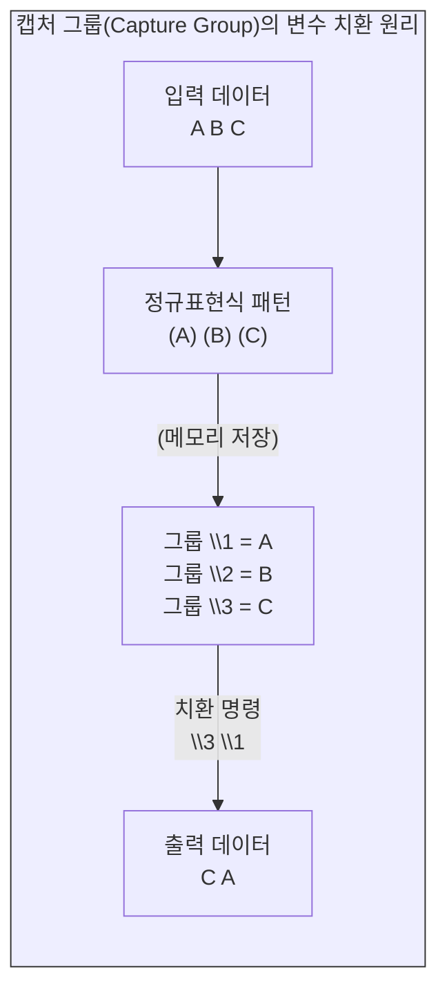

# 캡처 그룹과 데이터 구조화 심화

데이터 전처리의 진정한 위력은 단순히 불필요한 문자를 지우는 클렌징(Cleansing)을 넘어, 비정형 텍스트를 기계가 완벽히 인식할 수 있는 **“관계형 데이터베이스”**(RDBMS) 형태로 직조해 내는 **“데이터 구조화”**(Structuring)에 있습니다.

이 장에서는 마법의 패턴인 비탐욕적 탐색(`.*?`)을 이해하고, 정규표현식의 꽃이라 불리는 **“캡처 그룹”**(`()`)과 **“백레퍼런스”**(`\1`)를 활용하여 데이터의 순서를 뒤집고 식별자(ID)를 자동 부여하는 심화 공학 기술을 실습합니다.

## 1. 탐욕적 탐색(Greedy)과 비탐욕적 탐색(Lazy)

모든 문자를 의미하는 마침표(`.`)와 0개 이상의 반복을 의미하는 별표(`*`)를 결합한 `.*`는 정규표현식에서 가장 빈번하게 쓰이는 조합입니다. 하지만 기계의 탐색 알고리즘 특성을 이해하지 못하면 심각한 데이터 추출 오류를 겪게 됩니다.

### 1.1 욕심이 많은 탐색 (`.*`)
기계는 기본적으로 패턴을 평가할 때 가능한 한 가장 넓은 범위를 집어삼키려는 **“탐욕적”**(Greedy) 성향을 지닙니다.
영화 리뷰 데이터를 예로 들어 봅니다. (데이터 구조: `숫자 탭 리뷰내용 탭 점수`)

* **검색어:** `[0-9].*\t` (숫자로 시작해서 탭으로 끝나는 문자열)
* **결과:** 기계는 첫 번째 탭에서 멈추지 않고, 문장 맨 마지막에 있는 탭까지 통째로 삼켜버려 중간의 텍스트 데이터 전체를 하나의 덩어리로 묶어버립니다.

### 1.2 욕심을 제어하는 마법의 단어 (`.*?`)
메타문자 뒤에 물음표(`?`)를 붙이면, 기계의 알고리즘은 **“비탐욕적”**(Lazy 또는 Non-greedy) 방식으로 전환됩니다. 즉, 조건을 만족하는 **“최초의 순간”**에 탐색을 즉각 중단합니다.

* **검색어:** `[0-9].*?\t`
* **결과:** 숫자로 시작하여 **“첫 번째 탭”**이 나올 때까지만 정확히 추출합니다. 

따라서 우리가 원하는 특정 구간의 데이터를 안전하게 추출하기 위해 메타문자가 아닌 문자열의 집합을 지정할 때는 무조건 `.*?`를 사용해야 합니다.

## 2. 신비의 변수: 캡처 그룹과 백레퍼런스

괄호 `()`를 사용하여 특정 패턴을 **“그룹화”**하면, 기계는 괄호 안의 데이터를 임시 메모리에 저장합니다. 이렇게 캡처된 각 그룹은 순서대로 `\1`, `\2`, `\3` 형태의 변수(백레퍼런스)로 호출하여 자유자재로 위치를 바꾸거나 재조립할 수 있습니다.

### 2.1 열 데이터의 선택적 추출 및 삭제
`시간 \t 내용 \t 점수` 형식으로 이루어진 3개의 열(Column) 데이터에서, 가운데 내용 열을 삭제하고 시간과 점수 데이터만 남기는 실습입니다.

* **찾기:** `^(.*?\t)(.*?\t)(.*?)$` (문장 시작부터 첫 탭까지 그룹 1, 두 번째 탭까지 그룹 2, 문장 끝까지 그룹 3으로 묶습니다.)
* **바꾸기:** `\1\3` (그룹 1과 그룹 3만 호출하고 그룹 2는 소거합니다.)

### 2.2 텍스트 순서의 동적 재배치 (더 글로리 대본)
드라마 대본에서 `(행동 지문) 대사` 순서로 작성된 텍스트를 `대사(행동 지문)` 순서로 일괄 뒤집는 실습입니다.

* **찾기:** `(\(.*?\))(.*?)$` (실제 괄호 기호를 이스케이프한 `\(`와 `\)`로 묶인 지문 영역을 그룹 1로, 이어지는 대사를 그룹 2로 캡처합니다.)
* **바꾸기:** `\2\1` (대사를 먼저 출력하고 지문을 뒤로 보냅니다.)

## 3. 복합 정규표현식을 활용한 데이터베이스 구조화

가장 난이도가 높은 작업으로, 위에서 뒤로 텍스트를 읽어 내려가며 특정 식별자(ID)를 하위 행들에 자동으로 상속시키는 구조화 기법입니다.

### 3.1 식별자(ID) 상속 부여 1: 노랫말 파트 (Celebrity)
가사 데이터에서 `[1]`과 같은 파트 번호가 맨 윗줄에만 있을 때, 이를 아래 가사 줄에도 동일하게 기입하는 실습입니다.

* **찾기:** `^(\[.*?\])(.*?)$\n([^\[].*?)$`
  * 그룹 1: `^(\[.*?\])` (행 시작 부분의 괄호 묶인 파트 번호)
  * 그룹 2: `(.*?)$\n` (파트 번호 뒤의 첫 번째 가사 행)
  * 그룹 3: `([^\[].*?)$` (파트 번호가 없는 두 번째 가사 행)
* **바꾸기:** `\1\2\n\1\3` (그룹 1의 파트 번호를 첫 번째 줄과 두 번째 줄 모두의 맨 앞에 복제하여 삽입합니다.)

### 3.2 식별자(ID) 상속 부여 2: 시(Poem) 데이터베이스 구축
시 ID와 첫 번째 연이 같은 행에 있고, 두 번째 연부터는 빈칸으로 시작하는 TSV 데이터에서 모든 행에 시 ID를 일괄 부여하는 방법입니다. 이 과정은 데이터베이스의 기본 키(Primary Key)를 모든 레코드에 매핑하는 핵심 전처리입니다.

1.  **노이즈 제거:** 엑셀에서 넘어온 셀 내부 개행 흔적인 쌍따옴표 `"`를 찾아 빈칸으로 제거합니다.
2.  **ID 복제 및 상속:**
    * **찾기:** `(^[0-9]+\t)(.*?\n)(^[^0-9].*?\n)(^[^0-9].*?)$`
    * **설명:** 숫자로 시작하는 ID와 탭(그룹 1), 첫 번째 시 구절(그룹 2), 숫자로 시작하지 않는 두 번째 시 구절(그룹 3), 세 번째 시 구절(그룹 4)을 한 번에 캡처합니다.
    * **바꾸기:** `\1\2\1\3\1\4`
3.  **반복 수행:** 이 패턴을 더 이상 변경되는 데이터가 없을 때까지 반복(Replace All) 실행하면, 시의 모든 연마다 동일한 시 ID가 완벽하게 복제되어 구조화된 테이블이 완성됩니다.

## 4. 정규표현식 시각화 및 검증 도구

수많은 메타문자가 결합된 복합 정규표현식은 직관적으로 해독하기 어렵습니다. 작성한 정규식이 의도대로 작동하는지 검증하기 위해 **“RegExr”**(https://regexr.com/)와 같은 웹 기반 테스터를 적극 활용할 수 있습니다.

이 사이트에서는 상단에 정규표현식을 입력하고 하단에 테스트할 텍스트를 넣으면, 매칭되는 구간이 실시간으로 파란색으로 하이라이트됩니다. 또한 사용한 정규식이 어떤 알고리즘을 수행하는지 그 구조를 쪼개어 설명해 주므로 복잡한 전처리 로직을 설계할 때 매우 유용합니다.

:::{seealso} 📖 실습 자료 출처
이 장의 캡처 그룹 치환 및 관계형 데이터 구조화 예제는 다음의 교육 자료를 기반으로 심층 구성되었습니다.
* **이효림.** <데이터 전처리 - 정규표현식 (02-3. 정규표현식 실습 (기초편))>. 위키독스. <a href="https://wikidocs.net/214024" target="_blank">https://wikidocs.net/214024</a>
* **이효림.** <데이터 전처리 - 정규표현식 (02-4. 정규표현식 실습 (심화편))>. 위키독스. <a href="https://wikidocs.net/217176" target="_blank">https://wikidocs.net/217176</a>
:::