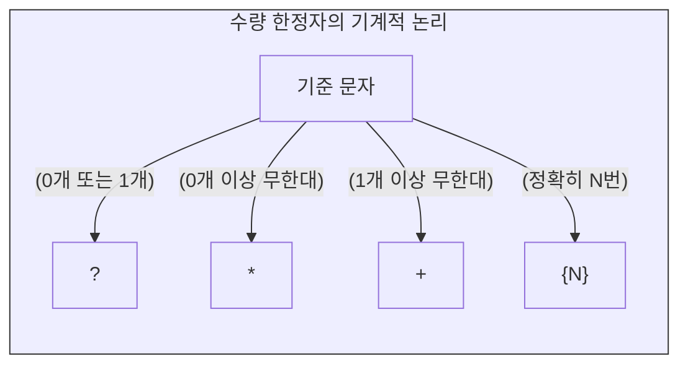

# 메타문자와 패턴의 논리

인간의 자연어는 고도로 불규칙하며 문맥에 따라 형태가 변합니다. 기계가 이러한 텍스트의 바다에서 특정한 데이터만을 추출하기 위해서는 일반적인 문자가 아닌, 정보공학적 명령어를 내포한 특수한 기호 체계가 필요합니다. 

정규표현식에서는 이를 “**메타문자**”(Meta Characters)라고 부릅니다. 메타문자는 원래 그 문자가 가진 시각적 형태의 뜻이 아니라, 기계적인 알고리즘을 수행하기 위한 “**특별한 용도로 사용하는 문자**”를 의미합니다. 이 장에서는 데이터 전처리의 뼈대가 되는 메타문자의 논리와 문법을 체계적으로 학습합니다.

## 1. 이스케이프(Escape): 명령과 문자의 경계

정규표현식을 다룰 때 가장 먼저 이해해야 하는 기호는 역슬래시(`\`)입니다. 역슬래시는 키보드 폰트나 운영체제 설정에 따라 원화(₩) 기호로 보이기도 하지만, 컴퓨터 내부에서는 완벽히 동일한 기능을 수행합니다.

* **기능:** 역슬래시는 “**이스케이프**”(Escape)용 문자로 작동하여, 뒤에 오는 메타문자가 가진 특수한 명령 기능을 무력화하고 “**일반 문자**” 그 자체로 기계가 인식하도록 만듭니다.
* **예시:** 마침표(`.`)는 정규표현식에서 “**모든 문자**”를 뜻하는 강력한 메타문자입니다. 문장 끝에 있는 진짜 마침표 기호 그 자체를 찾고 싶다면 반드시 `\.` 형태로 입력하여 메타문자의 기능을 탈출(Escape)시켜야 합니다.

## 2. 선택과 수량의 통제

기계에게 문자의 반복 횟수와 선택적 논리를 지시하는 메타문자들입니다.

### 2.1 논리합(OR)과 그룹화
* `|` (파이프): 프로그래밍의 불리언(Boolean) 연산인 “**또는(OR)**”을 의미합니다. `나의|너의`라고 입력하면 기계는 두 문자열 중 하나라도 일치하는 것을 모두 추출합니다.
* `()` (괄호): 여러 문자를 하나의 “**그룹**”으로 묶어줍니다. `나의|너의|그의`처럼 반복되는 구조는 `(나|너|그)의`로 압축하여 검색 알고리즘의 효율을 극대화할 수 있습니다.

### 2.2 수량 한정자 (Quantifiers)
특정 패턴이 몇 번 반복되는지를 기계에 지시합니다.

* `?` (물음표): 앞의 문자가 “**0개 혹은 1개**” 있음을 뜻합니다. 
* `*` (별표): 앞의 문자가 “**0개 이상**” 무한히 반복될 수 있음을 뜻합니다.
* `+` (플러스): 앞의 문자가 “**1개 이상**” 무조건 존재해야 함을 뜻합니다.
* `{min, max}`: 앞의 문자가 반복되는 “**최소 횟수와 최대 횟수**”를 정확히 지정합니다. 예를 들어 `생{1,3}`은 “**생**”이라는 글자가 1번에서 3번까지 반복되는 것을 모두 찾습니다. `{N}` 형태로 숫자 하나만 쓰면 정확히 N번 반복됨을 의미합니다.

## 3. 정보의 필터링: 문자 집합과 범위

대괄호 `[]`는 텍스트 데이터 내에서 특정 범주에 속하는 문자들만 걸러내는 강력한 필터 역할을 합니다. 대괄호 안의 문자는 단어가 아니라 “**범위 안의 모든 문자 1개**”를 의미합니다.

### 3.1 기본 범위 지정
* `[0-9]`: 0부터 9까지의 “**모든 숫자**”를 추출합니다.
* `[A-Za-z]`: 대문자와 소문자를 포함한 “**모든 알파벳**”을 추출합니다.
* `[^]`: 대괄호 맨 앞에 캐럿(`^`)을 붙이면 프로그래밍의 NOT 연산자로 작동하여, “**해당 범위를 제외한 나머지 모든 문자**”를 뜻하게 됩니다. 예컨대 `[^0-9]`는 숫자를 제외한 문자만 남깁니다.

### 3.2 동아시아 언어 전처리 특수 범위
디지털인문학과 한국학 데이터 전처리에서 가장 많이 쓰이는 필수 정규식입니다. 유니코드 테이블의 인덱스 범위를 활용합니다.

* `[가-힣]`: “**가**”부터 “**힣**”까지 조합이 완료된 “**모든 완전한 한글 음절**”을 뜻합니다.
* `[ㄱ-ㅎㅏ-ㅣ가-힣]`: 완전한 한글뿐만 아니라 “**ㅋㅋ**”, “**ㅠㅠ**”처럼 자음과 모음만으로 단독 구성된 한글 낱자까지 모두 포괄하여 추출합니다.
* `[一-龥豈-龎]`: “**모든 한자**”를 뜻합니다. 이 정규식을 활용하면 고문헌 데이터나 신문 기사에서 한자만 정확히 분리해 내거나 일괄 삭제할 수 있습니다.

## 4. 시스템 제어 문자 및 축약형 메타문자

공백, 탭, 줄바꿈 등 눈에 보이지 않는 시스템의 제어 신호들을 통제하는 문법입니다. 역슬래시(`\`)와 알파벳의 조합으로 이루어집니다.

### 4.1 공백과 형태의 통제
* `\t`: 데이터 열을 구분하는 “**탭(Tab)**” 기호를 뜻합니다.
* `\n` 또는 `\r`: 행을 나누는 “**개행 문자(Enter)**”를 뜻합니다.
* `\s`: 띄어쓰기, 탭, 개행 문자를 모두 포함하는 범용 “**공백 문자**”를 의미합니다. 반대로 `\S` (대문자)는 공백이 아닌 모든 문자를 뜻합니다.

### 4.2 축약형 범위 지정
자주 쓰는 문자 집합은 효율성을 위해 짧은 메타문자로 축약되어 있습니다.
* `\d`: “**모든 숫자**”를 뜻하며 `[0-9]`와 완전히 동일하게 작동합니다.
* `\D`: “**숫자가 아닌 모든 문자**”를 뜻하며 `[^0-9]`와 동일합니다.

### 4.3 위치의 지정 (Anchors)
단어의 내용이 아니라 문장 내에서의 물리적 위치를 탐색 조건으로 삼는 메타문자입니다.
* `^` (캐럿): 대괄호 `[]` 밖에서 쓰일 경우, “**행의 처음(시작)**”을 뜻합니다. 예를 들어 `^[A-Z]`는 반드시 대문자 알파벳으로 시작하는 문장만을 찾아냅니다.
* `$` (달러): “**행의 끝**”을 뜻합니다. 특정한 기호나 패턴으로 끝나는 데이터를 필터링할 때 필수적입니다.

:::{seealso} 📖 출처 및 참조
이 장의 메타문자 규칙 및 정규표현식 문법 해설은 다음의 실무 자료를 심층적으로 재구성한 것입니다.
* **이효림.** <데이터 전처리 - 정규표현식 (02-2. 정규표현식 기초)>. 위키독스. <a href="https://wikidocs.net/214025" target="_blank">https://wikidocs.net/214025</a>
:::