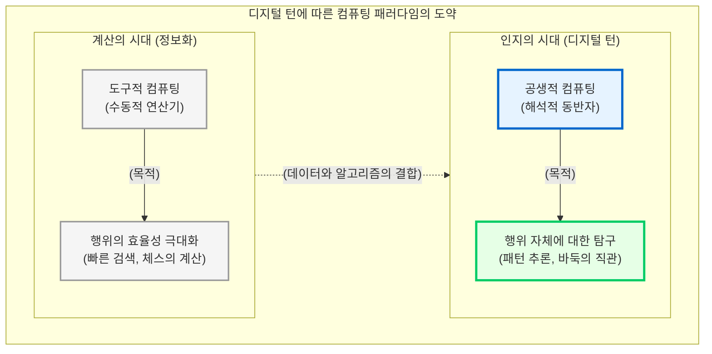

# 디지털 턴과 인간-기계 공생의 본질

인류의 지성사는 지식을 생산하고 유통하는 매체(Medium)의 발전과 불가분의 관계를 맺고 있습니다. 구전에서 문자 발명으로, 필사본에서 인쇄술로 이어지는 거대한 매체 혁명들은 단순히 정보의 전달 속도를 높인 것을 넘어 인간이 세계를 사유하는 방식 자체를 근본적으로 재편했습니다. 

21세기 인문학이 맞이한 가장 거대한 인식론적 단절이자 도약은 바로 “**디지털 턴(Digital Turn)**”입니다. 이 장에서는 흔히 대중 매체에서 4차 산업혁명으로 소비되는 기술적 변화의 본질을 인문학적 시선으로 해체하고, 컴퓨터가 수동적인 도구에서 인간과 지식을 공동 생산하는 “**공생(Symbiosis)**”의 파트너로 격상되는 철학적 궤적을 탐구합니다.

## 1. 정보 처리에서 인지 컴퓨팅으로의 도약

디지털 턴의 본질을 이해하기 위해서는, 20세기 후반의 3차 산업혁명(정보화 시대)과 현재 우리가 목도하고 있는 인공지능 시대의 근본적인 차이를 명확히 구분해야 합니다.

### 1.1 인간 행위의 효율성: 계산(Calculation)의 시대
초기 컴퓨터 과학과 3차 산업혁명의 목표는 철저히 “**인간 행위의 효율성 극대화**”에 맞추어져 있었습니다. 컴퓨터는 주어진 논리적 규칙(알고리즘)에 따라 인간보다 빠르고 정확하게 데이터를 저장하고 연산하는 “**수동적 정보 처리 기계(Information Processing Machine)**”였습니다.

이 시대의 기술적 화두는 다음과 같았습니다.
* “어떻게 하면 부산 가는 기차표를 수백만 명의 접속자 지연 없이 가장 빠르게 예매할 수 있는 데이터베이스를 구축할 것인가?”
* “어떻게 하면 체스 챔피언 가리 카스파로프(Garry Kasparov)를 이길 수 있는 초고속 경우의 수 탐색 알고리즘(딥블루)을 설계할 것인가?”

여기서 컴퓨터는 인간의 목적을 달성하기 위해 동원되는 훌륭하지만 수동적인 “**도구(Tool)**”에 불과했습니다.

### 1.2 인간 행위 자체에 대한 탐구: 인지(Cognition)의 시대
그러나 기계학습(Machine Learning)과 거대 데이터의 결합으로 촉발된 인지 컴퓨팅(Cognitive Computing) 시대는 전혀 다른 층위의 질문을 던집니다. 기계는 명시적인 규칙을 입력받지 않고도, 방대한 데이터 속에서 스스로 패턴을 찾아내고 확률적으로 추론하는 능력을 갖추게 되었습니다.

이제 기술적 화두는 효율성이 아니라 “**인간 본성에 대한 탐구**”로 이동합니다.
* “부산 가는 기차표를 구매하는 사람들은 누구이며, 어떤 문화적 욕망과 경제적 동기로 이동하는가?” (데이터 마이닝을 통한 인간 행동 패턴 분석)
* “알파고(AlphaGo)와 대국을 펼치며 패배의 충격 속에서도 새로운 묘수를 찾아내는 이세돌의 직관과 사유 방식은 무엇인가?” (인공지능의 거울에 비친 인간 인지의 본질 탐구)

이처럼 데이터가 축적된 현대의 컴퓨팅 환경은 그 자체로 전통적 인문학이 수백 년간 던져온 “**인간이란 무엇인가**”라는 명제를 실증적으로 탐구할 수 있는 거대한 인식론적 실험실이 되었습니다.

## 2. 인간-기계 공생(Human-Machine Symbiosis) 패러다임

기술이 효율성의 도구를 넘어 세계를 인식하는 렌즈가 되었을 때, 인문학자와 컴퓨터의 관계는 필연적으로 재정립됩니다. 사이버네틱스(Cybernetics)의 선구자인 J.C.R. 리클라이더(J.C.R. Licklider)가 1960년에 주창했던 “**인간-기계 공생(Man-Computer Symbiosis)**”의 비전은 오늘날 디지털 인문학에서 완벽하게 구현되고 있습니다.

### 2.1 도구적 종속에서 해석적 동반자로
도구적 관점에서 컴퓨터는 학자가 입력한 검색어에 대해 정해진 결과값을 반환하는 데 그칩니다. 그러나 공생적 패러다임에서 컴퓨터는 방대한 문헌을 읽어내고, 인간의 유한한 인지 능력으로는 결코 포착할 수 없는 거시적 패턴(Macro-patterns)을 추출하여 학자에게 제시합니다.

기계는 텍스트 내의 숨겨진 위상학적 네트워크나 장르의 변형 궤적을 제시하고, 인문학자는 이 기계적 연산 결과에 시대적 맥락과 철학적 의미를 부여하여 비판적으로 해석합니다. 즉, 기계의 “**연산적 거시성**”과 인간의 “**해석적 미시성**”이 상호 보완하며 융합하는 것입니다.

### 2.2 해석적 환경으로서의 디지털 인터페이스
디지털 인문학에서 데이터를 렌더링하는 인터페이스(예: 네트워크 그래프, 지리정보시스템)는 단순히 연구 결과를 예쁘게 포장하는 전시장이 아닙니다. 조해나 드러커(Johanna Drucker)가 강조하듯, 이러한 시각화 도구는 인문학자가 데이터를 이리저리 뒤집어보고, 매개변수를 조작하며, 직관적인 통찰(Heuristics)을 얻어내는 “**해석적 환경(Interpretive Environment)**”으로 작동합니다. 학자는 컴퓨터와 대화하듯 데이터를 탐색하며 새로운 질문을 공동으로 생성해 냅니다.

## 3. 디지털 턴을 맞이하는 인문학자의 책무

인간-기계 공생 패러다임은 인문학자에게 전례 없는 지적 무기를 제공하지만, 동시에 새로운 차원의 책무를 요구합니다. 

기계가 도출한 패턴은 객관적인 진리가 아니라, 알고리즘과 훈련 데이터의 구조에 의해 조건 지어진 연산의 결과일 뿐입니다. 따라서 21세기의 인문학자는 컴퓨터가 제공하는 결과를 무비판적으로 수용하는 수동적 소비자에 머물러서는 안 됩니다. 

세계를 기계가 읽을 수 있는 데이터로 “**편찬(Compilation)**”하는 과정에 깊숙이 개입하고, 코딩과 알고리즘의 원리를 이해하여 기계의 블랙박스를 비판적으로 해체할 수 있는 “**디지털 리터러시(Digital Literacy)**”를 갖출 때, 비로소 인간은 기계와의 공생 관계에서 주도권을 쥐고 지식 생산의 주체로 우뚝 설 수 있습니다. 이어지는 장에서는 이 공생의 철학이 실제 텍스트를 연산 가능한 데이터로 편찬하는 문헌학적 역사 속에서 어떻게 구현되어 왔는지 추적해 봅니다.

:::{seealso} 📖 참고문헌
* **김바로 (2026).** <특강: 학문으로서의 디지털인문학>. 전남대학교 예비 필로소포이 프로그램. (강의 자료).
* **Licklider, J. C. R. (1960).** <Man-Computer Symbiosis>. IRE Transactions on Human Factors in Electronics. HFE-1. pp. 4-11. <a href="https://doi.org/10.1109/THFE2.1960.4503259" target="_blank">DOI: 10.1109/THFE2.1960.4503259</a>
* **Johanna Drucker (2011).** <Humanities Approaches to Graphical Display>. Digital Humanities Quarterly. 5(1). <a href="http://www.digitalhumanities.org/dhq/vol/5/1/000091/000091.html" target="_blank">DHQ URL</a>
:::