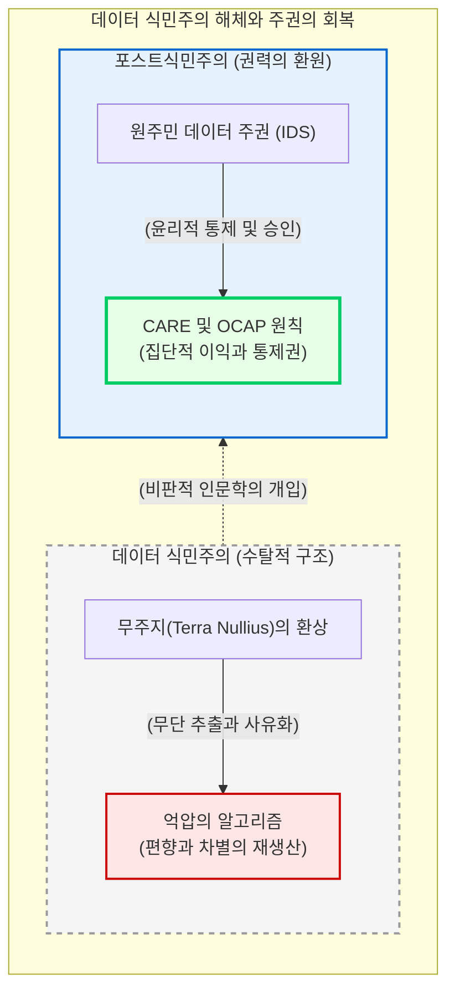

# 데이터의 위계성과 억압의 알고리즘

디지털 인문학은 초창기의 기술 낙관주의를 벗어나, 데이터와 알고리즘이 결코 가치 중립적이지 않으며 뚜렷한 권력의 위계와 정치적 의도를 지니고 있음을 해부하는 “**비판적 디지털 인문학(Critical Digital Humanities)**”으로 진화했습니다. 

이 장에서는 우리가 수집하고 연산하는 데이터베이스 이면에 도사린 “**알고리즘 편향성**”을 폭로하고, 21세기의 새로운 제국주의인 “**데이터 식민주의(Data Colonialism)**”를 비판합니다. 나아가 서구 중심의 지식 독점에 대항하여 데이터의 권력을 소외된 커뮤니티로 반환하는 “**원주민 데이터 주권(Indigenous Data Sovereignty)**”의 철학적, 실천적 대안을 심층적으로 탐구합니다.

## 1. 억압의 알고리즘과 데이터의 위계

컴퓨터 공학과 실리콘밸리의 기술 기업들은 검색 엔진과 인공지능이 수학적 통계에 기반한 객관적이고 “**중립적인 기술**”이라고 주장해 왔습니다. 그러나 비판적 정보학자 사피야 노블(Safiya U. Noble)은 그녀의 저서에서 “**억압의 알고리즘(Algorithms of Oppression)**”이라는 개념을 통해 이러한 기술적 환상을 산산조각 냈습니다.

### 1.1 알고리즘의 흑인 여성화와 편향의 재생산
노블의 연구는 구글과 같은 상업적 검색 엔진이 흑인 여성이나 소수자에 대한 검색 결과를 어떻게 성적 대상화하고 부정적인 고정관념으로 환원하는지를 실증적으로 폭로했습니다. 검색 알고리즘은 단순히 세상의 정보를 거울처럼 비추는 것이 아닙니다. 자본주의적 클릭 구조와 개발자 집단의 백인/남성 중심적 “**설계자 편향(Designer's Bias)**”이 코드로 하드코딩(Hardcoding)되어, 현실의 인종차별과 성차별을 디지털 공간에서 더욱 증폭시키고 정당화하는 “**인식론적 폭력(Epistemic Violence)**”을 자행합니다.

### 1.2 차별 민감형 메타데이터의 필요성
이러한 데이터의 위계성은 과거의 문헌을 디지털화하는 아카이브 구축 과정에서도 고스란히 재현됩니다. 주류 백인 남성의 서사는 상세한 인물 정보로 온톨로지화되는 반면, 여성이나 노예, 식민지 민중의 서사는 익명의 군집 데이터로 뭉뚱그려집니다. 

따라서 비판적 디지털 인문학자는 아카이브를 설계할 때부터 지배 계급의 언어가 아닌 “**차별 민감형 메타데이터(Discrimination-sensitive metadata)**”를 의도적으로 도입해야 합니다. 누구의 목소리가 과대 대표되고 있으며, 누구의 서사가 구조적으로 배제되었는지를 묻는 것이 데이터 편찬의 최우선 윤리입니다.

## 2. 데이터 식민주의와 무주지(Terra Nullius)의 환상

알고리즘 편향의 문제는 더 넓은 거시적 관점에서 “**데이터 식민주의(Data Colonialism)**”라는 21세기형 자본주의 수탈 구조와 맞닿아 있습니다. 닉 콜드리(Nick Couldry)와 율리세스 메히아스(Ulises Mejias)가 정립한 이 개념은, 다국적 거대 IT 기업들이 남반구(Global South)와 전 세계 사용자의 일상을 데이터로 추출하여 이윤을 독점하는 과정이 과거 역사적 제국주의의 자원 수탈과 구조적으로 동일함을 비판합니다.

### 2.1 데이터는 새로운 석유인가?
실리콘밸리의 자본가들은 “**데이터는 새로운 석유다**”라는 수사학을 즐겨 사용합니다. 이는 매우 위험한 은유입니다. 이 비유는 인간의 일상과 문화적 산물인 데이터를 주인이 없는 자연 자원, 즉 과거 제국주의자들이 아프리카와 아메리카 대륙을 강탈할 때 내세웠던 “**무주지(Terra Nullius)**”의 논리로 둔갑시킵니다. 

이러한 환상 속에서 기술 기업들은 소외된 계층과 비서구 국가들로부터 어떠한 정당한 보상이나 동의 없이 막대한 데이터를 무단으로 추출(Extraction)하고 전유합니다.

## 3. 포스트식민주의 디지털 인문학과 원주민 데이터 주권

데이터 식민지화의 착취적 논리에 대항하여, 진보적인 디지털 인문학계와 도서관, 박물관 전문가(GLAM)들은 데이터 권력을 해체하고 커뮤니티로 환원하는 “**원주민 데이터 주권(Indigenous Data Sovereignty, IDS)**” 프레임워크를 확립하고 있습니다.

### 3.1 FAIR 원칙을 넘어 CARE 원칙으로
기존 주류 과학계와 오픈 데이터 진영이 금과옥조로 삼았던 “**FAIR 원칙(Findable, Accessible, Interoperable, Reusable)**”은 정보의 자유로운 유통에만 초점을 맞춘 나머지, 원주민의 집단적 권리와 지적 재산을 침해하는 부작용을 낳았습니다. 이를 보완하기 위해 원주민 공동체의 자치권을 존중하는 “**CARE 원칙**”이 대안적 스탠더드로 부상했습니다.

* **C (Collective Benefit, 집단적 이익):** 데이터 생태계는 포용적이어야 하며, 데이터 수집과 활용의 결과가 반드시 원주민 공동체의 경제적, 사회적 안녕에 기여해야 합니다.
* **A (Authority to Control, 통제 권한):** 원주민은 자신의 데이터가 누구에 의해 어떻게 관리되고 재현될지에 대한 의사결정 권한(Agency)을 전적으로 보유합니다.
* **R (Responsibility, 책임성):** 연구자는 원주민 커뮤니티와 상호 호혜적 관계를 맺으며, 역량 강화에 기여할 책임을 지닙니다.
* **E (Ethics, 윤리):** 데이터 생애주기 전반에 걸쳐 원주민의 문화적 복지와 권리를 최우선으로 고려해야 합니다.

### 3.2 캐나다의 OCAP 원칙
이와 궤를 같이하는 캐나다 선주민들의 “**OCAP 원칙(Ownership, Control, Access, Possession)**”은 원주민 커뮤니티가 자신들의 역사적, 문화적 정보에 대한 배타적 “**소유권**”과 “**접근 통제권**”을 지님을 천명합니다. 이는 서구의 개인정보 보호 논리를 뛰어넘어, 문화유산 데이터를 집단적 주권의 문제로 격상시킨 철학적 승리입니다.

결론적으로, 비판적 디지털 인문학은 데이터를 기술적 객체로만 취급하던 순진한 시대를 종식시켰습니다. 데이터는 곧 권력이며, 알고리즘은 그 권력을 집행하는 정치적 장치입니다. 인문학자들은 데이터를 편찬하고 알고리즘을 설계하는 매 순간, 이 구조적 폭력을 해체하고 소외된 자들의 서사와 주권을 복원하는 방어선을 구축해야 할 막중한 철학적 책무를 지닙니다.

:::{seealso} 📖 참고문헌
* **Safiya U. Noble (2018).** <Algorithms of Oppression: How Search Engines Reinforce Racism>. NYU Press. <a href="https://nyupress.org/9781479837243/algorithms-of-oppression/" target="_blank">Publisher URL</a>
* **Nick Couldry, Ulises A. Mejias (2019).** <The Costs of Connection: How Data Is Colonizing Human Life and Appropriating It for Capitalism>. Stanford University Press. <a href="https://www.sup.org/books/title/?id=28816" target="_blank">Publisher URL</a>
* **Carroll, S. R. et al. (2020).** <The CARE Principles for Indigenous Data Governance>. Data Science Journal. 19(1). p. 43. <a href="https://doi.org/10.5334/dsj-2020-043" target="_blank">DOI: 10.5334/dsj-2020-043</a>
* **FNIGC (2024).** <The First Nations Principles of OCAP>. First Nations Information Governance Centre. <a href="https://fnigc.ca/ocap-training/" target="_blank">Project URL</a>
:::