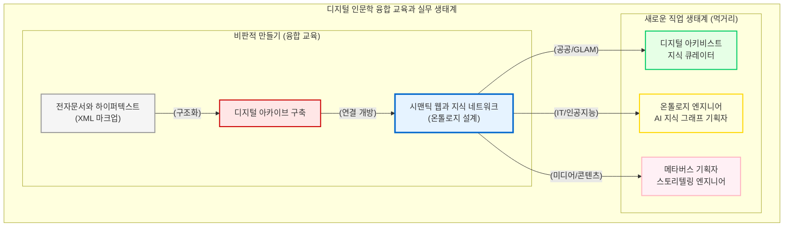

# 학문 후속 세대를 위한 융합 교육과 실무적 생태계 전망

인문학의 위기는 수십 년째 반복되는 낡은 화두입니다. 그러나 위기의 본질은 인문학적 사유 자체가 가치를 잃었기 때문이 아니라, 그 지식을 담아내는 매체와 유통 방식이 현대 사회의 기술적 생태계와 단절되었기 때문입니다. 

디지털 인문학은 텍스트를 연산 가능한 데이터로 편찬하고 거대한 지식 네트워크로 직조함으로써 이 단절을 극복합니다. 이 장에서는 시맨틱 웹(Semantic Web), 디지털 아카이브, 전자문서와 하이퍼텍스트의 원리를 체화한 학문 후속 세대들이 고립된 상아탑을 넘어 어떠한 실무적 생태계로 진출하고 있는지, 그 역동적인 “**직업적 비전과 먹거리**”를 조망합니다.

## 1. 융합 교육의 패러다임 전환: 읽기에서 만들기(Making)로

전통적인 인문학 교육은 완성된 텍스트를 읽고 비평하는 “**수동적 해석**”에 방점이 찍혀 있었습니다. 그러나 21세기의 디지털 인문학 융합 교육은 지식의 기반 인프라를 직접 설계하고 구축하는 “**비판적 만들기(Critical Making)**”로 패러다임을 전환했습니다.

오늘날의 대학원 및 융합 학부 과정은 학생들에게 단순히 철학이나 역사를 암기시키는 것을 넘어, 파편화된 고문헌 자료를 XML(eXtensible Markup Language) 구조로 정밀하게 마크업(Markup)하는 법을 훈련시킵니다. 또한, 단편적인 정보들을 관계형 데이터베이스로 묶어내고, 이를 다시 기계가독형 온톨로지(Ontology) 기반의 지식 네트워크로 설계하는 실무적 정보화 연구 능력을 배양합니다. 이는 인문학적 통찰과 공학적 설계 능력을 동시에 갖춘 융합 인재를 길러내는 가장 진보적인 학제간 훈련입니다.

## 2. 상아탑을 넘어선 새로운 직업적 비전

이러한 융합 교육을 이수한 디지털 인문학도들은 전통적인 교수나 연구원의 길에만 얽매이지 않습니다. 이들은 인문 지식을 데이터로 “**자산화(Assetization)**”하는 능력을 무기로, 현대 지식 정보 사회의 핵심 산업 생태계로 거침없이 진출하고 있습니다.

### 2.1 디지털 아키비스트 및 지식 큐레이터
박물관, 도서관, 기록관(GLAM) 생태계는 종이 문서를 보관하는 창고에서 거대한 디지털 지식 플랫폼으로 진화했습니다. 이곳에서 디지털 인문학 전공자들은 방대한 문화유산과 역사 사료를 국제 표준 메타데이터 체계에 맞추어 편찬하고, 이를 대중이 직관적으로 탐색할 수 있는 실감형 인터랙티브 전시로 큐레이션하는 “**디지털 아키비스트(Digital Archivist)**”로 활약합니다.

### 2.2 온톨로지 엔지니어 및 지식 그래프 설계자
가장 파급력이 큰 실무 영역은 거대 IT 기업과 인공지능 산업입니다. 인공지능이 환각(Hallucination) 없이 정확한 역사적, 문화적 사실을 추론하기 위해서는 기계가 이해할 수 있는 완벽한 논리 구조의 지식 그래프가 필요합니다. 인문학적 맥락을 깊이 이해하면서도 이를 시맨틱 웹의 언어(RDF 트리플)로 구조화할 수 있는 “**온톨로지 엔지니어(Ontology Engineer)**”는, 생성형 AI 시대에 가장 수요가 급증하는 대체 불가능한 핵심 지식 설계자입니다.

### 2.3 디지털 문화 콘텐츠 및 메타버스 기획자
잘 편찬된 역사 및 문학 데이터베이스는 게임, 영화, 메타버스 등 콘텐츠 산업의 원천 소스가 됩니다. 인문학적 상상력에 데이터 분석 능력을 결합한 인재들은, 수만 건의 사료 속에서 흥미로운 서사와 촘촘한 인물 관계망을 발굴하여 입체적인 세계관을 조형해 내는 “**스토리텔링 엔지니어**”이자 “**콘텐츠 기획자**”로 각광받고 있습니다.

## 3. 프롬프트 엔지니어링과 인문학적 사유의 귀환

거대언어모델(LLM)이 인간의 언어를 능수능란하게 구사하는 시대에, 역설적으로 가장 중요한 능력은 기계에게 “**어떤 질문을 어떻게 던질 것인가**”로 수렴되고 있습니다. 

단순히 코딩 문법을 아는 것을 넘어, 기계학습 모델의 편향성을 꿰뚫어 보고 윤리적, 철학적 맥락이 담긴 정교한 지시어를 설계하는 “**프롬프트 엔지니어링(Prompt Engineering)**”은 근본적으로 인문학적 훈련의 결과물입니다. 기계가 도출한 결과물의 진위와 맥락을 비판적으로 독해하는 능력, 즉 고도화된 “**디지털 리터러시**”는 21세기 노동 시장에서 인간이 인공지능에 종속되지 않고 공생을 주도할 수 있는 가장 강력한 무기입니다.

결론적으로, 디지털 인문학은 인문학의 종말을 알리는 묘비명이 아니라 인문학이 사회적 실천으로 부활하는 거대한 서막입니다. 디지털 턴(Digital Turn)의 본질을 이해하고, 기계와 공생하며 데이터를 능수능란하게 편찬해 내는 학문 후속 세대 앞에는 과거 그 어느 때보다 광활하고 역동적인 지식 생태계가 펼쳐져 있습니다.

이로써 디지털 인문학의 거시적 지평과 철학적 토대를 다룬 제1부를 마칩니다. 이어지는 제2부에서는 인문학적 사유를 현실의 데이터로 구현해 내는 물리적 뼈대, 즉 “**컴퓨팅과 네트워크**”의 작동 원리 속으로 직접 뛰어들어 보겠습니다.

:::{seealso} 📖 참고문헌
* **김바로 (2026).** <특강: 학문으로서의 디지털인문학>. 전남대학교 예비 필로소포이 프로그램. (강의 자료).
* **Constance Crompton et al. (2016).** <Doing Digital Humanities: Practice, Training, Research>. Routledge. <a href="https://doi.org/10.4324/9781315717730" target="_blank">DOI: 10.4324/9781315717730</a>
* **Burdick, Anne et al. (2012).** <Digital_Humanities>. MIT Press. <a href="https://mitpress.mit.edu/9780262528863/digital_humanities/" target="_blank">Publisher URL</a>
:::