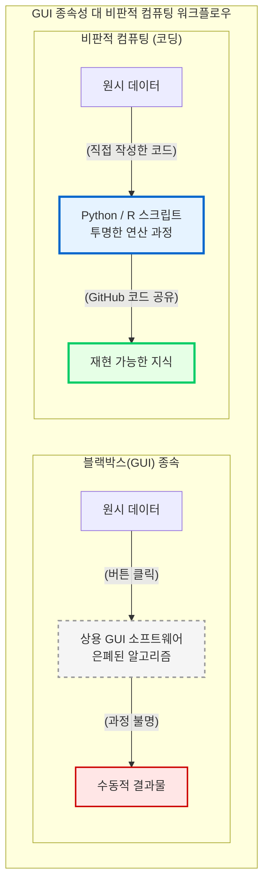

# 블랙박스의 해체와 디지털 리터러시

디지털 인문학의 5단계 파이프라인을 온전히 통제하고, 기계가 산출한 결과물의 이면을 꿰뚫어 보기 위해 현대의 인문학자에게 요구되는 가장 시급하고 핵심적인 역량은 바로 “**디지털 리터러시(Digital Literacy)**”의 획득입니다.

초창기 디지털 인문학 연구자들은 마우스 클릭만으로 화려한 시각화 결과를 산출해 내는 기성 상용 소프트웨어에 매료되었습니다. 그러나 이 장에서는 편리한 그래픽 유저 인터페이스(GUI) 이면에 도사린 “**블랙박스(Black Box)**”의 위험성을 폭로하고, 인문학자가 스스로 코드를 작성하는 “**비판적 컴퓨팅(Critical Computing)**”이 왜 필수불가결한 인식론적 저항인지 논증합니다.

## 1. GUI 도구의 환상과 블랙박스의 위험성

기성 상용 프로그램, 즉 GUI 기반의 분석 도구들은 복잡한 수학적 연산 과정을 화려한 아이콘과 버튼 뒤로 은폐합니다. 이러한 도구를 무비판적으로 수용할 때, 인문학자는 다음과 같은 치명적인 한계에 직면하게 됩니다.

### 1.1 알고리즘의 불투명성
상용 도구 내부에 탑재된 자연어 처리(NLP) 엔진이나 감성 분석 사전을 활용할 때, 우리는 텍스트가 구체적으로 어떤 기준에 의해 토큰화(Tokenization)되고 가중치가 분배되는지 전혀 알 수 없습니다. 이처럼 작동 원리가 완전히 차단된 상태를 “**블랙박스(Black Box)**”라고 부릅니다. 

### 1.2 인식론적 종속과 편향
소프트웨어를 설계한 거대 기술 기업이나 공학자들의 세계관, 즉 “**설계자의 편향(Designer's Bias)**”이 도구 안에 내재되어 있습니다. 인문학자가 단순히 버튼을 클릭하여 결과를 얻는 방식에 안주한다면, 이는 자신의 학문적 주체성을 기술 자본의 논리에 무비판적으로 종속시키는 결과를 낳습니다. 결국 연구 결과는 도구가 허용하는 범위 내에서만 도출되며, 인문학 본연의 비판적 사유는 거세됩니다.

## 2. 비판적 컴퓨팅과 코딩의 당위성

이러한 블랙박스를 산산조각 내고 지식 생산의 주도권을 탈환하기 위한 유일한 방법은, 인문학자 스스로 데이터의 입출력을 제어할 수 있는 코딩 능력을 갖추는 것입니다.

글로벌 최우수 대학들의 디지털 인문학 커리큘럼은 학생들에게 편리한 GUI 도구를 버리고 파이썬(Python), R, 정규표현식(Regex)과 같은 스크립트 언어의 기초 문법을 직접 다루도록 강제합니다. 인문학자가 코딩을 배우는 목적은 결코 전문적인 소프트웨어 개발자가 되기 위함이 아닙니다. 

* **투명한 통제권의 확보:** 코드를 직접 작성하면 데이터가 어떻게 정제되고 연산되는지 그 모든 인과 과정을 명명백백하게 통제할 수 있습니다.
* **새로운 학술적 언어:** 기계와 직접 대화하며 인문학적 의도를 알고리즘에 주입하기 위해, 코드는 단순한 기술이 아니라 21세기 인문학적 논증을 전개하는 “**새로운 수사학적 언어**”로 기능합니다.

## 3. 오픈 리포지토리를 통한 투명한 지식 공유

코딩 기반의 연구는 개인의 컴퓨터에 머물지 않고 디지털 지식 생태계로 확장됩니다. 

기존의 인문학 논문이 결과만을 서술하여 그 도출 과정을 검증하기 어려웠다면, 디지털 인문학에서는 깃허브(GitHub) 등의 “**오픈 리포지토리(Repository, 레포)를 통한 투명한 소스 코드 공유**”가 학문적 성취를 증명하는 새로운 척도로 자리 잡았습니다. 

연구자가 자신이 작성한 파이썬 스크립트와 정제된 데이터셋을 오픈 리포지토리에 투명하게 공개함으로써, 후속 연구자들은 언제든 그 코드를 다운로드하여 분석의 “**재현성(Reproducibility)**”을 검증할 수 있습니다. 이는 학문적 엄밀성을 비약적으로 높이며, 독점적 지식을 해체하고 개방적 연대를 지향하는 디지털 인문학의 핵심 윤리입니다.

결론적으로 디지털 리터러시는 인문학을 기술에 굴복시키는 것이 아닙니다. 오히려 자본과 권력이 이식해 놓은 기술적 편향성을 해체하고, 지식의 뼈대를 투명하게 재조립하기 위한 가장 맹렬하고 비판적인 “**인식론적 저항**”의 실천입니다. 이어지는 장에서는 코드로 무장한 디지털 인문학자들이 어떻게 개인 연구실을 벗어나 다학제적 협업을 전개하는지 살펴보겠습니다.

:::{seealso} 📖 참고문헌
* **김바로 (2026).** <특강: 학문으로서의 디지털인문학>. 전남대학교 예비 필로소포이 프로그램. (강의 자료).
* **Stephen Ramsay (2011).** <Who's In and Who's Out>. Defining Digital Humanities. Ashgate. pp. 239-241. <a href="https://hcommons.org/deposits/item/hc:11749" target="_blank">HC URL</a>
* **Constance Crompton et al. (2016).** <Doing Digital Humanities: Practice, Training, Research>. Routledge. <a href="https://doi.org/10.4324/9781315717730" target="_blank">DOI: 10.4324/9781315717730</a>
:::