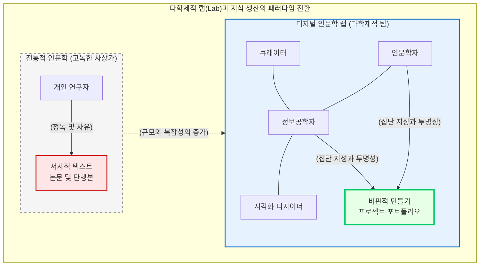

# 다학제적 랩(Lab)과 프로젝트 포트폴리오

전통적인 인문학의 이미지는 도서관의 구석진 서고에서 홀로 문헌을 파헤치고 사유하는 “**고독한 사상가**”의 모습에 가까웠습니다. 지식의 생산은 개인의 뇌를 거쳐 한 편의 완결된 텍스트(논문이나 저서)로 완성되는 지극히 개인적이고 선형적인 과정이었습니다. 

그러나 텍스트를 연산 가능한 데이터로 편찬하고 거시적 패턴을 분석하는 디지털 인문학의 5단계 파이프라인은, 결코 한 명의 천재적인 인문학자가 독자적으로 완수할 수 없는 광활한 스케일과 기술적 복잡성을 지닙니다. 이 장에서는 디지털 인문학이 어떻게 이질적인 전문가들이 모여 지식을 공동 생산하는 “**다학제적 랩(Interdisciplinary Lab)**” 모델로 전환되었는지, 그리고 학문적 성과(Scholarship)의 기준이 어떻게 “**만들기(Making)**” 기반의 프로젝트 포트폴리오로 확장되고 있는지 고찰합니다.

## 1. 지식 생산 주체의 변화: 고독한 천재에서 다학제적 팀으로

디지털 인문학의 프로젝트는 필연적으로 다양한 분과의 지식이 교차하는 융합적 환경을 요구합니다. 하나의 거대한 지식 생태계를 구축하기 위해서는 다음과 같은 다양한 전문가들의 유기적인 협업이 필수적입니다.

* **도메인 전문가(인문학자):** 역사적, 문학적 사료의 맥락을 이해하고, 알고리즘이 찾아낸 패턴에 비판적이고 수사학적인 해석을 부여하며 핵심 연구 질문을 던집니다.
* **기록학자 및 큐레이터(GLAM 전문가):** 물리적 아카이브의 자료를 기계가독형 메타데이터로 변환하고, 데이터의 출처주의(Provenance)와 진정성을 보존하는 데이터 편찬의 기초를 다집니다.
* **데이터 과학자 및 정보공학자:** 자연어 처리(NLP), 네트워크 분석, 지리정보시스템(GIS) 연산을 수행하며, 시맨틱 웹(Semantic Web) 환경에 맞추어 지식의 온톨로지(Ontology)를 설계하고 데이터베이스를 구축합니다.
* **시각화 디자이너 및 UI/UX 개발자:** 분석된 다차원 데이터를 대중과 학계가 직관적으로 탐색하고 상호작용할 수 있는 인터랙티브 웹 인터페이스로 렌더링합니다.

이러한 협업 체계에서 지식은 어느 한 사람의 머릿속에서 탄생하는 것이 아니라, 서로 다른 학문적 언어와 방법론이 부딪히고 타협하는 “**인식론적 마찰(Epistemological Friction)**”의 과정 속에서 공동 생산(Co-production)됩니다.

## 2. 물리적/가상적 공간으로서의 랩(Lab) 문화

자연과학이나 공학의 전유물로 여겨지던 실험실(Lab) 문화가 인문학의 중심부로 들어왔습니다. 스탠퍼드 문학 연구소(Stanford Literary Lab)나 로이 로젠츠바이크 역사 및 뉴미디어 센터(RRCHNM) 같은 기관들은 인문학 랩의 선구적인 모델을 제시했습니다.

디지털 인문학의 랩은 거대한 플라스크나 현미경 대신, 고성능 서버와 대형 디스플레이, 그리고 협업을 위한 거대한 회의용 화이트보드로 채워져 있습니다. 나아가 이 랩은 물리적 공간에 국한되지 않습니다. 깃허브(GitHub), 슬랙(Slack), 노션(Notion)과 같은 클라우드 기반의 협업 도구들은 전 세계에 흩어진 학자들이 실시간으로 소스 코드를 공유하고 데이터를 편찬하는 “**가상의 실험실**”로 기능합니다. 

이러한 랩 문화의 핵심 철학은 “**개방성과 투명성(Openness and Transparency)**”입니다. 연구자들은 완성된 결과물만을 발표하는 것이 아니라, 실패한 알고리즘의 로그와 전처리 과정이 담긴 파이썬(Python) 스크립트를 오픈 리포지토리에 투명하게 공개하여 집단 지성의 검증과 발전을 도모합니다.

## 3. 학문적 성과의 재정의: 에세이에서 프로젝트 포트폴리오로

협업 모델의 등장은 지식의 최종 산출물 형태와 학문적 평가 기준(Tenure and Promotion)을 근본적으로 뒤흔들고 있습니다.

전통적인 인문학에서는 텍스트 중심의 “**동료 평가(Peer-reviewed) 논문**”과 “**단행본(Monograph)**”만이 유일하고 절대적인 학문적 업적으로 인정받았습니다. 그러나 디지털 인문학에서는 다음과 같은 실천적 결과물들이 논문 쓰기에 필적하는, 혹은 그 이상의 파급력을 지닌 학술적 성취로 인정받기 시작했습니다.

* **디지털 아카이브 및 데이터베이스 구축:** 파편화된 사료를 시맨틱 구조로 편찬해 낸 지식 그래프(예: 중국역사인물데이터베이스 CBDB) 자체를 훌륭한 학문적 산출물로 평가합니다.
* **코드와 알고리즘 라이브러리:** 매튜 조커스의 감성 분석 패키지인 슈제트(Syuzhet)처럼, 다른 학자들이 널리 사용할 수 있는 범용적인 분석 코드를 개발하고 배포하는 행위입니다.
* **인터랙티브 웹 플랫폼:** 대중이 직접 지식을 탐색할 수 있는 시각화 대시보드나 디지털 전시물(Digital Exhibition)입니다.

이러한 패러다임의 변화는 “**비판적 만들기(Critical Making)**”라는 철학적 개념으로 요약됩니다. 지식을 서술하는 것(Writing)뿐만 아니라, 시스템을 설계하고 코드를 짜며 지식의 인프라를 구축하는 행위(Making) 자체가 고도의 인문학적 해석이자 논증이라는 선언입니다. 미래의 인문학자는 단편적인 논문 목록이 아니라, 자신이 구축하고 기여한 랩 기반의 “**프로젝트 포트폴리오(Project Portfolio)**”로 자신의 학문적 역량을 증명하게 될 것입니다.

결론적으로, 다학제적 랩의 부상은 인문학이 고립된 상아탑에서 벗어나 공학과 예술, 그리고 대중 사회와 역동적으로 호흡하는 공론장으로 진화하고 있음을 시사합니다. 디지털 인문학은 무엇을 알고 있는가의 문제가 아니라, 이질적인 주체들과 함께 어떻게 지식을 조형하고 편찬해 낼 것인가에 대한 거대한 사회적 실천입니다.

:::{seealso} 📖 참고문헌
* **김바로 (2026).** <특강: 학문으로서의 디지털인문학>. 전남대학교 예비 필로소포이 프로그램. (강의 자료).
* **Burdick, Anne et al. (2012).** <Digital_Humanities>. MIT Press. <a href="https://mitpress.mit.edu/9780262528863/digital_humanities/" target="_blank">Publisher URL</a>
* **Svensson, Patrik (2016).** <Big Digital Humanities: Imagining a Meeting Place for the Humanities and the Digital>. University of Michigan Press. <a href="https://doi.org/10.3998/dh.13607060.0001.001" target="_blank">DOI: 10.3998/dh.13607060.0001.001</a>
:::