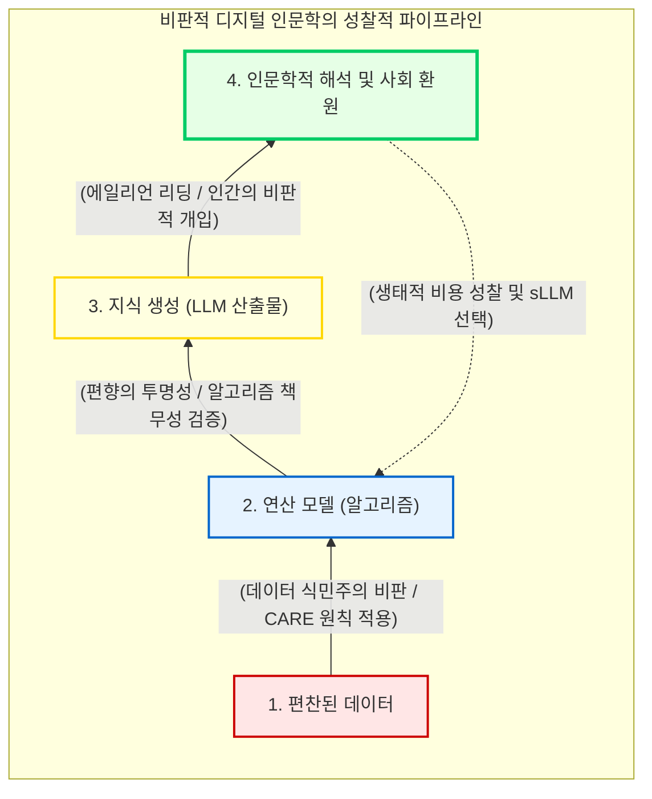

# 비판적 디지털 인문학과 매체의 실천

디지털 인문학의 초창기가 종이 문헌을 전산화하고 새로운 분석 도구를 개발하는 기술적 낙관론에 취해 있었다면, 현대의 디지털 인문학은 기술 이면에 은폐된 권력 구조와 인식론적 폭력을 해부하는 “**비판적 디지털 인문학(Critical Digital Humanities, CDH)**”으로 그 무게 중심을 이동했습니다.

이 장에서는 기계가독형 데이터가 결코 가치 중립적이지 않음을 폭로하고, 거대언어모델(LLM)과 감시 자본주의가 초래하는 인식론적 위기, 그리고 이 모든 가상적 성취를 떠받치고 있는 인공지능의 물리적, 생태적 한계를 가장 날카로운 매체 철학적 시선으로 고찰합니다.

## 1. 날것의 데이터라는 환상과 데이터 식민주의

우리가 맹신하는 컴퓨터 연산의 밑바탕에는 데이터라는 재료가 존재합니다. 그러나 비판적 디지털 인문학은 우리가 수집하고 편찬하는 데이터의 본질에 대해 근원적인 의심을 던집니다.

### 1.1 형용모순으로서의 원시 데이터(Raw Data)
미디어 이론가 리사 지텔먼(Lisa Gitelman)은 “**날것의 데이터(Raw Data)는 형용모순이다**”라고 일갈했습니다. 모든 데이터는 자연 상태에서 스스로 존재하는 것이 아니라, 특정한 정치적 목적, 이론적 틀, 그리고 지배적인 사회적 맥락에 의해 의도적으로 선별되고 가공된 결과물입니다. 아카이브의 메타데이터 체계를 분류하는 과정 전반에는 그것을 주도하는 헤게모니 기관의 가치관이 필연적으로 개입되며, 이를 망각할 때 우리는 알고리즘이 산출하는 결과를 객관적 진리로 착각하는 함정에 빠지게 됩니다.

### 1.2 무주지(Terra Nullius)의 은유와 원주민 데이터 주권
글로벌 거대 기술 기업들은 데이터를 “**새로운 석유**”라 칭하며, 누구나 마음껏 캐낼 수 있는 주인 없는 땅, 즉 “**무주지(Terra Nullius)**”처럼 취급합니다. 이는 과거 제국주의가 식민지의 자원을 수탈했던 논리와 정확히 일치하는 “**데이터 식민주의(Data Colonialism)**”의 현대적 발현입니다.

이에 대항하여 비판적 디지털 인문학자와 큐레이터들은 서구 중심의 오픈 데이터 정책을 넘어 “**원주민 데이터 주권(Indigenous Data Sovereignty)**” 프레임워크를 확립하고 있습니다. 데이터 수집이 원주민 공동체의 복지에 기여해야 한다는 “**CARE 원칙**”과 데이터의 물리적 통제권을 원주민 스스로가 보유해야 한다는 “**OCAP 원칙**”을 데이터베이스 설계의 가장 밑바탕에 하드코딩(Hardcoding)하는 것이 진정한 탈식민주의적 실천입니다.

## 2. 알고리즘 통치성과 편향의 책임 있는 관리

알고리즘과 인공지능은 단순히 도구가 아니라 우리의 사고를 규정하는 새로운 지배 체제입니다.

### 2.1 베르나르 스티글러와 파르마콘(Pharmakon)
매체 철학자 베르나르 스티글러(Bernard Stiegler)는 현대 기술 사회가 “**알고리즘 통치성(Algorithmic Governmentality)**”에 지배당하고 있다고 경고합니다. 이는 법적 토론이나 인간의 이성이 아니라, 블랙박스화된 기계학습의 통계적 확률에 의해 시민의 일상과 권리가 통제되는 사회를 의미합니다. 스티글러에게 기술은 질병을 치료하는 약인 동시에 우리를 파괴할 수 있는 독인 “**파르마콘(Pharmakon)**”입니다. 인문학은 이 알고리즘 통치성의 맹위에 압도당하지 않고 인간성을 옹호하는 치료적 방파제가 되어야 합니다.

### 2.2 투명성을 넘어선 알고리즘 책무성(Accountability)
사피야 노블(Safiya U. Noble)이 폭로한 억압의 알고리즘 사태 이후, 기술 해결주의자들은 코드를 대중에게 공개하는 투명성(Transparency)만으로 편향을 제거할 수 있다고 믿었습니다. 그러나 무결점의 중립 상태에 도달하는 것은 인식론적으로 불가능합니다. 현대 디지털 인문학은 불가능한 편향의 근절에 얽매이는 대신 “**책임 있는 편향 관리(Responsible Bias Management)**”로 패러다임을 전환했습니다. 알고리즘이 도출하는 산출물의 한계와 차별적 결과에 대해 구체적이고 법적인 책임을 묻는 “**알고리즘 책무성(Algorithmic Accountability)**”을 거버넌스로 확립해야 합니다.

## 3. 거대언어모델(LLM)과 에일리언 리딩(Alien Reading)

인간의 언어 능력을 고도로 모방하는 거대언어모델(LLM)의 등장은 수백 년간 인문학이 지탱해 온 저자성(Authorship)과 의미의 근원을 뒤흔들고 있습니다.

### 3.1 저자의 죽음과 의미의 위기
기계가 생성해 내는 텍스트의 이면에는 인간의 의식이나 심리적 고뇌가 전무합니다. 방대한 코퍼스 속에서 단어 간의 공기(Co-occurrence) 확률을 계산하여 기존 요소들을 재조합하는 “**조합적 창의성(Combinatorial Creativity)**”에 불과합니다. 발화의 주체가 사라진 기계 텍스트의 범람은 롤랑 바르트가 비유로 던졌던 “**저자의 죽음**”을 기술적으로 실현시키며 인문학에 깊은 의미의 위기를 촉발했습니다.

### 3.2 기이한 읽기 방식: 에일리언 리딩
이러한 기계를 단순히 거부하거나 무비판적으로 의인화하는 대신, 제프리 바인더(Jeffrey Binder)는 “**에일리언 리딩(Alien Reading)**”이라는 개념을 제안합니다. 기계의 데이터 처리를 인간의 사고나 작문과는 완전히 다른 차원의 기이하고 이질적인 존재론적 양식으로 받아들여야 한다는 것입니다. 기계를 “**확률론적 앵무새**”이자 이질적 주체로 인정할 때, 연구자는 생성된 텍스트의 환각(Hallucination)을 치밀하게 교정하는 “**인간 개입(Human-in-the-loop)**”의 비판적 조율자로 거듭날 수 있습니다.

## 4. 무중력의 환상 타파: 인공지능의 물질적 생태 기반

디지털 인문학과 거대언어모델을 찬양하는 학문적 수사들이 가장 뼈아프게 간과하고 있는 쟁점은, 가상의 클라우드 시스템이 초래하는 막대한 물리적 파괴와 “**생태학적 발자국(Carbon Footprint)**”입니다.

자연어 처리의 혁신을 이끈 BERT와 같은 거대 모델 하나를 학습시키는 과정에서 배출되는 탄소의 양은 내연기관 자동차 수 대가 평생 배출하는 탄소량과 맞먹습니다. 더 끔찍한 윤리적 딜레마는 “**환경적 형평성의 역설(Paradox of Environmental Equity)**”에서 발생합니다. 기술 발전의 혜택과 편익은 주로 북반구(Global North)의 거대 자본과 학계가 누리는 반면, 폭발적인 전력 소비와 탄소 배출이 야기하는 기후 재난은 정작 기술에서 소외된 남반구(Global South) 국가들이 고스란히 감당해야 합니다.

따라서 진보적인 디지털 인문학은 혁신이라는 명목하에 자행되는 기술 예찬에서 벗어나야 합니다. 무조건 최신의 가장 무거운 거대 모델을 사용하기보다는, 연구 목적에 부합하는 작고 에너지 효율적인 “**소형 맞춤형 모델(Small Language Models, sLLM)**”을 의도적으로 선택하는 지속 가능한 실천 강령을 지식 생산의 핵심 윤리로 채택해야 합니다.

:::{seealso} 📖 참고문헌
* **Lisa Gitelman (2013).** <"Raw Data" is an Oxymoron>. MIT Press. <a href="https://doi.org/10.7551/mitpress/9302.001.0001" target="_blank">DOI: 10.7551/mitpress/9302.001.0001</a>
* **Safiya U. Noble (2018).** <Algorithms of Oppression: How Search Engines Reinforce Racism>. NYU Press. <a href="https://nyupress.org/9781479837243/algorithms-of-oppression/" target="_blank">Publisher URL</a>
* **Bernard Stiegler (2015).** <Automatic Society 1: The Future of Work>. Polity Press. <a href="https://www.politybooks.com/bookdetail?book_slug=automatic-society-1-the-future-of-work--9781509506309" target="_blank">Publisher URL</a>
* **Jeffrey M. Binder (2022).** <Language and the Machine: Algorithmic Reading from the Renaissance to the Present>. Johns Hopkins University Press. <a href="https://jhupbooks.press.jhu.edu/title/language-and-machine" target="_blank">Publisher URL</a>
:::