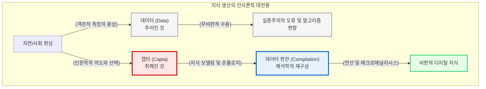

# “주어진 것(Data)”에서 “취해진 것(Capta)”으로

디지털 인문학에 입문하는 연구자가 가장 먼저 마주하는 인식론적 장벽은 바로 “**데이터(Data)**”라는 용어 자체가 뿜어내는 실증주의적 권위입니다. 우리는 무의식적으로 컴퓨터가 처리하는 숫자와 텍스트 데이터가 인간의 주관이 배제된 객관적이고 투명한 진리라고 믿는 경향이 있습니다.

이 장에서는 미디어 이론가와 디지털 인문학자들의 비판적 성찰을 통해 이러한 기술 결정론적 환상을 해체하고, 인문학 자료를 기계의 언어로 번역하는 “**데이터 편찬(Compilation)**” 과정이 왜 그 자체로 고도의 수사학적이고 해석학적인 행위인지 탐구합니다.

## 1. 날것의 데이터라는 형용모순

현대 정보 사회에서 데이터는 종종 자연 상태에서 채굴되는 광물이나 원유에 비유되곤 합니다. 그러나 미디어 이론가 리사 지텔먼(Lisa Gitelman)은 그녀의 선구적인 저서에서 “**날것의 데이터(Raw Data)는 형용모순이다**”라고 단호하게 일갈했습니다.

자연계에 스스로 존재하는 기계적인 정보의 덩어리란 존재하지 않습니다. 모든 데이터는 특정한 정치적 목적, 경제적 이해관계, 그리고 지배적인 사회문화적 맥락에 의해 의도적으로 “**선별되고, 분류되며, 가공된 결과물**”입니다.

예컨대 과거의 역사 기록물을 전산화할 때, 문서의 여백에 적힌 낙서나 훼손된 자국을 데이터베이스의 정식 항목으로 포함할 것인지, 아니면 노이즈(Noise)로 간주하여 삭제할 것인지를 결정하는 행위 자체가 이미 매우 강력한 필터링입니다. 데이터는 현실을 투명하게 반영하는 거울이 아니라, 특정한 프레임으로 세상을 잘라낸 “**인공적인 구성물**”임을 인식하는 것이 디지털 리터러시의 출발점입니다.

## 2. 인식론적 대전환: Data vs. Capta

이러한 문제의식을 디지털 인문학의 매체 철학으로 가장 정교하게 승화시킨 학자는 조해나 드러커(Johanna Drucker)입니다. 그녀는 전통적인 자연과학의 언어인 “**데이터(Data)**”를 버리고, 인문학 고유의 인식론적 토대를 세우기 위해 “**캡타(Capta)**”라는 대안적 개념을 강력히 제창했습니다.

* **데이터(Data):** 라틴어 “**dare(주다)**”의 과거분사형으로, 자연에 이미 “**주어진 것(Givens)**”을 의미합니다. 이는 관찰자의 개입 없이도 세상에 객관적으로 존재하는 사실(Fact)을 상정하는 환원주의적 관점입니다.
* **캡타(Capta):** 라틴어 “**capere(취하다)**”의 과거분사형으로, 연구자의 능동적인 관점과 해석의 틀에 의해 “**취해진 것(Takens)**”을 의미합니다. 인문학에서 다루는 모든 사료와 문학 텍스트는 관찰자의 시대적 배경과 이데올로기에 의해 선택적으로 채택된 캡타입니다.

드러커의 주장에 따르면, 19세기 런던의 빈곤율 통계는 하늘에서 주어진 객관적 데이터가 아닙니다. 그것은 당시의 행정 관료들이 “**무엇을 빈곤으로 정의할 것인가**”라는 주관적 기준을 가지고 현실에서 “**취해낸(Capta)**” 결과물입니다. 따라서 컴퓨터 화면에 시각화된 화려한 그래프를 맹신하기 전에, “**이 자료는 누구의 관점에 의해 포착되고 편찬되었는가?**”를 끊임없이 되물어야 합니다.

## 3. 단순 구축을 넘어선 편찬(Compilation)의 해석학

데이터가 사실상 캡타라면, 물리적 자료를 기계가독형(Machine-readable) 체계로 치환하는 작업은 단순한 전산 입력이나 “**데이터 구축**” 노동으로 치부될 수 없습니다. 이는 무질서한 파편들을 유기적인 지식의 연결망으로 직조해 내는 고도의 “**데이터 편찬(Compilation)**” 행위입니다.

### 3.1 텍스트 인코딩의 주관성
문서에 XML(eXtensible Markup Language)을 활용하여 태그(Tag)를 입히는 마크업(Markup) 과정을 살펴봅시다. 특정 단어에 `<person>`이라는 인명 태그를 부여할지, 혹은 해당 인물이 상징하는 `<institution>`이라는 기관 태그를 부여할지는 전적으로 연구자의 학술적 의도에 달려 있습니다. 즉, 마크업 행위는 기계에게 텍스트의 구조를 설명하는 것을 넘어, 그 자체로 텍스트에 대한 인문학자의 학술적 주석이자 번역이 됩니다.

### 3.2 앎의 구조화와 온톨로지(Ontology)
파편화된 인물, 장소, 사건을 관계형 데이터베이스로 편찬하는 온톨로지 설계 역시 마찬가지입니다. 누구를 중심 노드(Node)로 삼고 어떤 관계를 엣지(Edge)로 정의할 것인가의 문제는, 과거의 역사를 어떤 권력의 역학 관계로 서술할 것인가를 결정하는 막중한 해석학적 실천입니다. 

## 4. 비판적 구축가(Critical Builder)로서의 귀환

“**날것의 데이터**”라는 신화를 해체하고 “**캡타**”의 인식론을 수용할 때, 디지털 인문학자는 기술을 소비하는 방관자에서 벗어나 지식의 최전선을 개척하는 “**비판적 구축가(Critical Builder)**”로 귀환하게 됩니다. 

가장 우수한 연산 알고리즘이나 거대언어모델(LLM)조차도, 입력되는 편찬물의 수준을 뛰어넘는 통찰을 스스로 창조할 수는 없습니다. 결국 디지털 인문학의 성패는 알고리즘의 화려함이 아니라, 파편화된 인문학적 기록에 논리적 숨결을 불어넣고 의미망을 조형해 내는 인문학자의 숭고한 편찬(Compilation) 역량에 달려 있습니다.

이어지는 장에서는 이러한 철학적 무장을 바탕으로, 인문학 지식이 구체적으로 어떻게 설계되고, 편찬되며, 분석되는지 그 역동적인 “**지식의 생애주기**” 파이프라인 속으로 들어가 보겠습니다.

:::{seealso} 📖 참고문헌
* **김바로 (2026).** <특강: 학문으로서의 디지털인문학>. 전남대학교 예비 필로소포이 프로그램. (강의 자료).
* **Lisa Gitelman (2013).** <"Raw Data" is an Oxymoron>. MIT Press. pp. 1-14. <a href="https://doi.org/10.7551/mitpress/9302.001.0001" target="_blank">DOI: 10.7551/mitpress/9302.001.0001</a>
* **Johanna Drucker (2011).** <Humanities Approaches to Graphical Display>. Digital Humanities Quarterly. 5(1). <a href="http://www.digitalhumanities.org/dhq/vol/5/1/000091/000091.html" target="_blank">DHQ URL</a>
:::