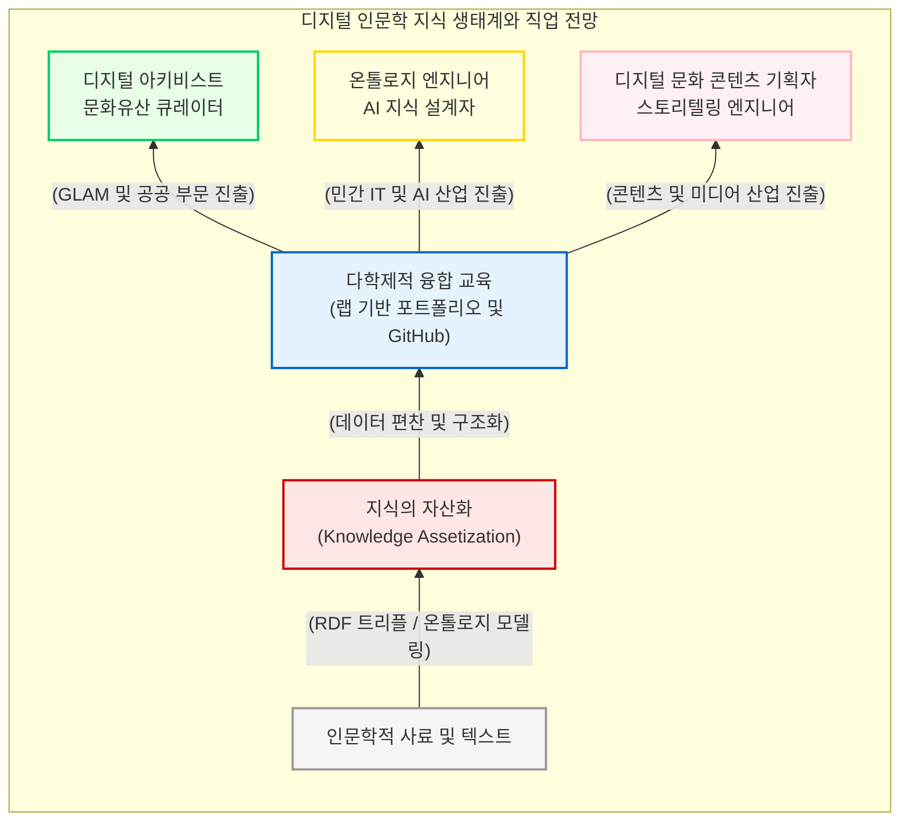

# 디지털 인문학의 생태계와 직업적 비전

지금까지 우리는 디지털 인문학이 전통적 인문학의 텍스트를 연산 가능한 데이터로 편찬해 내는 5단계 파이프라인과 그 인식론적 도약, 그리고 이면에 숨겨진 비판적 쟁점들을 폭넓게 조망했습니다. 

Part 1의 대단원을 장식하는 이 장에서는 시선을 현실로 돌려, 이러한 디지털 전환이 실제 사회 생태계 속에서 어떻게 “**인문 지식의 자산화(Knowledge Assetization)**”를 이루어내고 있는지 고찰합니다. 나아가 디지털 리터러시를 갖춘 학문 후속 세대들이 상아탑을 넘어 공공 및 민간 부문에서 어떠한 새로운 “**먹거리**”와 직업적 비전을 창출할 수 있는지에 대한 실무적 전망을 제시합니다.

## 1. 인문 지식의 자산화: 데이터 모델링과 가치 창출

인문학의 위기는 본질적으로 인문학적 지식이 현대 사회가 요구하는 유통 가능한 형태의 “**자산**”으로 변환되지 못했기 때문에 발생했습니다. 책 속에 잠들어 있는 철학적 사유나 역사적 서사는 독자의 독해 행위 없이는 사회적 부가가치를 창출하기 어렵습니다.

디지털 인문학은 이러한 정적인 텍스트를 기계가독형(Machine-readable) 데이터로 쪼개고 연결함으로써 지식의 자산화를 실현합니다. 그 핵심이 바로 “**주어-서술어-목적어**”로 이루어진 “**RDF 트리플(Resource Description Framework Triple)**”과 같은 데이터 모델링입니다. 

예컨대 “**조선왕조실록**”이라는 문헌을 “**세종(주어)은 훈민정음(목적어)을 창제했다(서술어)**”라는 논리적 트리플 구조로 온톨로지화하면, 이 지식은 단순한 읽을거리를 넘어 인공지능(AI) 챗봇의 학습 데이터, 메타버스 역사 게임의 시나리오 생성 엔진, 그리고 문화유산 검색 포털의 시맨틱(Semantic) 데이터베이스 등 다양한 산업적 파생 상품을 만들어내는 강력한 원천 자산(Source Asset)으로 거듭나게 됩니다.

## 2. 융합 교육의 진화: 논문 쓰기에서 만들기(Making)로

지식을 자산으로 편찬해 낼 수 있는 인재를 양성하기 위해 대학의 인문학 교육 역시 근본적인 패러다임 전환을 겪고 있습니다. 

전통적인 인문학 대학원과 학부 교육이 “**서사적 텍스트(논문 및 에세이)**”를 작성하는 고독한 글쓰기 훈련에 집중했다면, 현대 디지털 인문학 커리큘럼은 “**만들기(Making)**”와 “**구축(Building)**”을 통한 포트폴리오(Portfolio) 중심의 융합 교육을 지향합니다.

* **오픈소스 생태계 참여:** 학생들은 개인의 하드디스크에 과제를 저장하는 대신, 깃허브(GitHub)와 같은 오픈 리포지토리를 통해 전 세계 연구자들과 소스 코드 및 데이터를 투명하게 공유합니다.
* **프로젝트 기반 학습(PBL):** 코딩을 활용하여 직접 데이터베이스를 설계하고, 인터랙티브 지도를 렌더링하며, 대중을 위한 웹 전시(Web Exhibition)를 기획하는 실무 중심의 랩(Lab) 협업 체계를 경험합니다.

이러한 교육은 학생들에게 인문학적 비판 사유와 정보공학적 설계 능력을 동시에 부여하는 가장 진보적인 학제간 훈련입니다.

## 3. 디지털 인문학의 생태계와 새로운 직업군

디지털 인문학을 전공한 학문 후속 세대는 더 이상 비좁은 학계의 교수직이나 전통적인 연구원 자리에만 얽매이지 않습니다. 인문학적 상상력과 디지털 리터러시를 결합한 인재들은 정보와 문화가 교차하는 21세기의 핵심 산업 생태계로 진출하여 완전히 새로운 직업군을 형성하고 있습니다.

* **디지털 아키비스트 및 GLAM 큐레이터:** 박물관, 도서관, 기록관(GLAM)에서 실감형 콘텐츠를 기획하고, 방대한 문화유산 데이터를 글로벌 표준(CIDOC-CRM 등)에 맞추어 관리하고 개방하는 역할을 수행합니다.
* **온톨로지 엔지니어 (지식 구조화 전문가):** 포털 사이트, 에듀테크 기업, 인공지능(LLM) 개발사에서 기계가 인간의 맥락을 정확히 이해할 수 있도록 지식 그래프와 어휘 사전(시소러스)을 편찬하는 고도의 지식 설계 작업을 담당합니다.
* **디지털 문화 콘텐츠 기획자:** 게임, 방송, 메타버스 산업에서 역사적, 문학적 데이터베이스를 바탕으로 입체적인 세계관과 스토리텔링을 직조해 내는 핵심 인력으로 활동합니다.

결론적으로 디지털 인문학은 인문학의 소멸이 아니라, 인문 지식이 현대 자본주의 및 디지털 지식 경제 생태계와 가장 강력하게 결합하는 생존의 궤적이자 확장의 활로입니다. 

Part 1에서 살펴본 거시적인 지평과 철학적 토대를 바탕으로, 이어지는 하위 장(Level 3)들에서는 이러한 패러다임의 전환이 학문적 기원부터 세부 분과 방법론, 그리고 비판적 쟁점들에 이르기까지 어떻게 치열하게 전개되어 왔는지 가장 깊숙한 심연으로 들어가 보겠습니다.

:::{seealso} 📖 참고문헌
* **김바로 (2026).** <특강: 학문으로서의 디지털인문학>. 전남대학교 예비 필로소포이 프로그램. (강의 자료).
* **Constance Crompton et al. (2016).** <Doing Digital Humanities: Practice, Training, Research>. Routledge. <a href="https://doi.org/10.4324/9781315717730" target="_blank">DOI: 10.4324/9781315717730</a>
* **Burdick, Anne et al. (2012).** <Digital_Humanities>. MIT Press. <a href="https://mitpress.mit.edu/9780262528863/digital_humanities/" target="_blank">Publisher URL</a>
:::