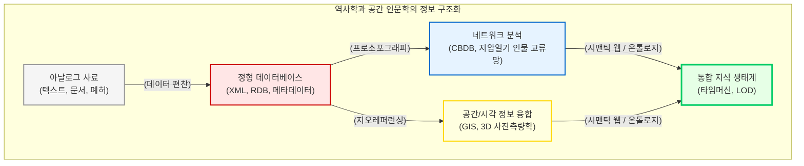

# 역사학과 공간 인문학의 디지털 전환

역사학은 과거의 시간과 공간 속에 흩어진 기록의 파편들을 수집하여 인간의 궤적을 재구성하는 학문입니다. 아날로그 시대의 역사학이 파편화된 사료를 정독하여 선형적인 “**서사(Narrative)**”로 엮어내는 데 집중했다면, 디지털 전환을 맞이한 역사학은 사료를 상호 연결된 “**관계형 데이터(Relational Data)**”와 “**공간 데이터(Spatial Data)**”로 편찬해 냅니다.

이 장에서는 역사적 사실들이 단순한 텍스트를 넘어 거대한 네트워크와 4차원 지리정보시스템(GIS)으로 구조화되는 과정, 그리고 가상 복원이 던지는 매체 윤리적 쟁점을 글로벌 핵심 프로젝트와 한국의 구축 사례를 통해 심층적으로 분석합니다.

## 1. 아카이브의 구조화와 미시사의 거시적 확장

종이 문서를 디지털 이미지나 텍스트로 단순 변환하는 것을 넘어, 문서의 논리적 구조를 데이터베이스로 설계하는 작업은 엘리트 중심의 거대 서사에서 배제되었던 평범한 사람들의 역사를 복원하는 강력한 도구가 됩니다.

### 1.1 올드 베일리 온라인 (Old Bailey Online)
영국의 런던 중앙형사재판소 기록을 디지털화한 “**올드 베일리 온라인**”은 1674년부터 1913년까지의 재판 기록 19만여 건을 구조화한 기념비적 아카이브입니다. 이 프로젝트는 사료를 무비판적으로 전사(Transcription)하는 대신, 범죄의 유형, 형량, 피고인의 인구통계학적 특성 등을 정밀하게 인덱싱했습니다. 이를 통해 역사가들은 18세기 런던 빈민 계층의 행위자성(Agency)과 여성 절도 피고인의 추이 등 미시적인 사회사를 정량적인 통계 데이터로 입증할 수 있게 되었습니다.

### 1.2 계곡의 그림자 (Valley of the Shadow)
미국 남북전쟁 시기 남과 북의 두 국경 지역 공동체를 비교 분석한 “**계곡의 그림자**” 프로젝트는, 아카이브가 그 자체로 학문적 논증이 될 수 있음을 보여주었습니다. 연구진은 신문, 일기, 인구 조사 기록을 XML과 관계형 데이터베이스로 편찬하여 대중에게 개방했습니다. 이들은 알고리즘이 도출한 단일한 정답을 제시하는 대신, 인터페이스에 의도적인 “**마찰(Friction)**”을 남겨두어 사용자가 직접 과거의 단서들을 추적하고 서사를 재구성하도록 유도했습니다.

## 2. 프로소포그래피(Prosopography)와 거대 인물 연결망

디지털 역사학은 개별 인물의 전기를 작성하는 것을 넘어, 특정 시대 집단 전체의 관계망을 분석하는 “**프로소포그래피(집단전기학)**”의 전성기를 열었습니다.

### 2.1 CBDB와 동아시아 역사 인물 네트워크
하버드 대학교, 대만 중앙연구원, 북경대학교가 공동 구축한 “**중국역사인물데이터베이스(CBDB)**”는 7세기부터 19세기에 이르는 약 64만 명 이상의 중국 역사 인물을 수록한 세계 최대의 관계형 데이터베이스입니다. 인물을 중심 노드(Node)로 삼고 친족, 관직, 학술적 교류를 엣지(Edge)로 연결하여, 과거 인물들이 위기 상황이나 일상 속에서 어떻게 전략적으로 네트워크를 구축했는지를 보여줍니다. 이를 벤치마킹한 “**일본역사인물데이터베이스(JBDB)**” 역시 에도 시대 지식인들의 문화적 살롱 교류망을 촘촘히 엮어내고 있습니다.

### 2.2 일상 기록의 데이터화와 재지사족 네트워크
한국의 역사 네트워크 분석 역시 개인의 일기 텍스트를 거대한 데이터베이스로 변환하며 고도화되고 있습니다. 류인태(2019)의 연구는 17세기 조선의 지방 양반인 이유가 남긴 “**지암일기(支巖日記)**” 등의 일상 기록을 데이터베이스화했습니다. 그가 매일 만난 인물, 주고받은 물품, 방문한 장소 데이터를 추출하여 네트워크 분석을 수행한 결과, 당대 재지사족(在地士族) 사회의 미시적인 교류 양상과 향촌 사회의 권력 구조가 시각적이고 구조적으로 입증되었습니다. 이는 개인의 사적인 일상이 어떻게 시대의 거시적 연결망으로 직조되는지를 보여주는 훌륭한 디지털 역사학 사례입니다.

## 3. 공간 인문학과 가상 복원의 딜레마

텍스트에 갇혀 있던 역사적 지명과 사건에 위경도 좌표를 부여하고 물리적 공간을 3D로 시뮬레이션하는 “**공간 인문학(Spatial Humanities)**”은 디지털 인문학의 융합적 정점을 보여줍니다.

### 3.1 베니스 타임머신: 과거의 빅데이터
스위스 EPFL이 주도하는 “**베니스 타임머신(Venice Time Machine)**” 프로젝트는 1,000년에 걸친 베네치아의 방대한 국가 행정 문서 80km 분량을 엑스선 싱크로트론 방사선 기술과 기계학습으로 해독했습니다. 텍스트 속 상업, 부동산, 인구 이동 데이터를 교차 참조하여 시맨틱 연결망을 구축함으로써, 900년부터 2000년까지 베네치아 도시 전체의 건축적, 사회적 진화 과정을 4D로 시뮬레이션하는 경이로운 성과를 이루어냈습니다.

### 3.2 아이코넴과 팔미라 가상 복원의 윤리학
프랑스의 디지털 헤리티지 스타트업 “**아이코넴(Iconem)**”은 컴퓨터 비전과 3D 사진측량학(Photogrammetry)을 결합하여 ISIS에 의해 파괴된 시리아의 팔미라(Palmyra) 유적을 3차원으로 가상 복원했습니다. 이 작업은 파괴된 인류 유산을 증강현실(AR)로 영구 보존했다는 찬사를 받았습니다. 
그러나 인문학계는 이러한 가상 복원이 원본의 “**진정성(Authenticity)**”을 훼손할 수 있으며, 끔찍한 파괴와 폭력의 역사마저 매끄럽게 지워버리는 “**역사의 검열(Censoring History)**”로 작동할 수 있다는 날카로운 매체 윤리적 딜레마를 제기하고 있습니다.

## 4. 한국의 국가 주도 지식 생태계와 온톨로지 편찬

영미권이 개별 프로젝트나 랩(Lab) 중심의 상향식(Bottom-up) 발전을 이루었다면, 한국은 방대한 기록 유산을 바탕으로 국가 기관이 주도하여 거대한 시맨틱 아카이브를 구축하는 하향식(Top-down) 혁신을 선도하고 있습니다.

* **한국역사정보통합시스템:** 국사편찬위원회가 주도하여 29개 유관 기관의 분절된 역사 사료를 메타 포털로 통합했습니다. 특히 “**한국역사용어시소러스(Thesaurus)**”를 구축하여, 한성, 경성, 한양처럼 시대별로 다르게 기록된 용어들을 시맨틱 망으로 묶어 지능형 검색을 가능하게 한 것은 정보공학적 쾌거입니다.
* **한양도성 타임머신:** 600년에 걸친 한양의 유무형 유산을 3D 데이터와 시맨틱 웹으로 엮어낸 국가 프로젝트입니다. 파편화된 역사 정보를 기계가 판독할 수 있도록 한국학중앙연구원의 EKC(Encyves of Korean Culture) “**온톨로지(Ontology)**” 스키마를 도입했으며, 서지학적 고증을 거쳐 3D 건축물 모델에 정밀한 디지털 좌표를 부여했습니다. 

결론적으로, 디지털 역사학과 공간 인문학은 깃허브(GitHub) 등의 오픈 리포지토리(Repository, 레포)를 통한 투명한 소스 코드 공유와 다학제적 협업을 통해 발전하고 있습니다. 과거의 파편들을 데이터베이스로 편찬하고, 이를 네트워크와 공간이라는 새로운 위상학적 도화지 위에 그려냄으로써, 우리는 인간의 역사적 행위자성을 입체적이고 다차원적으로 이해할 수 있는 강력한 인식론적 창구를 획득하게 되었습니다.

:::{seealso} 📖 참고문헌
* **류인태 (2019).** <데이터로 읽는 17세기 재지사족의 일상>. 한국학중앙연구원 박사학위논문.
* **Hitchcock, Tim et al. (2024).** <The Old Bailey Proceedings Online, 1674-1913>. <a href="https://www.oldbaileyonline.org/" target="_blank">Project URL</a>
* **Bol, Peter K. (2024).** <China Biographical Database Project (CBDB)>. Harvard University. <a href="https://digitalhumanities.fas.harvard.edu/projects/cbdb/" target="_blank">Project URL</a>
* **EPFL (2024).** <Venice Time Machine>. <a href="https://vtm.epfl.ch/" target="_blank">Project URL</a>
* **Iconem (2024).** <Palmyra 3D Restorations>. <a href="https://iconem.com/en/palmyra/" target="_blank">Project URL</a>
:::