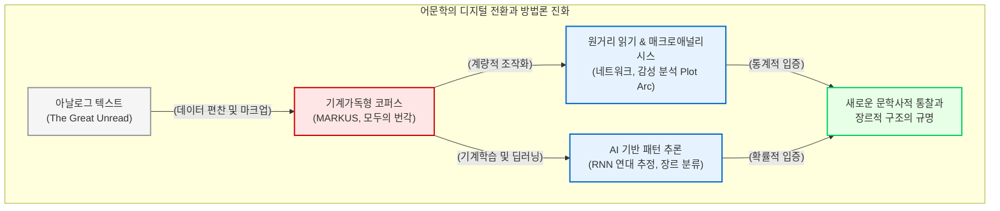

# 어문학과 언어학의 디지털 전환

어문학은 인류가 텍스트라는 매체 위에 구축해 온 상상력, 미학, 그리고 서사의 논리를 탐구하는 학문입니다. 수백 년간 어문학의 지배적인 방법론은 훈련된 비평가가 소수의 훌륭한 문학 작품(Canon)을 현미경처럼 들여다보고 이면의 의미를 파헤치는 “**정독(Close Reading)**”이었습니다. 

그러나 인쇄 자본주의의 발달로 쏟아져 나온 수백만 권의 문헌, 즉 “**위대한 미해독물(The Great Unread)**” 앞에서는 인간의 인지적 한계로 인해 정독의 방식이 더 이상 유효하지 않습니다. 이 장에서는 어문학이 텍스트를 연산 가능한 “**데이터**”로 편찬하고, 기계학습과 통계적 알고리즘을 도입하여 어떻게 문학사의 거시적 패턴을 증명해 내고 있는지 글로벌 및 국내 핵심 사례를 통해 심층적으로 조명합니다.

## 1. 문학 이론의 조작화(Operationalizing)와 스탠퍼드 문학 연구소

디지털 어문학의 글로벌 표준을 확립한 가장 기념비적인 거점은 프랑코 모레티(Franco Moretti)가 주도한 “**스탠퍼드 문학 연구소(Stanford Literary Lab)**”입니다. 이들은 개별 작품의 서사를 읽는 대신 텍스트 집단 전체의 통계적 패턴을 추출하는 “**원거리 읽기(Distant Reading)**” 방법론을 창시했습니다.

이 연구소의 가장 위대한 철학적 공헌은 문학적 개념을 측정 가능한 수치로 변환하는 “**조작화(Operationalizing)**”의 실천입니다. 

* **네트워크와 플롯 분석:** 셰익스피어의 희곡이나 찰스 디킨스의 소설에서 인물 간의 대화 빈도를 노드(Node)와 엣지(Edge)로 환원하여 네트워크 그래프로 시각화했습니다. 이를 통해 중국 고전 “**홍루몽**”에 내재된 특유의 관계(Guanxi)망이 서사 구조에 어떻게 투영되었는지 수학적으로 증명했습니다.
* **서스펜스와 인식론적 불확실성:** 독자에게 긴장감을 유발하는 “**서스펜스(Suspense)**”라는 추상적인 미학적 감각을, 텍스트 내에서 지각적 동사(seemed, perceived 등)가 출현하여 정보의 불확실성을 가중시키는 빈도로 치환하여 정량적으로 입증해 냈습니다.

## 2. 매크로애널리시스와 플롯의 수학적 렌더링

매튜 조커스(Matthew Jockers)는 모레티의 방법론을 계승하여, 수만 권의 디지털 텍스트 컬렉션을 컴퓨터 알고리즘으로 분석하는 “**매크로애널리시스(Macroanalysis)**”를 독자적으로 정립했습니다. 

과거의 문학 연구가 텍스트 내 특정 명사의 빈도에 집착했다면, 조커스는 문장 속에 담긴 “**감정적 이동(Emotional shifts)**”이야말로 소설이 갈등에서 해소로 나아가는 플롯(Plot)의 궤적을 대리할 수 있다고 통찰했습니다.

그는 R 프로그래밍 언어를 기반으로 감성 분석(Sentiment Analysis) 알고리즘인 “**슈제트(Syuzhet)**” 패키지를 개발했습니다. 약 5만 편의 소설을 대상으로 문장 단위의 긍정 및 부정 감성 어휘의 가중치를 계산하여, 이야기의 진행에 따른 감정의 등락을 시계열 곡선(Plot arc)으로 추출해 냈습니다. 이 획기적인 분석을 통해 전 세계의 수만 편의 이질적인 소설들이 사실상 몇 가지의 정형화된 플롯 아키텍처(예: Rags to Riches, Man in a Hole 등)로 귀결됨을 시각적으로 증명하며 문학의 보편적 구조를 해체했습니다.

## 3. 동아시아 다국어 텍스트 마이닝의 인프라: MARKUS와 모두의 번각

영미권 영어 텍스트에 편중되어 있던 디지털 방법론은 동아시아의 한문, 한국어, 일본어 문헌과 조우하며 새로운 형태의 “**디지털 문헌학**” 인프라를 탄생시켰습니다. 띄어쓰기나 명확한 문장 부호가 없는 고문헌을 분석하기 위해서는 고도화된 전처리와 데이터 편찬 시스템이 필수적입니다.

* **MARKUS 플랫폼:** 네덜란드 라이덴 대학교에서 개발된 MARKUS는 방대한 고문헌 코퍼스 내에서 인명, 지명, 직위, 시간 등의 개체명(Named Entities)을 기계가 자동으로 식별하고 태깅(Tagging)하는 범용 분석 인프라입니다. 인문학자는 IT 전문가에 의존하지 않고도 이 플랫폼을 통해 텍스트를 구조화된 데이터로 편찬할 수 있습니다. 예컨대 18세기 조선 연행록에 나타난 물품과 인물 데이터를 추출하여 네트워크로 시각화함으로써, 공식 외교관이 아닌 하급 역관들이 거대한 조공 무역을 통제했던 숨겨진 허브(Hub)였음을 실증적으로 규명할 수 있습니다.
* **모두의 번각(Minna de Honkoku):** 텍스트를 기계가 읽을 수 있도록 변환하는 기초적인 디지타이제이션(Digitization)의 혁신 사례입니다. 일본 국립역사민속박물관은 해독이 난해한 에도 시대의 초서체(Kuzushiji) 문헌을 인공지능 기반 광학 문자 인식(AI OCR)과 대중의 크라우드소싱을 결합하여 수백만 자의 기계가독형 텍스트로 변환하는 데 성공했습니다. 이는 구축과 편찬이라는 절대적 토대가 마련되어야만 연산적 분석이 가능함을 방증합니다.

## 4. 인공지능과 한국 문학의 딥러닝 연산

한국의 디지털 어문학 연구는 이러한 글로벌 인프라의 성과를 바탕으로, 자연어 처리(NLP)를 넘어 최신의 딥러닝(Deep Learning) 아키텍처를 문학의 원본 텍스트에 직접 적용하는 혁신적 단계로 진입했습니다.

### 4.1 옛한글 문헌의 기계학습 연대 추정
과거 문헌학자들이 작자 미상 문헌의 작성 시기를 추정하기 위해 표기법의 변화나 특정 어휘의 등장 여부를 일일이 수작업으로 대조했다면, 이제는 딥러닝이 그 자리를 대신합니다. 박진호(2019)의 연구는 연대가 명확히 확인된 옛한글 문헌 데이터를 순환 신경망(RNN, Recurrent Neural Network) 모델에 대규모로 학습시켰습니다. 이를 통해 알고리즘이 스스로 시대별 언어학적 패턴과 문체의 변화를 가중치로 인식하여, 미상의 고문헌이 어느 시대에 작성되었는지 확률적으로 추정해 내는 획기적인 성과를 거두었습니다.

### 4.2 방각본 소설의 딥러닝 장르 분류
서사의 장르를 구분하는 작업 역시 기계의 수학적 연산 범위 안으로 포섭되었습니다. 강우규와 김바로(2020)의 연구는 영웅소설, 애정소설 등 경판 방각본 소설 텍스트 데이터를 딥러닝 알고리즘으로 학습시킨 후, 검증 데이터를 투입하여 소설의 유형을 자동으로 분류하는 실험을 성공적으로 수행했습니다. 이는 독자의 주관적 감상이나 비평가의 인문학적 직관에 전적으로 의존하던 장르 분류라는 추상적 행위가, 텍스트가 지닌 형태소와 어휘의 통계적 분포에 기반한 인공지능의 연산적 확률 체계로 완벽히 입증될 수 있음을 선언한 “**상상력의 디지털적 재현**”입니다.

결론적으로, 디지털 전환을 맞이한 어문학은 텍스트의 파괴나 문학성의 상실을 의미하지 않습니다. 수만 권의 문헌을 데이터로 편찬해 내는 고된 수고로움 위에서, 인문학자는 인공지능과 통계라는 렌즈를 통해 과거에는 결코 볼 수 없었던 거대한 이야기의 숲과 인간 상상력의 본질적인 구조를 가장 과학적인 언어로 재발견하고 있습니다.

:::{seealso} 📖 참고문헌
* **박진호 (2019).** <딥러닝을 이용한 옛한글 문헌의 연대추정>. 디지털 시대 옛한글의 끝나지 않은 도전.
* **강우규, 김바로 (2020).** <딥러닝을 활용한 경판 방각본 소설의 유형 고찰 -영웅소설과 애정소설 유형을 중심으로->. 국제어문학회. 84. pp.9-35. <a href="http://www.riss.kr/link?id=A106886407" target="_blank">RISS</a>
* **Jockers, Matthew L. (2013).** <Macroanalysis: Digital Methods and Literary History>. University of Illinois Press. <a href="https://www.press.uillinois.edu/books/?id=p080084" target="_blank">Publisher URL</a>
* **Moretti, Franco (2013).** <Distant Reading>. Verso Books. <a href="https://www.versobooks.com/products/2157-distant-reading" target="_blank">Publisher URL</a>
* **Ho, Hilde De Weerdt et al. (2024).** <MARKUS: Classical Chinese Text Analysis and Reading Platform>. Leiden University. <a href="https://dh.chinese-empires.eu/markus/" target="_blank">Project URL</a>
:::