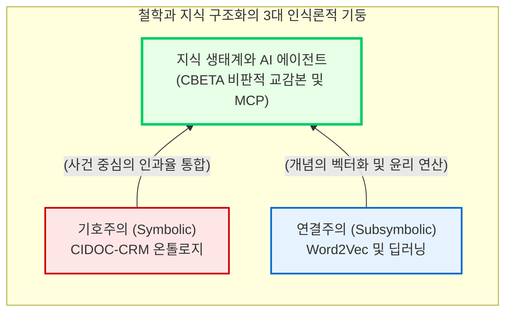

# 철학과 지식 구조화의 디지털 전환

가장 추상적인 학문인 철학과 언어학에 디지털 방법론이 도입되는 과정은 단순한 도구적 보조를 넘어 학문의 근본적인 인식론적 도약(Epistemological Leap)을 야기합니다. 과거의 텍스트가 물리적 매체에 고정된 단일한 해석의 대상이었다면, 디지털 공간의 지식은 숫자 코딩과 모듈식 조직화를 통해 연산 가능한 거대한 의미 네트워크로 전환됩니다.

이 장에서는 세상을 기계가 이해할 수 있는 논리로 기호화하는 “**온톨로지(Ontology)**” 설계, 기계학습을 통해 형이상학적 개념의 궤적을 쫓는 “**개념사(Conceptual History)**” 연구, 그리고 동아시아 고전문헌의 한계를 극복한 새로운 문헌학의 성취를 심층적으로 분석합니다.

## 1. 지식의 존재론적 구조화: CIDOC-CRM과 사건 중심 철학

디지털 환경에서 지식을 어떻게 구조화할 것인가의 문제는, 본질적으로 세계를 어떻게 인식하고 표상할 것인가에 관한 형이상학적 질문입니다.

### 1.1 사물(Object)에서 사건(Event)으로의 전환
전통적으로 도서관이나 박물관에서 사용해 온 메타데이터 구조(예: 더블린 코어)는 대상을 고정된 속성을 지닌 “**사물(Object)**”로 취급해 왔습니다. 이 체계에서 책이나 도자기는 저자나 제작일이라는 속성을 매달고 있는 정적인 객체이며, 그 이면에 얽힌 역사적 인과관계를 추론하기 어렵습니다.

반면, 전 세계 문화유산 데이터의 글로벌 표준으로 자리 잡은 “**CIDOC-CRM(Conceptual Reference Model)**”은 모든 지식과 관계의 성립 근거를 “**사건(Event, E5)**”에 두는 혁명적인 온톨로지입니다. 아리스토텔레스의 범주론을 논리적으로 수용한 이 모델은, 책을 독립된 사물이 아니라 특정한 시간(E52)과 장소(E53)에서 특정 행위자(E39)가 참여하여 만들어낸 “**생산 사건(Production, E12)**”의 결과물로 기술합니다.

이러한 “**사건 중심(Event-centric)**” 모델은 물리적 사물이 파괴되고 새로운 사물로 변형되는 철학적 변화 양상이나, 서로 다른 예술가들이 주고받은 무형의 심리적 영향을 기계가 독해할 수 있는 다중 원인론적 지식 그래프로 완벽히 구조화해 냅니다.

## 2. 기계학습과 형이상학의 연산: 딥러닝과 윤리 모델링

데이터베이스 수준의 구조화가 지식의 뼈대를 세웠다면, 기계학습(Machine Learning)은 방대한 비정형 텍스트 내부의 의미론적 미세구조를 포착하는 인식론적 렌즈를 제공합니다.

### 2.1 워드투벡(Word2Vec)과 불교 철학의 독해
기계학습을 활용한 텍스트 마이닝은 유사한 문맥에서 나타나는 단어들은 유사한 의미를 지닌다는 언어학의 분포 가설(Distributional Hypothesis)에 철학적 기반을 둡니다. 기계는 단어와 문맥의 공기(Co-occurrence) 확률을 학습하여 각 단어를 다차원의 연속적인 벡터(Vector) 공간 좌표로 변환합니다.

한국의 디지털 철학 연구는 이를 적극적으로 수용했습니다. 김바로(2019)의 연구는 대만 전자불전(CBETA)의 방대한 한문 불경 데이터를 워드투벡(Word2Vec) 모델로 학습시켰습니다. 인간의 명시적 지시 없이도 인공지능은 부처, 보살, 열반과 같은 고도의 형이상학적 불교 개념들이 어떤 단어 군집과 관계 맺고 있는지를 벡터 공간의 코사인 거리(Cosine Distance)로 계산해 냈습니다. 이는 기계가 인간의 사유 체계를 통계적으로 읽어내고 철학적 해석을 보조할 수 있음을 증명한 획기적인 도약입니다.

### 2.2 도덕의 계산과 설명 가능한 AI (XAI)
인간의 윤리와 도덕적 판단을 데이터로 치환하는 작업 역시 전위적으로 진행되고 있습니다. 김효은과 김바로(2020)의 연구는 입시 관련 뉴스 기사 텍스트를 형태소로 분석하고, 이를 “**도덕기반유형(Moral Foundation Types)**”이라는 윤리적 척도에 맵핑하여 한국 사회의 가치관을 계량화했습니다. 이러한 윤리적 모델링은 인공지능이 도출한 결정의 근거를 인간이 이해할 수 있는 형태로 역추적하는 “**설명 가능한 AI(eXplainable AI, XAI)**” 설계의 가장 중요한 기초 토대가 됩니다.

## 3. 디지털 문헌학과 AI 에이전트의 융합: 대만 전자불전(CBETA)

서구의 영어 데이터 중심 방법론은 동아시아의 고전문헌과 조우하며 독자적인 “**새로운 문헌학(Digital Philology)**”을 개척했습니다. 대만의 중화전자불전협회(CBETA)가 주도한 대장경 전자화 사업은 지식 편찬의 극치를 보여줍니다.

### 3.1 결자(Gaiji)의 극복과 비판적 교감본
초기 컴퓨터 코드 체계(유니코드)에는 불교 문헌에 등장하는 수천 자의 희귀 이체자나 범어 문자가 존재하지 않았습니다. CBETA 연구진은 이 “**결자(缺字)**”들을 유니코드 국제 표준에 정식으로 등재시키는 투쟁을 전개하여, 비서구 문명의 형이상학적 언어 체계가 디지털 세계에서 소외되지 않도록 방어했습니다.

더 나아가, 이들은 텍스트 인코딩 이니셔티브(TEI)의 XML 마크업 표준을 도입하여 20개 이상의 대장경 이본(Variants)을 비교 대조하는 동적인 “**비판적 교감본(Critical Edition)**” 모델을 선언했습니다. 종이책의 물리적 제약을 넘어, 판본, 페이지, 단, 행 번호를 조합한 절대 좌표(행 수 정보)를 부여함으로써 전 세계 학계의 변하지 않는 디지털 객체 식별자(DOI)를 확립했습니다.

### 3.2 환각의 통제와 모델 컨텍스트 프로토콜(MCP)
최근 생성형 인공지능(LLM)이 범람하면서, AI가 검증되지 않은 정보로 불교 철학을 왜곡하여 생성하는 “**환각(Hallucination)**” 문제가 대두되었습니다. 이를 원천적으로 차단하기 위해 CBETA는 거대언어모델이 대장경 텍스트에 직접 접근하고 통신할 수 있도록 지원하는 “**모델 컨텍스트 프로토콜(Model Context Protocol, MCP)**” 서버를 구축했습니다. 

이제 AI 에이전트는 환각에 의존하지 않고 세계에서 가장 신뢰할 수 있는 텍스트 아카이브를 스스로 룩업(Look-up)하여 정교한 철학적 추론을 이끌어냅니다. 이는 기계가 지식의 구조 속으로 완전히 융화되는 진정한 인간-기계 공생의 실천입니다.

결론적으로, 철학과 지식 구조화의 교차는 단순한 기술적 전산화를 의미하지 않습니다. 온톨로지 이면에 숨겨진 이데올로기를 성찰하고, 기계학습 모델의 다차원적 위상 공간 속에서 인간 사유의 기원을 재발견하는 작업은 현대 디지털 인문학이 도달한 가장 심원한 학문적 성취입니다.

:::{seealso} 📖 참고문헌
* **CIDOC CRM (2024).** <The CIDOC Conceptual Reference Model>. <a href="https://www.cidoc-crm.org/" target="_blank">Project URL</a>
* **김바로 (2019).** <딥러닝으로 불경 읽기 - Word2Vec으로 CBETA 불경 데이터 읽기>. 대동철학. 80. <a href="http://www.riss.kr/link?id=A106291390" target="_blank">RISS</a>
* **김효은, 김바로 (2020).** <빅데이터를 활용한 도덕기반 텍스트분석: 입시 기사를 중심으로>. 한국디지털콘텐츠학회논문지. 21(9). pp.1651-1658. <a href="http://www.riss.kr/link?id=A107010214" target="_blank">RISS</a>
* **CBETA (2024).** <Chinese Buddhist Electronic Text Association>. <a href="https://www.cbeta.org/" target="_blank">Project URL</a>
:::