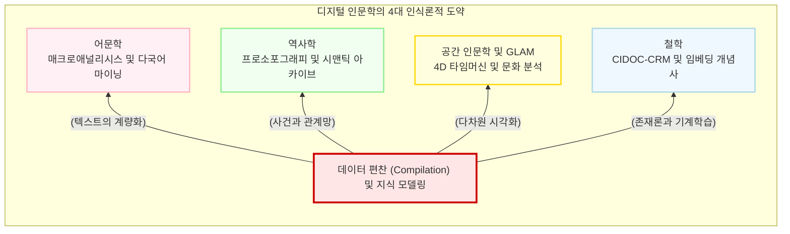

# 분과학문과 연산적 방법론의 확장

디지털 인문학의 “**데이터 편찬(Compilation)**” 패러다임과 연산적 방법론은 단일한 형태를 띠지 않습니다. 문학 텍스트의 상상력, 역사적 시공간의 궤적, 문화유산의 다차원적 시각성, 그리고 인간 사유의 존재론적 구조 등 각 분과학문은 저마다 고유한 인식론적 질문을 품고 있으며, 디지털 기술 역시 이에 맞추어 독창적인 융합의 궤적을 그려왔습니다.

이 장에서는 어문학, 역사학, 공간 인문학(GLAM), 그리고 철학이라는 4대 핵심 분과에서, 한국의 인프라와 글로벌 디지털 인문학(DH)의 클래식 프로젝트들이 어떻게 전통적 방법론의 한계를 돌파하고 있는지 그 거대한 조감도를 제시합니다.

## 1. 어문학: 텍스트의 해체와 매크로애널리시스

어문학은 텍스트가 빚어내는 언어적 구조와 미학을 탐구합니다. 전통적인 문학 연구가 소수의 정전(Canon)을 현미경처럼 들여다보는 “**정독(Close Reading)**”에 의존해 왔다면, 연산적 방법론은 인간이 평생을 바쳐도 다 읽을 수 없는 방대한 코퍼스(Corpus) 전체를 알고리즘으로 조망합니다.

### 1.1 원거리 읽기와 매크로애널리시스
프랑코 모레티(Franco Moretti)가 설립한 스탠퍼드 문학 연구소는 수만 권의 소설 텍스트를 통계적으로 해부하는 “**원거리 읽기(Distant Reading)**”를 주창했습니다. 이들은 등장인물 간의 대화를 네트워크로 모델링하고, 세계은행 보고서의 문법적 추이를 추적하여 신자유주의적 수사학의 진화를 폭로했습니다. 

나아가 매튜 조커스(Matthew Jockers)는 R 프로그래밍을 활용한 “**슈제트(Syuzhet)**” 패키지를 개발하여, 텍스트에 내재된 “**감정적 이동(Emotional shifts)**”을 시계열 함수로 추출하는 “**매크로애널리시스(Macroanalysis)**”를 확립했습니다. 수만 편의 소설이 본질적으로 몇 가지의 정형화된 감정적 플롯(Plot arc)을 공유하고 있음을 수학적으로 입증한 쾌거입니다.

### 1.2 동아시아 다국어 텍스트 마이닝
네덜란드 라이덴 대학교의 “**MARKUS**” 플랫폼은 한문, 한국어, 일본어 고문헌에 포함된 개체명(인명, 지명 등)을 기계가 자동으로 태깅하는 인프라를 제공하여, 조선 연행록 속 하급 역관들의 무역 네트워크 등을 실증적으로 복원해 냈습니다. 한국 역시 딥러닝을 활용하여 작자 미상의 옛한글 문헌 연대를 추정하거나(박진호, 2019), 방각본 소설의 장르를 자동 분류하는(강우규 등, 2020) 등 문학적 직관을 확률적 패턴으로 증명해 내고 있습니다.

## 2. 역사학: 시공간의 거대 연결망과 지식 생태계

역사학에서의 디지털 전환은 파편화된 과거의 사료를 “**기계가독형 데이터**”로 편찬하여, 미시적 행위자들의 거시적 네트워크와 공간적 위상을 재구성하는 작업입니다.

### 2.1 아카이브의 구조화와 프로소포그래피
단순한 텍스트 전사를 넘어 역사적 서사를 데이터베이스로 엮어내는 작업은 새로운 통찰을 낳습니다. 영국의 “**올드 베일리 온라인(Old Bailey Online)**”은 런던의 형사재판 기록 19만 건을 구조화하여 엘리트 중심의 서사에서 배제되었던 평민 계층의 범죄와 빈곤 양상을 복원했습니다. 미국의 “**계곡의 그림자(Valley of the Shadow)**” 프로젝트는 남북전쟁 시기 두 지역의 텍스트와 GIS를 결합하여 노예제가 유발한 사회 조직의 근본적 차이를 증명했습니다.

특히 집단 전기학인 “**프로소포그래피(Prosopography)**”의 정점을 보여주는 “**중국역사인물데이터베이스(CBDB)**”는 64만 명 이상의 중국 역사 인물 간의 친족, 관직, 학술 네트워크를 구축하여 동아시아 역사 연구의 패러다임을 바꿨습니다.

### 2.2 한국의 국가 주도 거대 지식 생태계
한국은 국가 주도의 강력한 하향식(Top-down) 디지털 편찬을 통해 세계적인 인프라를 구축했습니다. 국사편찬위원회의 “**한국역사정보통합시스템**”은 29개 기관의 분절된 사료를 “**한국역사용어시소러스**”라는 거대한 시맨틱(Semantic) 망으로 묶어냈으며, “**조선왕조실록**”의 디지털화는 최근 인공지능 기반의 고문헌 자동 번역 모델 구축으로까지 진화하고 있습니다.

## 3. 공간 인문학과 문화유산(GLAM): 다차원 시뮬레이션

텍스트의 1차원적 기호를 넘어, 디지털 인문학은 공간(Space)과 문화유산(GLAM: 갤러리, 도서관, 아카이브, 박물관)의 시각적 물질성을 다차원 데이터로 시뮬레이션합니다.

### 3.1 타임머신 프로젝트와 3D 공간 복원
스위스 EPFL이 주도하는 “**베니스 타임머신(Venice Time Machine)**”은 1,000년에 걸친 베네치아의 행정 문서 80km 분량을 스캔하여, 도시의 건축적 진화와 자본의 흐름을 4D로 시뮬레이션하는 “**과거의 빅데이터**”를 창출했습니다. 한국의 “**한양도성 타임머신**” 프로젝트 역시 600년 한양의 유무형 유산을 EKC 온톨로지와 정밀 3D 좌표(Cesium)로 결합하여 살아 숨 쉬는 지식 관계망을 구축했습니다.

한편, 프랑스 아이코넴(Iconem)은 드론과 3D 사진측량학(Photogrammetry)을 활용해 ISIS에 의해 파괴된 시리아 팔미라 유적을 가상 복원했습니다. 이는 파괴된 문화유산의 보존이라는 찬사와 함께, 폭력의 역사를 인위적으로 지워버리는 가상 복원의 “**진정성(Authenticity)**”에 관한 첨예한 윤리적 논쟁을 촉발했습니다.

### 3.2 기계가 바라보는 예술과 문화 분석
구글 아트 앤 컬처(Google Arts & Culture)는 기계학습 알고리즘을 통해 수백만 점의 예술 작품을 미술사적 연대기가 아닌 “**시각적 유사성(t-SNE Map)**”이나 “**색채(Art Palette)**” 기준으로 큐레이션하는 파격적인 미학적 실험을 선보였습니다. 레프 마노비치(Lev Manovich)의 “**문화 분석(Cultural Analytics)**”은 소셜 미디어의 이미지 수백만 장을 알고리즘으로 분석하여 동시대 도시의 사회적, 미학적 지형도를 계량적으로 해부합니다.

## 4. 철학과 지식 구조화: 온톨로지와 인공지능

가장 추상적인 인문학 분과인 철학은, 지식을 기계가 이해할 수 있는 논리로 기호화(Ontology)하고, 인공지능의 통계적 패턴(Machine Learning) 속에서 사유의 궤적을 추적하는 인식론적 도약을 맞이했습니다.

### 4.1 CIDOC-CRM과 사건 중심의 존재론
전 세계 문화유산 데이터의 온톨로지 표준인 “**CIDOC-CRM**”은 세상을 고정된 “**사물(Object)**”이 아니라 “**사건(Event)**” 중심으로 표상하는 철학적 전환을 이룩했습니다. 책이나 유물이 생산되고 파괴되는 변화의 양상을 시맨틱 웹(Semantic Web)의 연결 개방형 데이터(LOD)로 구조화함으로써, 파편화된 역사적 사실들을 다중 원인이 얽힌 거대한 지식 그래프로 통합해 냅니다.

### 4.2 딥러닝과 대만 전자불전(CBETA)의 철학적 전위
대만의 전자불전(CBETA) 프로젝트는 유니코드 확장을 통해 한자 문화권의 “**결자(Gaiji)**” 문제를 극복한 디지털 문헌학의 금자탑입니다. XML 마크업을 통한 비판적 교감본 구축을 넘어, 최근에는 거대언어모델(LLM)이 경전 데이터에 직접 접근하여 추론하는 AI 에이전트(MCP) 기술까지 접목하고 있습니다.

인공지능을 활용한 개념사 연구 역시 활발합니다. 워드투벡(Word2Vec) 모델을 통해 특정 철학적 개념이 시대에 따라 어떻게 의미적 위상(Cosine Distance)을 변화시켰는지 실증하거나(김바로, 2019), 기계학습을 활용해 뉴스 기사에 담긴 “**도덕기반유형**”을 계량화하여 한국 사회의 윤리적 척도를 분석하는 시도(김효은 등, 2020)는 디지털 철학의 무한한 가능성을 보여줍니다.

:::{seealso} 📖 참고문헌
* **김바로 (2019).** <딥러닝으로 불경 읽기 - Word2Vec으로 CBETA 불경 데이터 읽기>. 대동철학. 80. <a href="http://www.riss.kr/link?id=A106291390" target="_blank">RISS</a>
* **강우규, 김바로 (2020).** <딥러닝을 활용한 경판 방각본 소설의 유형 고찰>. 국제어문학회. 84. pp.9-35. <a href="http://www.riss.kr/link?id=A106886407" target="_blank">RISS</a>
* **Bol, Peter K. (2024).** <China Biographical Database Project (CBDB)>. Harvard University. <a href="https://digitalhumanities.fas.harvard.edu/projects/cbdb/" target="_blank">Project URL</a>
* **Jockers, Matthew L. (2013).** <Macroanalysis: Digital Methods and Literary History>. University of Illinois Press. <a href="https://www.press.uillinois.edu/books/?id=p080084" target="_blank">Publisher URL</a>
* **EPFL (2024).** <Venice Time Machine>. <a href="https://vtm.epfl.ch/" target="_blank">Project URL</a>
* **CIDOC CRM (2024).** <The CIDOC Conceptual Reference Model>. <a href="https://www.cidoc-crm.org/" target="_blank">Project URL</a>
:::