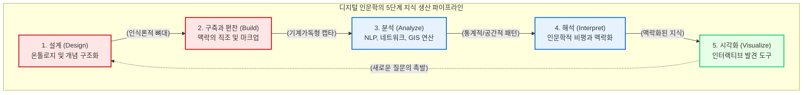

# 지식의 생애주기와 5단계 파이프라인

디지털 인문학의 연구 과정은 아날로그 사료를 읽고 머릿속으로 사유하여 논문을 작성하는 전통적인 선형 구조를 따르지 않습니다. 그 대신, 파편화된 자료를 기계가독형(Machine-readable) 데이터로 조형하고 연산하여 새로운 지식을 창출하는 순환적인 “**지식의 생애주기(Knowledge Lifecycle)**”를 거치게 됩니다.

글로벌 디지털 인문학계와 한국의 선도적 프로젝트들이 보편적으로 공유하는 이 연구 파이프라인은 “**설계(Design)**”, “**구축과 편찬(Build & Compilation)**”, “**분석(Analyze)**”, “**해석(Interpret)**”, “**시각화(Visualize)**”라는 5개의 핵심 단계로 구성됩니다. 이 장에서는 각 단계의 기술적 메커니즘과 그 이면에 자리한 인문학적 당위성을 해부합니다.

## 1. 설계 (Design): 지식의 청사진 그리기

모든 디지털 인문학 프로젝트의 성패는 코딩이나 알고리즘의 화려함이 아니라, 가장 첫 단계인 “**설계**”의 치밀함에 달려 있습니다. 아날로그 자료를 무작정 컴퓨터에 입력하기 전에, 연구자는 텍스트에 내재된 정보를 기계의 언어로 어떻게 표상할 것인지 철학적인 청사진을 그려야 합니다.

* **온톨로지(Ontology) 모델링:** 연구 대상이 되는 세계의 구조를 기계가 이해할 수 있는 논리적 규칙으로 정의하는 작업입니다. 예컨대 역사적 문헌에서 인물, 장소, 관직이라는 “**개념(Class)**”을 정의하고, 이들 사이의 “**관계(Property)**”를 “**주어-서술어-목적어**” 구조의 RDF 트리플(Triple)로 매핑하는 규칙을 세웁니다.
* **메타데이터(Metadata) 표준 선정:** 더블린 코어(Dublin Core)나 CIDOC-CRM과 같은 국제 표준 구조 중 어떤 것을 차용하여 데이터의 상호 운용성을 확보할 것인지 결정하는 고도화된 인식론적 기획 단계입니다.

## 2. 구축과 편찬 (Build & Compilation): 맥락의 직조

설계된 청사진을 바탕으로 물리적 자료를 디지털 환경으로 옮겨 담는 단계입니다. 여기서 디지털 인문학의 가장 중요한 철학적 구분이 발생합니다.

* **단순 구축(Digitization & Build):** 종이 문헌을 스캐너로 읽어 들이고 광학 문자 인식(OCR)을 통해 텍스트로 추출하는 물리적 변환 작업입니다. 이는 데이터의 양적 축적일 뿐, 그 자체로 인문학적 가치를 지니기는 어렵습니다.
* **데이터 편찬(Compilation):** 디지털 인문학의 진정한 정수는 구축을 넘어선 편찬에 있습니다. 편찬이란 텍스트 인코딩 이니셔티브(TEI) 표준에 맞추어 마크업(Markup) 태그를 삽입하거나, 정규표현식(Regex)을 활용해 노이즈를 정제하면서 서로 다른 파편적 지식들을 “**특정한 인문학적 의도**”를 가지고 꿰어 맞추는 행위입니다. 이는 과거의 기록에 논리적 숨결을 불어넣는 21세기형 문헌학의 숭고한 실천입니다.

## 3. 분석 (Analyze): 연산적 방법론을 통한 거시적 탐색

견고하게 편찬된 데이터베이스가 마련되면, 인간의 인지적 한계를 뛰어넘는 컴퓨터의 연산 능력을 투입하여 “**분석**”을 수행합니다. 

수백만 권의 텍스트나 수십만 명의 인물 데이터 속에서 숨겨진 패턴을 추출하기 위해 다양한 방법론이 동원됩니다. 단어의 공기(Co-occurrence) 패턴을 추출하는 “**자연어 처리(NLP)**”, 인물 간의 권력 지형도를 계량화하는 “**네트워크 분석**”, 지명에 위경도 좌표를 부여하여 공간적 이동을 추적하는 “**지리정보분석(GIS)**”, 그리고 인공지능이 스스로 패턴의 가중치를 학습하는 “**기계학습(Machine Learning)**” 기법들이 복합적으로 교차합니다. 이를 통해 연구자는 현미경적 시야에서 벗어나 “**거시적 패턴(Macroscopic pattern)**”을 포착하게 됩니다.

## 4. 해석 (Interpret): 인간의 비판적 개입

기계가 도출한 숫자, 통계적 군집, 복잡한 네트워크 그래프 그 자체는 결코 역사적 진리가 아닙니다. 분석 단계의 결과물은 연구자에게 새로운 질문을 던지기 위한 단서일 뿐입니다.

이 단계에서 인문학자는 원거리 읽기(Distant Reading)를 통해 발견된 거시적 패턴을, 다시 특정 문헌의 미시적인 텍스트(Close Reading)와 교차 검증하며 “**해석**”합니다. 기계의 연산 결과에 내재된 알고리즘의 편향성, 데이터의 누락, 시대적 맥락의 간극을 비판적으로 평가하여 차가운 데이터에 다시 인간의 통찰과 서사를 불어넣는 필수 불가결한 과정입니다.

## 5. 시각화 (Visualize): 다차원적 인터페이스와 유희

최종적으로 생산된 지식은 닫힌 텍스트 논문이 아니라, 대중과 학계가 직접 조작하고 반응할 수 있는 “**시각화**” 인터페이스로 배포됩니다.

인터랙티브 대시보드, 3D 가상 현실(VR), 맵핑(Mapping) 기반의 웹사이트 등은 분석 결과를 예쁘게 포장하는 장식이 아닙니다. 조해나 드러커(Johanna Drucker)가 강조하듯, 훌륭한 시각화는 독자가 데이터를 이리저리 뒤집어 탐색하며 기존의 해석을 의심하고 “**새로운 인문학적 질문**”을 자발적으로 던지게 유도하는 발견적(Heuristic) 도구입니다.

이 5단계의 파이프라인은 일방향으로 끝나지 않고 끊임없이 순환합니다. 시각화를 통해 도출된 새로운 질문은 다시 온톨로지 설계의 고도화로 이어지며 지식의 생태계를 무한히 확장시킵니다. 이어지는 장에서는 이 거대한 기계적 블랙박스 시스템을 통제하기 위해 인문학자가 왜 직접 코드를 작성하는 “**연산적 리터러시**”를 갖추어야 하는지 그 비판적 당위성을 탐구하겠습니다.

:::{seealso} 📖 참고문헌
* **김바로 (2026).** <특강: 학문으로서의 디지털인문학>. 전남대학교 예비 필로소포이 프로그램. (강의 자료).
* **Constance Crompton et al. (2016).** <Doing Digital Humanities: Practice, Training, Research>. Routledge. <a href="https://doi.org/10.4324/9781315717730" target="_blank">DOI: 10.4324/9781315717730</a>
* **Johanna Drucker (2011).** <Humanities Approaches to Graphical Display>. Digital Humanities Quarterly. 5(1). <a href="http://www.digitalhumanities.org/dhq/vol/5/1/000091/000091.html" target="_blank">DHQ URL</a>
:::