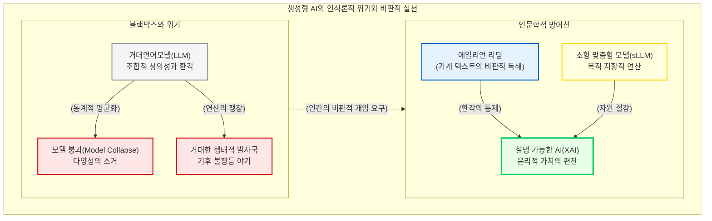

# 생성형 AI 시대와 설명 가능성의 위기

디지털 인문학은 텍스트를 기계의 언어로 번역하는 구축의 시대를 지나, 이제 기계가 스스로 텍스트를 생성하고 인간의 사유를 모방하는 “**거대언어모델(Large Language Model, LLM)**”의 시대를 마주하고 있습니다. 

챗GPT(ChatGPT)로 대변되는 생성형 인공지능의 폭발적인 등장은 인간의 고유한 영역으로 여겨졌던 창작과 지식 생산의 경계를 허물고 있습니다. 이 장에서는 인공지능이 뿜어내는 수사학적 텍스트가 어떻게 수백 년간 이어져 온 인문학적 저자성(Authorship)과 의미의 근원을 뒤흔들고 있는지, 그리고 딥러닝 알고리즘의 거대한 블랙박스 속에서 “**설명 가능한 AI(eXplainable AI, XAI)**”를 구축하기 위한 인문학의 치열한 매체 철학적 사투를 심층적으로 고찰합니다.

## 1. 저자의 죽음과 비기호적 지식의 탄생

인간의 언어 능력을 고도로 모방하는 기계의 등장은 철학과 언어학에 가장 도발적인 질문을 던집니다. 의식이나 고뇌가 없는 거대 신경망이 통계적 확률에 따라 조립해 낸 문장을 우리는 진정한 “**의미(Meaning)**”나 “**지식(Knowledge)**”으로 인정할 수 있을까요?

### 1.1 조합적 창의성과 의미의 위기
LLM이 생성해 내는 텍스트 이면에는 발화자의 물리적 경험이나 실존적 고뇌가 전무합니다. 그것은 방대한 인터넷 코퍼스 속에서 단어 간의 공기(Co-occurrence) 확률을 계산하여 기존의 텍스트 요소들을 매끄럽게 재조합하는 “**조합적 창의성(Combinatorial Creativity)**”의 결과물입니다. 발화의 주체가 증발해 버린 텍스트의 범람은, 과거 프랑스 철학자 롤랑 바르트(Roland Barthes)가 선언했던 “**저자의 죽음(Death of the Author)**”을 기술적 차원에서 완벽하게 실현시키며 인문학에 깊은 인식론적 위기를 촉발했습니다.

### 1.2 에일리언 리딩 (Alien Reading)
이러한 기계의 텍스트를 무비판적으로 의인화하거나 단순한 표절로 폄하하는 대신, 제프리 바인더(Jeffrey Binder)는 “**에일리언 리딩(Alien Reading)**”이라는 혁신적인 독해 방식을 제안합니다. 기계의 데이터 처리를 인간의 사고나 작문과는 완전히 다른 차원의 기이하고 이질적인 존재론적 양식으로 받아들여야 한다는 것입니다. 기계를 인간의 모방품이 아니라 확률을 연산하는 “**이질적 주체**”로 인정할 때, 비로소 연구자는 인공지능이 생성한 그럴듯한 거짓말, 즉 “**환각(Hallucination)**”을 치밀하게 교정하고 통제하는 비판적 조율자로 거듭날 수 있습니다.

## 2. 모델 붕괴와 인식론적 폭력

LLM은 결코 가치 중립적인 백지상태의 지능이 아닙니다. 훈련 데이터에 내포된 인류의 편견과 지배 권력의 세계관이 알고리즘을 통해 여과 없이 증폭됩니다.

### 2.1 서구 중심적 세계관의 강제
세계의 다양한 언어와 가치관을 학습했다고 주장하는 글로벌 LLM들조차, 그 내부 구조를 해부해 보면 압도적으로 영미권 중심의 “**개인주의**”와 특정 지배 문화의 가치관을 기본값(Default)으로 상정하고 있습니다. 기계가 출력하는 보편적이고 합리적인 정답이 실상은 비서구권의 다원적 가치를 균질화하고 삭제해 버리는 “**인식론적 폭력(Epistemic Violence)**”으로 기능할 수 있음을 경계해야 합니다.

### 2.2 의미 이동과 모델 붕괴 (Model Collapse)
더 치명적인 위협은 기계가 생성한 합성 텍스트(Synthetic outputs)가 다시 인터넷의 바다로 흘러 들어가, 후속 인공지능 모델의 훈련 데이터로 재사용되는 순환 고리에서 발생합니다. 이 오염된 순환 속에서 소수자의 관점, 변두리의 방언, 그리고 기발한 은유들은 통계적 평균화 과정에 의해 강제로 깎여나갑니다. 

결국 언어의 진화가 인간의 창의성이 아니라 확률 최적화에 의해 주도되는 “**의미 이동(Semantic Drift)**”을 겪게 되며, 궁극적으로 인공지능 모델 자체가 붕괴하는 “**모델 붕괴(Model Collapse)**” 현상을 초래하게 됩니다. 이는 지식 생태계의 다양성을 치명적으로 훼손하는 재앙입니다.

## 3. 설명 가능한 AI(XAI)와 생태적 지속가능성

거대언어모델의 거대한 블랙박스 속에서 인문학의 책무는 무엇입니까? 그것은 알고리즘의 결과에 인간의 윤리적 척도를 부여하고, 무한한 기술 팽창 이면의 생태적 비용을 심문하는 것입니다.

### 3.1 윤리의 연산과 설명 가능한 인공지능
딥러닝의 결과가 도출된 근거를 인간의 언어로 역추적하고 해석해 내는 “**설명 가능한 AI(XAI)**” 기술은 현재 컴퓨터 공학의 최대 과제입니다. 그러나 무엇이 윤리적이고 합당한 결정인지를 알고리즘에 수학적으로 정의해 주는 역할은 온전히 철학과 인문학의 몫입니다. 도덕기반유형을 계량화하고 사회적 가치를 데이터로 편찬하는 비판적 인문학자의 개입 없이, 인공지능의 안전장치를 마련하는 것은 불가능합니다.

### 3.2 탄소 배출과 무중력의 환상 타파
가장 간과하기 쉬운 비판적 쟁점은 가상의 클라우드 시스템이 초래하는 막대한 물리적 파괴와 “**생태학적 발자국(Carbon Footprint)**”입니다. 거대 모델 하나를 학습시키기 위해 뿜어져 나오는 탄소와 냉각에 소모되는 엄청난 수자원은 “**환경적 형평성의 역설**”을 낳습니다. 기술의 편익은 자본을 쥔 북반구(Global North)가 독점하지만, 그로 인한 기후 재난은 기술에서 소외된 남반구(Global South)가 짊어지게 됩니다.

따라서 진보적인 디지털 인문학은 혁신이라는 명분 아래 맹목적으로 가장 거대한 상업용 LLM에 의존하는 것을 경계해야 합니다. 연구 목적에 부합하는 가볍고 투명한 “**소형 맞춤형 모델(Small Language Models, sLLM)**”을 구축하고, 생태적 비용을 고려한 지속 가능한 연산을 실천하는 것이 21세기 지식 지식 생산의 핵심 윤리가 되어야 합니다.

결론적으로, 인공지능 시대의 디지털 인문학은 기계가 생성한 지식을 무비판적으로 수용하는 소비자가 되기를 거부합니다. 인간은 기계를 이질적인 사유의 동반자로 대우하면서도, 그 이면에 얽힌 자본과 탄소의 윤리를 집요하게 파고드는 비판적 감시자이자 지식 생태계의 책임 있는 설계자로 우뚝 서야 합니다.

:::{seealso} 📖 참고문헌
* **Jeffrey M. Binder (2022).** <Language and the Machine: Algorithmic Reading from the Renaissance to the Present>. Johns Hopkins University Press. <a href="https://jhupbooks.press.jhu.edu/title/language-and-machine" target="_blank">Publisher URL</a>
* **Roland Barthes (1977).** <The Death of the Author>. Image-Music-Text. Fontana. pp. 142-148.
* **Emily M. Bender et al. (2021).** <On the Dangers of Stochastic Parrots: Can Language Models Be Too Big?>. FAccT '21. <a href="https://doi.org/10.1145/3442188.3445922" target="_blank">DOI: 10.1145/3442188.3445922</a>
:::