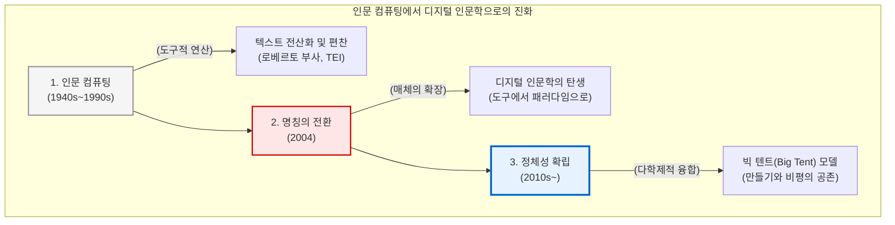

# 인문 컴퓨팅에서 디지털 인문학으로

디지털 인문학은 어느 날 갑자기 하늘에서 떨어진 신생 학문이 아닙니다. 이는 20세기 중반 컴퓨터의 등장과 함께 태동하여, 수십 년간 텍스트를 기계의 언어로 번역하고자 분투했던 인문학자들의 치열한 “**편찬(Compilation)**”의 역사 위에 서 있습니다. 

이 장에서는 학문의 명칭이 “**인문 컴퓨팅(Humanities Computing)**”에서 “**디지털 인문학(Digital Humanities)**”으로 진화해 온 궤적을 추적하고, 로베르토 부사 신부의 선구적 작업부터 학문의 외연을 둘러싼 “**빅 텐트(Big Tent)**” 논쟁에 이르기까지 디지털 인문학의 정체성이 어떻게 형성되었는지 탐구합니다.

## 1. 인문 컴퓨팅의 여명: 로베르토 부사와 텍스트의 편찬

디지털 인문학의 공식적인 기원은 1946년, 이탈리아의 예수회 사제 로베르토 부사(Roberto Busa)가 미국의 IBM 창립자 토마스 왓슨(Thomas J. Watson)을 찾아간 사건으로 거슬러 올라갑니다. 

부사 신부는 중세 철학자 토마스 아퀴나스의 방대한 라틴어 저작(약 1,100만 단어)에 등장하는 모든 단어의 용례와 형태소를 분석하여 색인으로 만들고자 했습니다. 인간의 수작업으로는 수십 년이 걸릴 이 거대한 작업을 위해, 그는 왓슨을 설득하여 IBM의 천공 카드(Punched card) 기계를 지원받았고, 마침내 “**토마스 아퀴나스 저작 색인(Index Thomisticus)**” 프로젝트를 출범시킵니다.

이 프로젝트가 디지털 인문학의 “**창세기**”로 불리는 이유는 단순히 기계로 단어의 개수를 세었기 때문이 아닙니다. 부사의 진정한 업적은 인간의 모호한 자연어(라틴어) 텍스트를 기계가 연산할 수 있는 논리적 구조로 쪼개고 재조합하는 “**데이터 편찬**”의 원형을 제시했다는 점에 있습니다. 문헌을 데이터베이스로 직조해 내는 이 고단한 편찬 작업은 이후 수십 년간 인문 컴퓨팅의 가장 핵심적인 실천 강령이 되었습니다.

## 2. 인문 컴퓨팅(Humanities Computing) 시대의 전개

1960년대부터 1990년대까지 이 분야는 주로 “**인문 컴퓨팅(Humanities Computing)**”이라는 이름으로 불렸습니다. 이 시기의 연구자들은 주로 언어학자, 문체론자, 그리고 아카이브 관리자들이었습니다.

이 시대의 주요 화두는 “**계산적 도구의 적용**”이었습니다. 연구자들은 작자 미상의 문헌(예: 셰익스피어의 위작 논란)에 대해 단어의 빈도수와 문장 길이를 통계적으로 측정하는 문체 측정학(Stylometry)을 발전시켰습니다. 또한 1987년에는 이질적인 텍스트 데이터를 통일된 규격으로 전산화하기 위한 국제 표준인 “**텍스트 인코딩 이니셔티브(TEI, Text Encoding Initiative)**”가 결성되어, 문헌을 XML 구조로 편찬하는 디지털 문헌학의 굳건한 토대를 마련했습니다.

그러나 이 시기까지 컴퓨터는 어디까지나 전통적 인문학 연구를 보조하는 “**기계적 도구(Tool)**”의 지위에 머물러 있었으며, 학계 주류로부터는 “**기술자들의 특수한 취미**” 정도로 치부되는 주변화의 한계를 겪어야 했습니다.

## 3. 명칭의 전환과 패러다임의 도약

2004년, 수잔 슈라이브먼(Susan Schreibman), 레이 지멘스(Ray Siemens), 존 언스워스(John Unsworth)가 공동 편집한 획기적인 저서 “**디지털 인문학 컴패니언(A Companion to Digital Humanities)**”이 출간되면서 학문의 명칭은 역사적인 전환점을 맞이합니다.

이들은 책의 제목에서 의도적으로 컴퓨팅(Computing)이라는 단어를 지우고 “**디지털(Digital)**”이라는 수식어를 채택했습니다. 이는 대단히 중요한 인식론적 선언이었습니다.

* **Computing의 한계:** 행위나 기술적 도구(연산)에 종속된 느낌을 주며, 연구의 1차적 수단에 방점을 찍습니다.
* **Digital의 확장성:** 도구를 넘어선 새로운 “**매체(Medium)**”이자 “**문화(Culture)**”를 상징합니다. 텍스트뿐만 아니라 공간(GIS), 시각 매체, 네트워크를 아우르는 다차원적 지식 생산 패러다임 전체를 포괄합니다.

이 명칭의 전환과 함께 디지털 인문학은 보조 학문에서 벗어나, 인간의 기록 유산 전체를 디지털 생태계 위에서 새롭게 해석하고 편찬하는 융합 학문의 중심으로 도약하게 됩니다.

## 4. 빅 텐트(Big Tent) 논쟁과 학문의 정체성

디지털 인문학이 급격히 팽창하던 2010년대 초반, 학계 내부에서는 “**무엇이 디지털 인문학이며, 누가 디지털 인문학자인가?**”를 둘러싼 치열한 정체성 논쟁이 벌어졌습니다. 이를 흔히 “**빅 텐트(Big Tent)**” 논쟁이라 부릅니다.

### 4.1 코딩과 만들기(Building)의 의무론
논쟁에 불을 지핀 것은 스티븐 램지(Stephen Ramsay)였습니다. 그는 2011년 학술대회에서 “**디지털 인문학자가 되기 위해서는 프로그래밍 방법을 배워야 하는가?**”라는 질문에 단호하게 “**그렇다**”라고 대답했습니다. 그는 전통적 인문학이 “**비평적 글쓰기**”에 머물러 있다면, 디지털 인문학의 본질적 행위는 직접 코드를 짜고 데이터베이스를 직조해 내는 “**만들기(Building)**”와 “**편찬**”에 있다고 역설했습니다. 

### 4.2 포용의 은유: 빅 텐트(Big Tent)
램지의 급진적인 주장은 코딩 능력을 기준으로 학문의 경계를 나누려는 배타적 태도라는 비판을 받았습니다. 이에 대한 반향으로 디지털 인문학계는 특정 기술이나 코딩 능력의 유무로 자격을 제한하지 않고, 전통적 인문학자, 데이터 과학자, 사서, 아키비스트(GLAM 종사자), 디자이너 등 다양한 주체들을 모두 수용하는 거대한 천막, 즉 “**빅 텐트(Big Tent)**” 모델을 학문의 공식적인 철학으로 합의하게 됩니다.

오늘날의 디지털 인문학은 극단적인 기술주의를 경계하면서도, 지식을 데이터로 “**편찬**”해 내는 실천적 노력을 학문적 성과로 웅변합니다. 빅 텐트 아래 모인 이질적인 연구자들은 서로의 방법론을 교차 검증하며, 인간을 이해하기 위한 거대한 지식 생태계를 함께 구축해 나가는 다학제적 랩(Lab)의 동반자로 자리매김하고 있습니다.

:::{seealso} 📖 참고문헌
* **Busa, Roberto (1980).** <The Annals of Humanities Computing: The Index Thomisticus>. Computers and the Humanities. 14(2). pp. 83-90. <a href="https://doi.org/10.1007/BF02403798" target="_blank">DOI: 10.1007/BF02403798</a>
* **Schreibman, Susan et al. (2004).** <A Companion to Digital Humanities>. Blackwell Publishing. <a href="http://www.digitalhumanities.org/companion/" target="_blank">Publisher URL</a>
* **Ramsay, Stephen (2011).** <Who's In and Who's Out>. Defining Digital Humanities. Ashgate. pp. 239-241. <a href="https://hcommons.org/deposits/item/hc:11749" target="_blank">HC URL</a>
* **Terras, Melissa (2011).** <Peering Inside the Big Tent>. Digital Humanities Blog. <a href="http://melissaterras.blogspot.com/2011/07/peering-inside-big-tent-digital.html" target="_blank">Blog URL</a>
:::