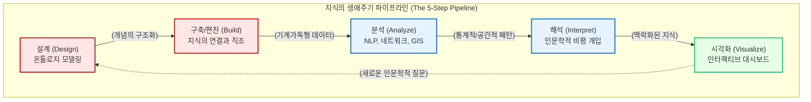

# 지식의 생애주기와 연산적 리터러시

아날로그 시대의 인문학 지식은 주로 도서관의 서고에서 발굴되어, 연구자의 뇌를 거쳐, 단행본이나 논문이라는 완결된 “**서사적 텍스트**”로 고정되는 선형적인 생애를 살았습니다. 그러나 디지털 턴(Digital Turn) 이후, 인문학적 자료는 기계의 연산망 속으로 진입하며 단순한 텍스트가 아닌 “**데이터**”로서 완전히 새로운 지식의 생애주기(Knowledge Lifecycle)를 겪게 됩니다.

이 장에서는 디지털 인문학이 지식을 생산하는 보편적인 “**5단계 파이프라인**”을 해부하고, 단순한 구축을 넘어선 “**데이터 편찬(Compilation)**”의 의미를 조명합니다. 나아가 이 파이프라인을 통제하기 위해 인문학자가 반드시 갖추어야 할 “**연산적 리터러시(Computational Literacy)**”의 당위성과 “**다학제적 랩(Lab)**” 중심의 협업 생태계를 고찰합니다.

## 1. 디지털 인문학의 5단계 파이프라인

현대 디지털 인문학은 파편화된 과거의 기록을 전 세계가 접속할 수 있는 지식 네트워크로 변환하기 위해, 고도로 조직화된 5단계의 순환적 연구 방법론을 채택합니다.

### 1.1 설계 (Design): 온톨로지와 지식 모델링
연구의 가장 첫 단계는 아날로그 자료를 기계가독형(Machine-readable) 데이터로 치환하기 위한 개념적 뼈대를 “**설계**”하는 것입니다. 대상 문헌에서 추출할 정보가 “**주어-서술어-목적어**” 구조의 RDF 트리플(Triple) 모델에 어떻게 부합할 것인지, 어떤 메타데이터(Metadata) 표준을 차용할 것인지 철학적인 기준을 세워야 합니다. 데이터 모델링은 세상을 기계의 언어로 번역하는 가장 고차원적인 인문학적 기획입니다.

### 1.2 구축과 편찬 (Build & Compilation): 지식을 꿰어내는 인문학적 의도
이 단계는 물리적 자료를 디지털로 옮기는 단순한 전산화 작업을 넘어섭니다. 종이 문헌을 스캔하여 이미지로 만들고 광학 문자 인식(OCR)으로 글자를 추출하는 물리적 변환은 단순한 “**데이터 구축**”에 불과합니다.

디지털 인문학의 진정한 정수는 “**데이터 편찬**”에 있습니다. 편찬이란 흩어져 있는 수많은 파편적 지식과 데이터들을 특정한 **인문학적 의도**를 가지고 서로 꿰어 맞추고 연결하는 고도의 해석적 행위입니다. 텍스트에 의미론적 태그를 입히고 서로 다른 인물, 장소, 사건의 관계망을 논리적으로 직조해 내는 이 편찬 과정이야말로 디지털 시대 문헌학의 핵심입니다.

### 1.3 분석 (Analyze): 연산적 방법론을 통한 거시적 탐색
견고하게 편찬된 데이터베이스에 자연어 처리(NLP), 네트워크 분석, 지리정보분석(GIS) 등의 다차원적인 연산적 방법론을 투입하여 “**분석**”을 수행합니다. 이러한 방법론들은 통계적 추론, 규칙 기반 알고리즘, 그리고 최신의 기계학습(Machine Learning) 기법 등을 복합적으로 활용합니다. 이를 통해 인간의 유한한 인지 능력으로는 파악할 수 없는 방대한 코퍼스 속에서 장르의 진화, 권력의 지형도, 공간적 이동 패턴과 같은 거시적 지형(Macroscopic pattern)을 추출해 냅니다.

### 1.4 해석 (Interpret): 인간의 비판적 개입
기계가 도출한 숫자와 위상학적 군집 자체는 역사적 진리가 아닙니다. 이 단계에서 인문학자는 원거리 읽기(Distant Reading)로 발견된 거시적 패턴을 다시 미시적인 텍스트(Close Reading)와 교차 검증하며 “**해석**”합니다. 기계의 연산 결과에 내재된 편향성과 시대적 맥락의 간극을 비판적으로 평가하여 데이터에 다시 인간의 통찰을 불어넣습니다.

### 1.5 시각화 (Visualize): 다차원적 지식의 배포와 상호작용
최종적으로 생산된 지식은 텍스트 논문이 아닌 인터랙티브 맵, 3D 모델링, 혹은 네트워크 대시보드의 형태로 “**시각화**”되어 대중에게 배포됩니다. 시각화는 단순히 분석 결과를 예쁘게 포장하는 것이 아니라, 독자가 데이터를 직접 탐색하고 유희하며 새로운 질문을 던질 수 있도록 유도하는 인식론적 인터페이스입니다.

## 2. 블랙박스의 해체와 연산적 리터러시(Computational Literacy)

이러한 지식의 파이프라인을 온전히 통제하기 위해 현대의 디지털 인문학자에게 요구되는 가장 시급한 역량은 “**연산적 리터러시(Computational Literacy)**”의 획득입니다.

초창기 디지털 인문학 연구자들은 마우스 클릭만으로 화려한 결과를 산출해 내는 기성 상용 소프트웨어, 즉 그래픽 유저 인터페이스(GUI) 기반의 도구들을 무비판적으로 수용했습니다. 그러나 이러한 상용 도구들은 알고리즘의 내부 작동 방식을 불투명하게 은폐하는 “**블랙박스(Black Box)**”와 같습니다.

알고리즘 시스템 내부에서 텍스트가 어떻게 형태소로 분해되는지, 네트워크의 중심성 가중치가 어떤 수학적 원리로 분배되는지 알지 못한다면, 인문학자는 거대 기술 기업이 설계한 편향된 논리에 지적으로 종속될 수밖에 없습니다.

따라서 디지털 인문학 커리큘럼은 학생들에게 블랙박스 도구를 버리고 파이썬(Python), R, 정규표현식(Regex)과 같은 스크립트 언어의 기초 문법을 직접 다루도록 강제합니다. 코딩을 배운다는 것은 전문 개발자가 되기 위함이 아닙니다. 연구자 스스로 데이터의 입출력 구조를 투명하게 통제하고, 자본과 권력이 이식해 놓은 기술적 편향성을 해체하기 위한 가장 맹렬하고 비판적인 “**인식론적 저항**”의 실천입니다.

## 3. 고독한 천재에서 다학제적 랩(Lab)으로

디지털 인문학의 지식 파이프라인은 결코 한 명의 인문학자가 독자적으로 완수할 수 없는 광활한 스케일을 지닙니다. 과거의 인문학이 도서관 구석에서 홀로 문헌을 파헤치는 고독한 사상가들의 세계였다면, 오늘날의 디지털 인문학은 이질적인 전문가들이 모여 지식을 공동 생산하는 “**다학제적 랩(Interdisciplinary Lab)**” 모델로 급격히 전환되었습니다.

문헌의 파편을 수집하는 기록학자, 이를 온톨로지로 엮어내는 정보학자, 지리정보와 네트워크 연산을 수행하는 데이터 사이언티스트, 그리고 전체의 역사적 의미를 꿰뚫어 보는 인문학자가 하나의 프로젝트를 위해 유기적인 협업 생태계를 구성합니다.

이러한 협업 환경에서는 평가의 기준도 달라집니다. 깃허브(GitHub)를 통한 투명한 소스 코드 공유, 확장 가능한 관계형 데이터베이스의 구축, 그리고 대중이 직접 지식 생산에 참여할 수 있는 인터랙티브 웹 포트폴리오의 제시가 학문적 성취를 증명하는 새로운 척도로 자리 잡고 있습니다. “**만들기(Making)**”와 지식의 “**편찬(Compilation)**” 자체가 논문 쓰기에 필적하는 지식 생산 행위로 인정받는 시대가 도래한 것입니다.

:::{seealso} 📖 참고문헌
* **김바로 (2026).** <특강: 학문으로서의 디지털인문학>. 전남대학교 예비 필로소포이 프로그램. (강의 자료).
* **Stephen Ramsay (2011).** <Who's In and Who's Out>. Defining Digital Humanities. Ashgate. pp. 239-241. <a href="https://hcommons.org/deposits/item/hc:11749" target="_blank">HC URL</a>
* **Constance Crompton et al. (2016).** <Doing Digital Humanities: Practice, Training, Research>. Routledge. <a href="https://doi.org/10.4324/9781315717730" target="_blank">DOI: 10.4324/9781315717730</a>
:::