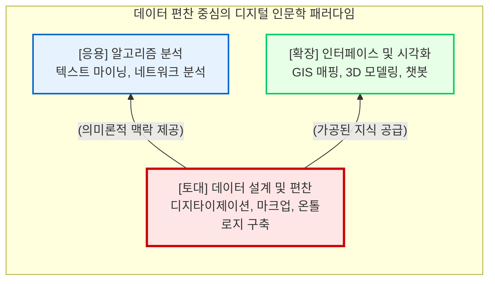

# 디지털 인문학의 철학과 기원

디지털 인문학(Digital Humanities, DH)은 단순히 인문학 연구에 컴퓨터라는 편리한 도구를 도입하여 기존의 수작업을 자동화한 학문이 아닙니다. 이는 지난 수십 년에 걸쳐 텍스트의 본질, 지식의 생산 방식, 그리고 학문적 성과물(Scholarship)의 정의 자체를 근본적으로 재구성해 온 거대한 인식론적 패러다임의 전환입니다.

이 장에서는 기술의 도구적 수용을 넘어선 “**디지털 턴(Digital Turn)**”의 철학적 배경을 탐색하고, 초기 인문 컴퓨팅의 역사적 발자취를 되짚어보며, 분석보다 선행되어야 할 “**데이터 편찬(Compilation)**”의 진정한 학문적 가치를 조명합니다.

## 1. 디지털 턴(Digital Turn)과 인간-기계 공생 패러다임

인문학의 역사는 지식을 담아내는 매체의 발전과 언제나 궤를 같이해 왔습니다. 21세기 인문학이 직면한 가장 거대한 인식론적 변화는 바로 “**디지털 턴(Digital Turn)**”입니다. 이는 과거 철학의 “**언어적 전환(Linguistic Turn)**”에 필적하는 패러다임의 변화로, 컴퓨터를 단순한 보조 도구로 취급하던 시대를 지나 연산(Computation)과 데이터 자체가 세상을 이해하는 새로운 철학적 렌즈로 자리 잡았음을 선언합니다.

이 디지털 턴의 핵심에는 “**인간-기계 공생(Human-Machine Symbiosis) 패러다임**”이 자리하고 있습니다. 과거 정보화 시대의 기술이 기차표를 어떻게 더 빠르고 효율적으로 예매할 것인가, 혹은 체스에서 어떻게 연산 속도를 높일 것인가라는 “**인간 행위의 효율성**”에만 집중했다면, 현대의 인공지능과 데이터 과학은 전혀 다른 층위의 질문을 던집니다.

* **도구적 컴퓨팅의 시대:** “어떻게 하면 체스나 바둑에서 승리하는 효율적인 계산 알고리즘을 만들 것인가?”
* **인간-기계 공생의 시대:** “알파고와 대국하며 바둑을 두는 인간의 직관과 사유 방식은 무엇인가? 부산 가는 기차표를 구매하는 사람들은 누구이며, 어떤 문화적 목적과 욕망으로 이동하는가?”

이러한 공생 시대의 질문들은 본질적으로 전통적인 인문학이 탐구해 온 “**인간이란 무엇인가**”라는 명제와 정확히 맞닿아 있습니다. 인간-기계 공생 패러다임 속에서 컴퓨터는 더 이상 수동적인 계산기나 거대한 자료 저장소가 아닙니다. 방대한 데이터 속에서 인간의 숨겨진 패턴을 읽어내고, 인문학자와 함께 지식을 공동 생산하는 “**해석적 환경이자 협업의 동반자**”로 격상된 것입니다.

## 2. 인문 컴퓨팅의 여명: 로베르토 부사와 지식의 편찬

디지털 인문학의 역사적 기원은 1946년, 이탈리아의 로베르토 부사(Roberto Busa) 신부가 IBM의 창립자 토마스 왓슨의 지원을 받아 착수한 “**토마스 아퀴나스 저작 색인(Index Thomisticus)**” 프로젝트로 거슬러 올라갑니다.

부사 신부는 토마스 아퀴나스의 방대한 라틴어 저작 1,100만여 단어를 천공 카드(Punched cards)를 이용해 기계적으로 색인화하고 형태소를 분석했습니다. 이 작업이 디지털 인문학의 “**창세기**”로 불리는 이유는, 단순히 기계가 단어의 개수를 세었기 때문이 아닙니다.

부사의 진정한 공헌은 텍스트에 선험적인 해석의 틀을 들이대는 대신, 수천만 개의 단어 데이터 자체가 보여주는 패턴을 추적하는 “**귀납적(Inductive) 방법론**”을 도입했다는 데 있습니다. 또한, 비정형 언어(Unstructured language)로 이루어진 인문학적 텍스트를 기계가 연산할 수 있는 논리적 구조로 설계하고 편찬해 낸 최초의 실증적 시도였습니다. 이 프로젝트는 장장 34년이 걸렸으며, 인문학자의 지적 노동이 “**글쓰기**”에서 “**데이터 모델링과 시스템 구축**”으로 확장될 수 있음을 증명한 위대한 선언이었습니다.

## 3. 날것의 데이터라는 환상과 캡타(Capta)의 인식론

디지털 인문학에 입문하는 연구자가 가장 먼저 깨뜨려야 할 신화는, 컴퓨터로 처리하는 데이터가 객관적이고 가치 중립적인 진리라는 믿음입니다. 미디어 이론가 리사 지텔먼(Lisa Gitelman)은 “**날것의 데이터(Raw Data)는 형용모순이다**”라고 일갈했습니다.

데이터는 자연 상태에서 저절로 솟아나는 것이 아닙니다. 조해나 드러커(Johanna Drucker) 교수의 지적처럼, 인문학에서 다루는 모든 자료는 자연과학의 객관적 “**데이터(Data, 주어진 것)**”가 아니라, 연구자의 주관적 관점과 해석의 틀에 의해 선택되고, 배제되며, 의도적으로 구조화된 “**캡타(Capta, 취해진 것)**”입니다.

역사적 문헌의 텍스트를 디지털화할 때, 어떤 단어에 인명 태그를 달고 어떤 단어를 지명으로 분류할 것인지 결정하는 메타데이터 설계 과정에는 필연적으로 그 시대를 바라보는 연구자의 이데올로기와 지식 권력이 개입됩니다. 따라서 기계 연산의 결과물을 맹신하기 전에, “**이 데이터베이스는 누구의 관점으로 설계되었는가?**”를 묻는 비판적 데이터 리터러시가 디지털 인문학의 최우선 덕목입니다.

## 4. 분석을 넘어선 편찬(Compilation)의 학문화

최근 디지털 인문학계는 텍스트 마이닝이나 네트워크 분석(SNA), 지리정보시스템(GIS)과 같은 화려한 거시적 분석 및 시각화 방법론에 매몰되는 경향이 있습니다. 그러나 글로벌 스탠더드와 한국의 디지털 인문학적 토대를 융합할 때 가장 강조되어야 할 핵심은 바로 “**인문 데이터의 설계(Design)와 편찬(Compilation)**”입니다.

* **Garbage In, Garbage Out:** 아무리 최첨단의 인공지능 모델과 분석 알고리즘을 사용하더라도, 입력되는 데이터의 질이 떨어지면 결과 역시 쓰레기에 불과합니다. 분석과 시각화는 데이터 편찬이라는 튼튼한 토대 위에서만 학술적 가치를 지닙니다.
* **편찬은 곧 고도의 해석이다:** 파편화된 고문헌에서 노이즈를 제거하고, 정규표현식으로 정제하며, XML 마크업을 통해 의미론적 관계를 맺어주는 데이터 편찬 행위는 결코 단순한 전산 입력 노동이 아닙니다. 이는 아날로그 텍스트를 기계가독형(Machine-readable) 지식으로 번역해 내는, 21세기 디지털 인문학의 가장 정수이자 숭고한 문헌학적(Philological) 실천입니다.

현대의 인문학자는 기술을 단순히 소비하는 자를 넘어, 스스로 코드를 짜고 지식의 구조를 편찬하는 “**비판적 구축가(Critical Builder)**”가 되어야 합니다. 다음 장에서는 이러한 철학적 토대 위에서 인문학 지식이 어떻게 전산화되고 구조화되는지, 그 구체적인 연구 생애주기 파이프라인을 살펴보겠습니다.

:::{seealso} 📖 참고문헌
* **김바로 (2026).** <특강: 학문으로서의 디지털인문학>. 전남대학교 예비 필로소포이 프로그램. (강의 자료). 
* **Lisa Gitelman (2013).** <"Raw Data" is an Oxymoron>. MIT Press. pp. 1-14. <a href="https://doi.org/10.7551/mitpress/9302.001.0001" target="_blank">DOI: 10.7551/mitpress/9302.001.0001</a>
* **Johanna Drucker (2011).** <Humanities Approaches to Graphical Display>. Digital Humanities Quarterly. 5(1). <a href="http://www.digitalhumanities.org/dhq/vol/5/1/000091/000091.html" target="_blank">DHQ URL</a>
:::