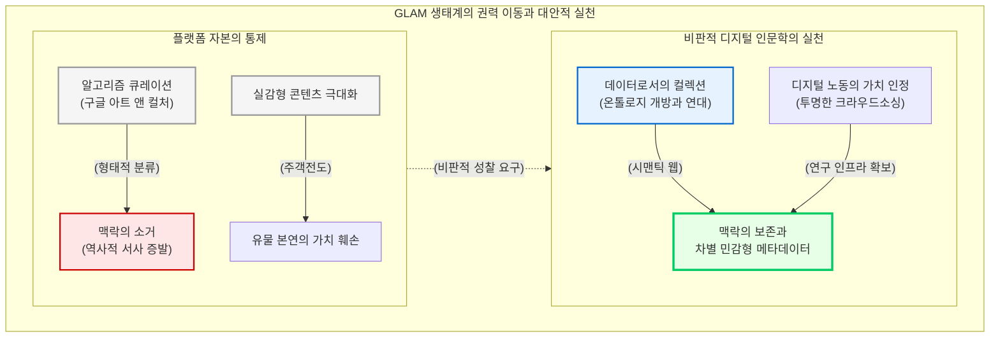

# 문화 유산 기관(GLAM)과 대중적 실천

갤러리, 도서관, 아카이브, 박물관을 아우르는 “**GLAM(Galleries, Libraries, Archives, Museums)**” 생태계는 디지털 인문학이 대중과 만나는 가장 거대한 최전선입니다. 아날로그 시대의 GLAM 기관이 유물을 수장고에 보관하고 소수 엘리트 연구자에게 제공하는 닫힌 공간이었다면, 디지털 시대의 GLAM은 수백만 점의 유물을 데이터로 편찬하여 전 세계에 개방하는 퍼블릭 인문학(Public Humanities)의 중심지로 도약했습니다.

그러나 비판적 디지털 인문학은 이러한 개방성과 화려한 디지털 전시 이면에 도사린 새로운 형태의 권력 구조를 직시합니다. 이 장에서는 실감형 콘텐츠의 스펙터클이 역사적 서사를 어떻게 잠식하는지, 크라우드소싱과 플랫폼 자본주의가 어떻게 지식을 통제하는지, 그리고 알고리즘 큐레이션이 전시의 맥락을 어떻게 소거하는지를 비판적으로 해부합니다.

## 1. 실감형 콘텐츠의 빛과 그림자: 주객전도의 위기

최근 전 세계 박물관과 미술관은 가상현실(VR), 증강현실(AR), 프로젝션 맵핑(Projection Mapping) 기술을 결합한 “**실감형 콘텐츠(Immersive Content)**”를 경쟁적으로 도입하고 있습니다. 한국의 국립중앙박물관 역시 실감 영상관을 구축하여 관람객에게 압도적인 시각적 몰입감을 제공하며 대중적 흥행을 거두었습니다.

그러나 화려한 디지털 외투는 자칫 박물관 본연의 목적과 유물의 본질적 가치를 가려버릴 수 있습니다. 비판적 큐레이터와 학자들은 실감형 콘텐츠의 맹목적인 도입이 낳는 “**주객전도(主客顚倒)**” 현상을 강력히 경고합니다. 

콘텐츠를 구성하는 과정에서 관람객의 말초적 흥미와 미디어아트로서의 미적 감각에만 치중한 나머지, 문화유산이 지닌 깊은 역사성, 지역성, 그리고 고유한 “**서사(Narrative)**”가 거세되는 현상이 발생합니다. 기술은 유물을 깊이 있게 이해하도록 돕는 매개체여야 하지만, 전시의 맥락이 스펙터클에 잠식당할 때 관람객은 역사적 진실과 유리된 얕은 시각적 유희만을 소비하게 됩니다.

## 2. 알고리즘 큐레이션과 맥락의 소거(Decontextualization)

과거 전시실의 벽면에 걸릴 작품을 선정하고 서사를 부여하는 권력은 인간 큐레이터와 인문학자에게 있었습니다. 그러나 거대 기술 기업이 GLAM 생태계에 진입하면서 이 권력은 “**알고리즘(Algorithm)**”으로 이동하고 있습니다.

“**구글 아트 앤 컬처(Google Arts & Culture)**”는 기계학습(Machine Learning) 알고리즘을 통해 수백만 점의 예술 작품을 큐레이션하는 파격적인 실험을 선보였습니다. 알고리즘은 인간의 미술사적 지식(르네상스, 인상파 등)을 배제하고, 오직 이미지의 색상이나 형태적 유사성을 추출하여 3차원 공간에 군집화하는 “**t-SNE 지도(t-SNE Map)**”를 창조해 냅니다.

이러한 기계의 지각(Machine Perception)은 시공간을 초월한 새로운 미적 패턴을 발견하는 쾌감을 선사합니다. 그러나 동시에 알고리즘은 작품이 잉태된 당대의 치열한 정치적, 사회적, 역사적 “**맥락(Context)**”을 철저히 삭제해 버리는 “**맥락 소거(Decontextualization)**”의 폭력을 자행합니다. 기계가 재배열한 아름다운 픽셀의 바다 속에서, 예술 작품이 품고 있던 혁명의 서사나 피지배 계층의 고통은 덧없이 증발해 버립니다. 이것이 바로 전시를 통제하는 “**인터페이스의 권력성**”입니다.

## 3. 크라우드소싱과 불안정한 디지털 노동

대규모 아카이브 구축을 위해 GLAM 기관들은 종종 일반 대중의 참여를 유도하는 “**크라우드소싱(Crowdsourcing)**” 기법을 활용합니다. 일본의 “**모두의 번각(Minna de Honkoku)**” 프로젝트처럼 대중이 직접 고문헌의 글자를 해독하여 데이터를 생산하는 방식은 “**지식 생산의 민주화**”라는 긍정적인 평가를 받습니다.

그러나 비판적 디지털 인문학은 이 거대한 플랫폼을 떠받치고 있는 “**불안정한 디지털 노동(Precarious DH Labor)**”의 구조적 모순을 지적합니다. 

거대한 3D 복원이나 메타데이터 구축의 이면에는 그랜트(연구비)나 임시 직위에 의존하여 고도의 코딩과 데이터 편찬을 수행하는 사서, 연구원, 그리고 대중들의 무급 노동이 존재합니다. 전통적 학계와 자본은 디지털 인문학의 화려한 결과물만을 소비할 뿐, 보이지 않는 곳에서 시스템을 조율하고 코드를 작성하는 이들의 뼈를 깎는 편찬 노동을 정당한 학술적 업적이나 노동 가치로 환산하지 않습니다.

## 4. 데이터로서의 컬렉션(Collections as Data)과 지식 연대

이러한 상업적, 기술적 종속을 극복하기 위해, 선도적인 GLAM 기관들은 단순한 웹페이지 전시를 넘어 기관의 소장품 전체를 기계가 읽을 수 있는 원시 데이터셋으로 개방하는 “**데이터로서의 컬렉션(Collections as Data)**” 운동을 전개하고 있습니다.

단순히 구글과 같은 거대 플랫폼에 데이터를 넘겨주고 알고리즘의 처분을 기다리는 것이 아니라, 기관과 인문학자가 주도하여 데이터의 표준 온톨로지를 설계하고 오픈 API로 배포하는 것입니다. 한국의 “**한양도성 타임머신**” 프로젝트가 파편화된 유산을 EKC(Encyves of Korean Culture) “**온톨로지(Ontology)**” 스키마로 엮어 시맨틱(Semantic) 데이터망으로 개방한 것이 훌륭한 실천 사례입니다.

거대 기술 자본이 통제하는 큐레이션 알고리즘의 블랙박스를 인문학의 비판적 시선으로 열어젖히고, 해석의 자율성을 대중에게 복원할 때 GLAM 기관은 진정한 지식의 민주화를 이룰 수 있습니다. 기술적 스펙터클의 함정을 피하여, 데이터의 주권과 불안정한 디지털 노동자의 권리를 제도적으로 보장하는 것이 21세기 문화 유산 기관이 직면한 가장 무거운 윤리적 과제입니다.

:::{seealso} 📖 참고문헌
* **Lev Manovich (2020).** <Cultural Analytics>. MIT Press. <a href="https://mitpress.mit.edu/9780262539715/cultural-analytics/" target="_blank">Publisher URL</a>
* **Thomas Padilla et al. (2019).** <Always Already Computational: Collections as Data>. <a href="https://collectionsasdata.github.io/" target="_blank">Project URL</a>
* **Burdick, Anne et al. (2012).** <Digital_Humanities>. MIT Press. <a href="https://mitpress.mit.edu/9780262528863/digital_humanities/" target="_blank">Publisher URL</a>
:::