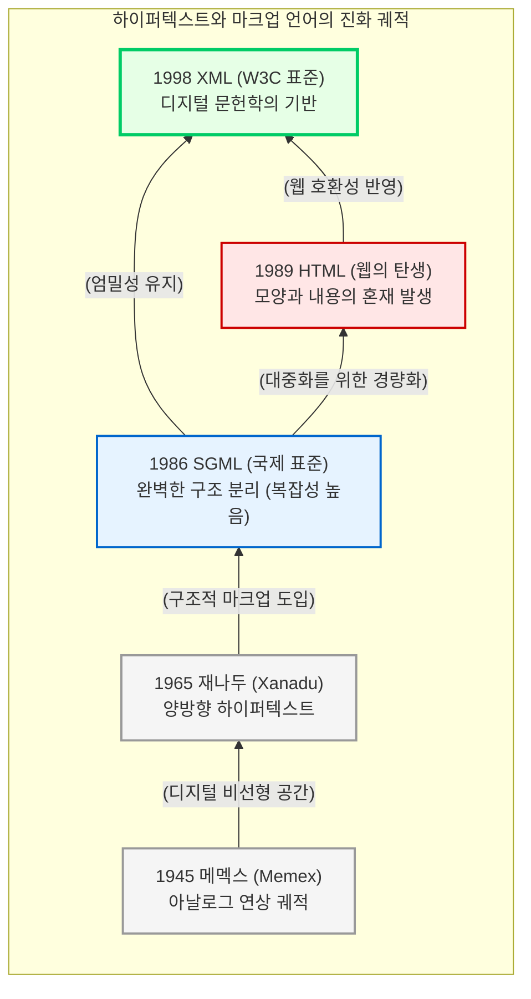

# 하이퍼텍스트 연대기와 XML의 탄생

인간의 사고는 책의 페이지처럼 처음부터 끝까지 일직선으로 이어지는 선형적(Linear) 구조가 아닙니다. 하나의 개념은 꼬리에 꼬리를 물고 다른 개념으로 이어지는 다차원적인 “**연상적(Associative)**” 구조를 띱니다. 

앞선 장에서 살펴본 “**기계가독성**”과 “**구조의 분리**”라는 XML의 매체 철학은 어느 날 갑자기 하늘에서 떨어진 공학적 발명품이 아닙니다. 이는 지식을 인간의 사고방식과 가장 유사한 형태로 연결하고 보존하려 했던 수십 년간의 치열한 역사적 분투의 결과물입니다. 이 장에서는 아날로그 시대의 상상력에서 출발하여 오늘날 디지털 문헌학의 궁극적 표준인 XML이 탄생하기까지의 웅장한 “**하이퍼텍스트 연대기**”를 추적합니다.

## 1. 연상적 연결의 시초: 바네바 부시와 메멕스(Memex)

하이퍼텍스트의 개념적 기원은 컴퓨터가 대중화되기 훨씬 전인 1945년으로 거슬러 올라갑니다. 제2차 세계대전 당시 미국의 과학 연구를 총괄했던 바네바 부시(Vannevar Bush)는 “**우리가 생각하는 대로(As We May Think)**”라는 기념비적인 논문에서 정보의 폭발적인 증가를 경고하며, 이를 효율적으로 관리할 가상의 아날로그 기계인 “**메멕스(Memex)**”를 제안했습니다.

메멕스는 마이크로필름을 기반으로 모든 책, 기록, 통신문을 저장하고, 사용자가 두 개의 정보 사이에 “**연상의 궤적(Associative Trails)**”을 구축할 수 있게 해주는 장치였습니다. 비록 물리적인 한계로 실제 제작되지는 못했지만, 문헌과 문헌을 기계적으로 연결하여 새로운 지식의 지도를 만든다는 메멕스의 철학은 이후 모든 하이퍼텍스트 시스템의 영적인 청사진이 되었습니다.

## 2. 비선형적 글쓰기: 테드 넬슨과 재나두(Xanadu)

메멕스의 개념을 디지털 환경으로 끌어와 현대적인 의미의 “**하이퍼텍스트(Hypertext)**”라는 용어를 최초로 창안한 인물은 테드 넬슨(Ted Nelson)입니다. 그는 1965년 문헌들이 서로 거미줄처럼 얽혀 있는 비선형적 글쓰기 공간을 구상하며 “**재나두(Project Xanadu)**” 프로젝트를 출범시킵니다.

테드 넬슨이 꿈꾸었던 재나두의 핵심 철학은 오늘날의 일반적인 웹(Web)보다 훨씬 진보된 것이었습니다.
* **양방향 링크(Bi-directional Links):** 한 문서에서 다른 문서를 참조하면, 원본 문서에서도 누가 자신을 참조했는지 역으로 추적할 수 있는 구조입니다. (현재의 웹은 단방향 링크 중심입니다.)
* **트랜스클루전(Transclusion):** 복사하여 붙여넣는 방식이 아니라, 원본 데이터의 특정 부분을 실시간으로 참조하여 인용의 맥락과 저작권을 완벽하게 보존하는 개념입니다.

테드 넬슨의 재나두는 구현의 복잡성으로 인해 상업적으로 완성되지는 못했지만, 텍스트가 단순히 화면에 출력되는 이미지가 아니라 고도로 연결된 “**데이터의 망(Network of Data)**”이어야 한다는 위대한 사상을 남겼습니다.

## 3. 구조와 내용의 분리: 찰스 골드파브와 SGML

문헌을 하이퍼텍스트로 연결하기 위해서는, 컴퓨터가 문헌 내부의 구조(제목, 본문, 주석 등)를 정확히 식별할 수 있는 범용적인 규칙이 필요했습니다. 

1969년 IBM의 연구원이었던 찰스 골드파브(Charles Goldfarb)는 문서를 특정 소프트웨어나 하드웨어에 종속시키지 않고 보존하기 위해 GML(Generalized Markup Language)을 개발했습니다. 이 개념은 비약적으로 발전하여 1986년 국제표준화기구(ISO)에 의해 “**SGML(Standard Generalized Markup Language)**”이라는 국제 표준으로 제정됩니다.

SGML은 앞선 장에서 강조했던 “**구조, 내용, 모양의 분리**”라는 대원칙을 수학적이고 엄밀하게 구현한 최초의 시스템이었습니다. 항공기 매뉴얼이나 방대한 법률 문서 등 고도의 구조화가 필요한 분야에서 혁명적인 성과를 거두었으나, 그 문법과 검증 체계가 일반 대중이나 학자들이 다루기에는 “**지나치게 무겁고 복잡하다**”는 치명적인 단점이 있었습니다.

## 4. 웹의 폭발과 HTML의 한계

SGML의 복잡성을 해결하고 하이퍼텍스트를 전 세계의 대중이 사용할 수 있도록 만든 인물은 팀 버너스리(Tim Berners-Lee)입니다. 그는 1989년 스위스 유럽입자물리연구소(CERN)에서 월드와이드웹(WWW)을 발명하며, 누구나 쉽게 문서를 작성하고 연결할 수 있는 가벼운 마크업 언어인 “**HTML(HyperText Markup Language)**”을 세상에 내놓았습니다.

HTML은 미리 정해진 소수의 태그(예: `<h1>`, `
`, `<a>`)만을 사용하여 배우기 쉬웠고, 이는 인터넷의 폭발적인 대중화를 이끌었습니다. 그러나 1990년대 후반 넷스케이프와 마이크로소프트 간의 치열한 “**브라우저 전쟁**”이 발발하면서, HTML은 철학적인 위기에 봉착합니다.

* **모양과 내용의 혼재:** 브라우저 제조사들은 화면을 예쁘게 꾸미기 위해 ``, `<blink>`와 같은 시각적 태그를 무분별하게 추가했습니다.
* **데이터 가치의 상실:** 기계가독성을 위한 구조적 정보는 사라지고, HTML은 데이터를 담는 그릇이 아니라 “**화면을 그리는 붓**”으로 전락해 버렸습니다. 웹은 넓어졌지만, 컴퓨터는 그 안의 텍스트가 사람인지 지명인지 전혀 이해할 수 없는 상태로 퇴보한 것입니다.

## 5. 디지털 문헌학의 완성: XML의 탄생

HTML의 무질서와 데이터 종속성을 극복하기 위해, 1998년 월드와이드웹 컨소시엄(W3C)은 마침내 “**XML(eXtensible Markup Language)**”이라는 새로운 표준을 제정하여 발표합니다.

[Image comparing the strict structural rules of SGML, the presentation focus of early HTML, and the extensible data focus of XML]

XML은 이전 시대의 매체들이 가진 장점만을 취합하고 단점을 버린 가장 완벽한 타협점이자 철학적 완성이었습니다.
* **SGML의 엄밀성 계승:** 사용자가 자신의 학문적 목적에 맞게 태그를 무한대로 “**확장(eXtensible)**”하여 창조할 수 있으며, 구조와 모양을 엄격하게 분리합니다.
* **HTML의 단순성 차용:** SGML의 지나치게 복잡한 문법(선택적 태그 생략 등)을 폐기하고, 인터넷 환경에서 데이터를 가볍고 빠르게 교환할 수 있는 문법적 명료성을 확보했습니다.

결론적으로 XML의 탄생은 단순한 IT 기술의 발전이 아닙니다. 바네바 부시가 상상했던 연상적 지식의 궤적을 인간의 문법으로 정의하고, 테드 넬슨이 꿈꾸었던 파편화된 문서들의 영구적인 연결망을 기계가 독해할 수 있는 데이터로 편찬해 낸 “**디지털 문헌학의 가장 위대한 승리**”입니다. 

이제 우리는 이 위대한 언어의 구체적인 문법 속으로 들어가, 텍스트를 기계의 뇌 속으로 각인시키는 가장 기초적인 규칙들을 학습하게 될 것입니다.

:::{seealso} 📖 참고문헌
* **Bush, Vannevar (1945).** <As We May Think>. The Atlantic Monthly. 176(1). pp. 101-108.
* **Nelson, Theodor H. (1965).** <Complex Information Processing: A File Structure for the Complex, the Changing and the Indeterminate>. ACM '65. pp. 84-100. <a href="https://doi.org/10.1145/800197.806036" target="_blank">DOI: 10.1145/800197.806036</a>
:::