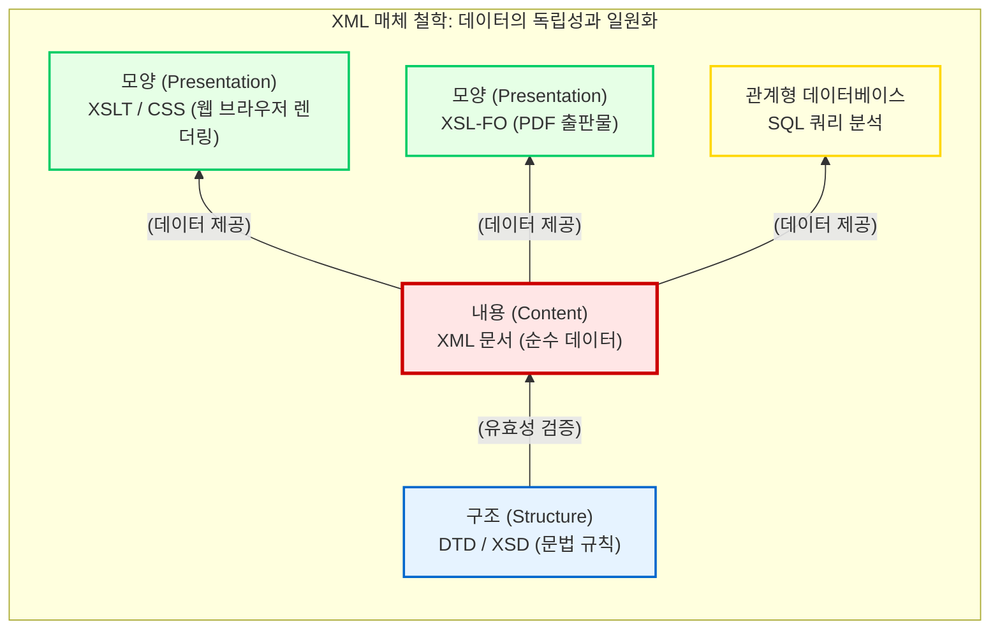

# 매체 철학과 기계가독성(Machine-Readability)

우리는 컴퓨터 모니터나 스마트폰 화면에 떠 있는 글자를 읽으며, 텍스트가 디지털화되었다고 착각하곤 합니다. 그러나 스캐너로 읽어 들인 고문헌의 이미지(JPG)나, 단순히 키보드로 타이핑한 평문(Plain Text) 파일은 컴퓨터의 관점에서는 무의미한 픽셀의 집합이거나 전기적 신호의 나열에 불과합니다. 

이 장에서는 인문학의 서사적 텍스트가 기계와 소통하기 위해 반드시 획득해야 하는 핵심 속성인 “**기계가독성(Machine-Readability)**”의 개념을 탐구하고, 구조와 내용을 분리하는 디지털 문헌학의 가장 위대한 대원칙을 확립합니다.

## 1. 아날로그 텍스트와 기계가독성의 획득

인간과 기계가 세계를 인식하는 방식에는 거대한 인식론적 단절이 존재합니다. 인간은 문맥(Context)과 배경지식을 통해 텍스트 이면의 의미를 직관적으로 추론하지만, 컴퓨터는 명시적으로 지시되지 않은 정보는 절대 스스로 연산하지 못합니다.

### 1.1 기계의 맹점과 마크업(Markup)의 탄생
다음과 같은 역사적 문장이 있다고 가정해 봅시다.

> “**이순신은 한산도에서 왜나라 수군과 싸웠다.**”

훈련된 인문학자나 평범한 독자는 이 문장을 보자마자 “**이순신**”이 실존했던 역사적 인물이며, “**한산도**”가 지명임을 즉각적으로 인지합니다. 나아가 조선왕조실록에 “**충무(忠武)**”라는 단어가 등장하면, 그것이 이순신의 시호임을 문맥상 파악할 수 있습니다. 

그러나 컴퓨터 알고리즘에게 “**이순신**”이나 “**충무**”는 그저 문자 코드(예: 유니코드)의 배열일 뿐입니다. 기계는 이 단어들이 동일한 인물을 지칭하는지, 사람인지 장소인지 알지 못합니다. 이 깊은 단절을 극복하기 위해 인문학자가 텍스트의 뼈대에 의미표지(Tag)를 달아주는 행위를 “**마크업(Markup)**”이라고 부릅니다. 

### 1.2 기계가독성(Machine-Readability)의 완성
마크업 언어(XML 등)를 활용하여 원본 텍스트를 다음과 같이 감싸는 순간, 텍스트는 완전히 새로운 생명력을 얻게 됩니다.

> `<인물>이순신</인물>은 <지명>한산도</지명>에서 왜나라 수군과 싸웠다.`

이제 컴퓨터는 수십만 장의 텍스트 속에서 `<인물>` 태그로 감싸진 데이터만을 정확히 추출하여 네트워크 분석이나 통계 연산을 수행할 수 있습니다. 텍스트가 “**기계가독성(Machine-Readability)**”을 획득한 것입니다. 

더 나아가, 역사 속에는 이순신이라는 동명이인이 존재할 수 있습니다. 충무공 이순신과 무의공 이순신을 기계가 오인하지 않도록, 우리는 속성(Attribute)을 부여하여 더욱 정교한 기계가독성을 달성합니다.

> `<인물 id="P001" 시호="충무">이순신</인물>`
> `<인물 id="P002" 시호="무의">이순신</인물>`

이처럼 마크업은 단순한 코딩 기술이 아닙니다. 그것은 인간의 고도화된 배경지식과 추론 과정을 컴퓨터의 논리 체계로 번역하여 가르치는 “**가장 적극적인 인문학적 해석 행위**”입니다.

## 2. 디지털 문헌학의 대원칙: 구조, 내용, 모양의 분리

기계가독성을 부여하는 마크업 언어 중 대중에게 가장 친숙한 것은 웹페이지를 만드는 HTML(HyperText Markup Language)입니다. 그러나 HTML은 인문학 데이터를 영구적으로 보존하고 분석하기에는 치명적인 철학적 결함을 안고 있습니다. 

### 2.1 HTML의 한계: 모양과 내용의 혼재
초기 웹 생태계에서 HTML은 화면에 글자를 어떻게 예쁘게 보여줄 것인가에 집착했습니다. 그 결과 텍스트의 의미(내용)와 시각적 장식(모양)이 하나의 태그 안에 뒤섞이게 되었습니다.

> `이순신은 <b>한산도</b>에서 싸웠다.`

위의 코드는 사람의 눈에 이순신을 붉은색으로, 한산도를 굵은 글씨로 보여주지만, 컴퓨터는 붉은색 텍스트가 인물인지, 강조된 단어인지, 오류 메시지인지 구분하지 못합니다. 데이터로서의 가치가 완전히 상실된 상태입니다.

### 2.2 XML의 철학: 완벽한 분리(Separation)의 미학
XML(eXtensible Markup Language)은 이러한 HTML의 한계를 극복하고, 데이터의 본질적 가치를 영구히 보존하기 위해 탄생했습니다. XML의 가장 위대한 매체 철학은 바로 “**구조(Structure), 내용(Content), 모양(Presentation)의 완벽한 분리**”입니다.

1. **내용(Content):** 순수한 데이터 자체는 XML 문서 안에 존재합니다. 이곳에는 폰트 색상이나 글씨 크기 같은 시각적 요소가 절대 개입해서는 안 됩니다. (예: `<person>이순신</person>`)
2. **구조(Structure):** 이 XML 문서가 어떤 태그를 사용할 수 있고, 어떤 계층 구조를 가져야 하는지에 대한 문법 규칙은 DTD(Document Type Definition)나 XSD(XML Schema)라는 별도의 문서로 분리되어 통제됩니다.
3. **모양(Presentation):** 기계가독형으로 잘 짜인 데이터를 인간이 보기 좋게 화면에 뿌려주는 역할은 XSLT(eXtensible Stylesheet Language Transformations)나 CSS와 같은 스타일 변환 문서가 전담합니다.

이러한 완벽한 분리 정책 덕분에, 우리는 하나의 XML 원형 데이터(One Source)를 가지고 웹사이트, 인쇄용 PDF, 그리고 데이터베이스 검색용 API에 이르기까지 무한한 형태로 재사용(Multi Use)할 수 있습니다. 

결론적으로 XML 마크업은 문헌을 낡은 종이의 한계에서 해방시켜, 시공간을 초월해 기계와 인간이 공유할 수 있는 “**영구적인 지식의 결정체**”로 편찬해 내는 가장 견고한 정보공학적 실천입니다. 이어지는 장에서는 이 위대한 매체 철학이 어떠한 역사적 궤적을 거쳐 현재의 XML 표준으로 확립되었는지, 하이퍼텍스트의 연대기를 추적해 보겠습니다.

:::{seealso} 📖 참고문헌
* **Coombs, James H. et al. (1987).** <Markup Systems and the Future of Scholarly Text Processing>. Communications of the ACM. 30(11). pp. 933-947. <a href="https://doi.org/10.1145/32206.32209" target="_blank">DOI: 10.1145/32206.32209</a>
:::